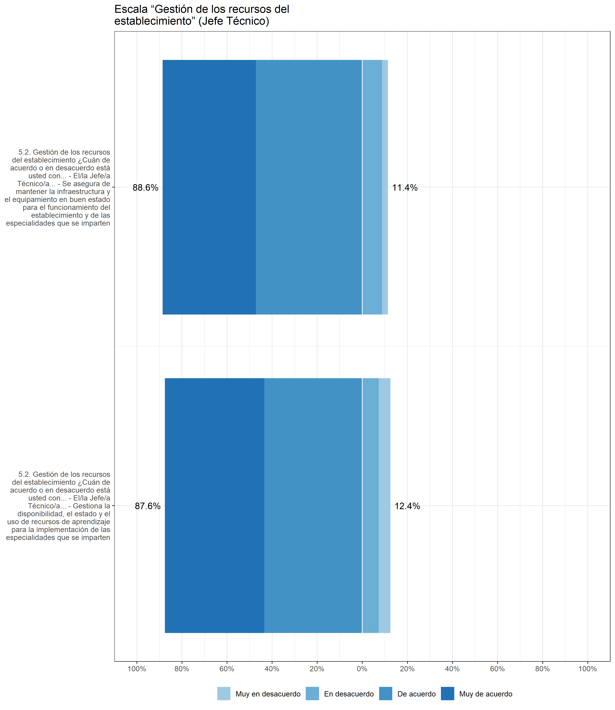

```{r setup, include=FALSE}
knitr::opts_chunk$set(echo = TRUE, warning = FALSE, message = F)
```

# Introducción

El presente documento expone un análisis de validez con la intención de disminuir la cantidad de ítems por baterías de preguntas. Se busco eliminar aquellas variables que permitieran mantener o mejorar las propiedades psicométricas de las escalas. 

El documento esta estructurado según escalas, siendo cada una sección seleccionable en la barra de la izquierda. Dentro de cada sección se propone un conjunto de variables a eliminar, señalando las razones y el modelo propuesto. Además, en las pestañas se pueden observar descriptivos y correlaciones. 

# __Cuestionario para docentes y directivos (exceptuando a director/a, jefe/a de UTP y jefe/a Técnico)__

# Escala uso de datos para la mejora escolar (Schildkamp):  {.tabset .tabset-fade .tabset-pills}


¿Cuán de acuerdo o en desacuerdo está usted con las siguientes afirmaciones acerca del uso de datos en su establecimiento? (4 niveles) (Q22)

+	Original: En nuestra escuela utilizamos las evaluaciones externas para nuestra propia mejora  __Utilizado__: En nuestro establecimiento utilizamos las evaluaciones externas para nuestros propios procesos de mejora (Q22_1)

+	Original: Los líderes de mi escuela muestran a los profesores en qué medida la escuela está logrando sus objetivos en función de los datos   __Utilizado__: Los y las directivos/as de mi establecimiento muestran a los profesores en qué medida el centro educativo está logrando sus objetivos en función de los datos (Q22_2)

+	Original: Los análisis detallados de los datos son una parte esencial de los procesos de mejora en mi escuela   __Utilizado__: Los análisis detallados de los datos son una parte esencial de los procesos de mejora en nuestro establecimiento (Q22_3)
+	Original: La división del tiempo de enseñanza en mi escuela se basa en las necesidades de aprendizaje identificadas de los alumnos   __Utilizado__: En mi establecimiento la distribución del tiempo pedagógico se basa en las necesidades de aprendizaje de los estudiantes (Q22_4)

+	Original: En mi escuela utilizamos los resultados de los alumnos para determinar los objetivos anuales de mejora de la escuela   __Utilizado__: En mi establecimiento utilizamos los resultados de los estudiantes para determinar las metas anuales de mejora del centro educativo (Q22_5)

+	Original: En mi escuela los resultados de los estudiantes conducen a decisiones respecto al desarrollo profesional docente    __Utilizado__: En mi establecimiento los resultados de los estudiantes guían las decisiones respecto al desarrollo profesional docente (Q22_6)

+	Original: Los resultados de los logros de los estudiantes se utilizan para identificar las brechas en nuestro plan de estudios   __Utilizado__: Los resultados de los logros de los estudiantes se utilizan para identificar brechas en nuestro plan y programas de estudios (Q22_7)

+	Original: En mi colegio utilizamos los datos como una herramienta para determinar los métodos de enseñanza eficaces   __Utilizado__: En mi establecimiento utilizamos los datos como una herramienta para determinar las estrategias de enseñanza más efectivas (Q22_8)

Indicador adicional que se presenta en la batería de preguntas, pero que no pertenece a la escala original de Schildkamp:

+	En mi establecimiento se analizan sistemáticamente los datos del contexto social y productivo del territorio en que se encuentra el centro educativo para evaluar los perfiles de las especialidades (Q22_9)

```{r,echo=FALSE}

pacman::p_load(dplyr, sjmisc, car, sjlabelled, stargazer, SciViews, summarytools, misty,sjPlot,PerformanceAnalytics,ggplot2,lavaan,haven)


Cuestionario_SD_09_09 <- read_sav("../input/data/Cuestionario_SD_09-09.sav")


# Seleccionar y renombrar variables de la base de datos de estudiantes.                               
datos_mejoras <- Cuestionario_SD_09_09  %>% dplyr::select(starts_with("Q22")) 

##datos_mejoras <- set_na(datos_mejoras, na = c(5,9), drop.levels = TRUE, as.tag = FALSE) # Transformar a NA
datos_mejoras =na.omit(datos_mejoras)

```


## Descriptivos

```{r, echo=FALSE}
#sjPlot::view_df(datos_mejoras, show.type = T, show.frq = T, show.prc = T) # Cambiar por dfsummary

####------------------descriptivos---------------######

# short var labels
#items <- c("A", "B","C","D","E")

sjlabelled::set_label(datos_mejoras) = gsub('4.1. ¿Cuán de acuerdo o en desacuerdo está usted con las siguientes afirmaciones acerca del uso de datos en su establecimiento?', '',sjlabelled::get_label(datos_mejoras)) #eliminar espacio


# cambiar orden para la leyenda
labels= c("Muy en desacuerdo",
"En desacuerdo",
"De acuerdo",
"Muy de acuerdo")  ### E


#sjPlot::plot_likert(datos_mejoras,
esc_datos_doc<-sjPlot::plot_likert(datos_mejoras,
                         #axis.labels   = items,
                         legend.labels = labels,
                         #legend.pos = "bottom",
                        #cat.neutral   = , # identifica a indiferentes
                         geom.colors   = c("#9ECAE1", "#6BAED6", "#4292C6",
                                           "#2171B5"), # colorbrewer2.org
                         sort.frq      = NULL, # "neg.asc", # sort descending)
                         title         = "Escala uso de datos para la mejora escolar",
                         intercept.line.color = "white", # vertical middle
                         expand.grid   = F, # no inner margins in plot
                         show.n        = FALSE, # hide N's in axis labels
                         #grid.range    = 1.8,
                         geom.size = 0.6, 
                        values = "sum.outside") + theme_bw() + theme(legend.position = "bottom") 

ggplot2::ggsave(esc_datos_doc, file = "esc_datos_doc.png",device = "png",width = 26,height = 22,dpi = "retina",units = "cm")

```


## Correlaciones


 
```{r, echo=FALSE}
# correlaciones 

chart.Correlation(datos_mejoras, histogram = TRUE, method = "spearman")


#-----------------------------------------------------------------------------------------##
```
+ 	   


## Modelos de medida

```{r, echo=FALSE, results='hide'}


# Modelo general 

HS.model1 <- ' dat_mej  =~ Q22_1 + Q22_2 + Q22_3 + Q22_4 + Q22_5 +Q22_6 + Q22_7 + Q22_8 + Q22_9'

fit1 <- cfa(HS.model1, data=datos_mejoras, estimator="DWLS", ordered = T)

summary(fit1, fit.measures=TRUE)


# Modelo reducido 1

HS.model2 <- ' dat_mej  =~ Q22_2 + Q22_3 + Q22_4 + Q22_5 +Q22_6 + Q22_7 + Q22_8 + Q22_9'

fit2 <- cfa(HS.model2, data=datos_mejoras, estimator="DWLS", ordered=T)

summary(fit2, fit.measures=TRUE)


# Modelo reducido 2

#HS.model3 <- ' dat_mej  =~ P16A + P16B + P16C +  P16E'
HS.model3 <- ' dat_mej  =~  Q22_1 + Q22_2 + Q22_3 + Q22_4 + Q22_5 +Q22_6 + Q22_7 + Q22_8'

fit3 <- cfa(HS.model3, data=datos_mejoras, estimator="DWLS", ordered=T)

summary(fit3, fit.measures=TRUE)
```


```{r, echo=FALSE}
#-----------------------------------------------------------------------------------------##
# Crear tabla para comparar AFC

pacman::p_load(dplyr, kableExtra, knitr)

# extract fit indices from models and add to table
sum_fit1<- dplyr::bind_rows(fitmeasures(fit1)[c("chisq","df","pvalue","cfi","tli","rmsea","srmr")],fitmeasures(fit3)[c("chisq","df","pvalue","cfi","tli","rmsea","srmr")])


# Customize object
sum_fit1$mod <- c("Escala completa","Eliminando Q22_9 (Externo)")
sum_fit1$nobs <- c(nobs(fit1),nobs(fit3))
sum_fit1$est <- c("DWLS","DWLS")
sum_fit1$df_ch<-c(sum_fit1$chisq/sum_fit1$df)
sum_fit1 <- dplyr::select(sum_fit1,mod,nobs,est,everything())
colnames <- c("Utilizando variables como","N","Estimador","chi2","df","p-value","CFI","TLI","RMSEA","SRMR","Chi2/df")

# Create table
table_cfa_fits1 <-kable(sum_fit1, format="pandoc", digits=3, booktabs=T, col.names=colnames,  caption = "Comparación entre modelos", escape = FALSE) %>% kable_styling(full_width = F, font_size = 14)
table_cfa_fits1

```

```{r}
anova(fit1,fit3) # La diferencia
```


El modelo mejora significativamente el eliminar la variable Q22_9, la cual no forma parte de la batería original.


> Modelo reducido (Eliminando indicador Q22_9)

```{r, echo =FALSE,results='hide'}
library(sjPlot)
library(dplyr)
library(lavaan)
library(semPlot)
library(stargazer)
library(corrplot)
library(psych)
library(knitr)
library(kableExtra)
library(rvest)
library(sjlabelled)
library(ggplot2)

fm03<- data.frame(v1=fitmeasures(fit3, output ="matrix")[c("chisq","df","cfi","rmsea","pvalue"),])
fm03 <- round(fm03,3)
par(mai = c(2,2,2,2)) # Set the margin on all sides to 2
par(mar = c(5, 5, 5, 5)) # Set the margin on all sides to 6
layout(matrix(c(1, # semPlot
                1, # semPlot
                1,
                1,
                1,
                2),# ajuste
              nrow=6,
              byrow=TRUE))

#layout.show(n = 2)
semPaths(
  fit3 ,
   whatLabels = "std", # Indica si aparecen los valores
  #what = "mod",
  label.cex = 1.3, # Tamaño de las etiquetas dentro de los nodos.
  edge.label.cex =  1.8, #  0.8 Tamaño de los valores estimados.
  residuals = T,
  optimizeLatRes =F,
  edge.color = "black",
  style = "lisrel",
  nCharNodes = 0,
  curvePivot = F,
  curve = 2.5,
  rotation = 4,
  layout = "tree2",
  cardinal = "lat cov",
  legend.cex = 0.6, # 0.6
  label.cex = 1,
  label.font = 6,
  edge.label.font = 14,
  asize = 3,
  edge.width = 1.2,
  sizeMan = 8,# largo manifest
  sizeMan2= 8,# alto manifest
  sizeLat = 5.5, # largo de los circulos
  sizeLat2 = 20, # alto de los circulos
  residScale = 10,
  width = 21.5, # 17
  height = 10, # 10
  # nodeNames = nodeNames,
  intercepts = F,
  reorder = T,
  thresholds = F,
  fixedStyle =1,
  node.height = 1,
  node.width = 4,
  label.scale = F,
  shapeMan = "rectangle",
  shapeLat = "ellipse",
 # nodeLabels = nodeNames,
  details = T)

ld<- standardizedsolution(fit3) %>% select(lhs,op,rhs,est.std) %>% filter(op=="=~") 
ld$est.std<- sprintf("%.2f", ld$est.std)


library(draw) #para hacer rectangulo de fit


size <- 10


drawText(x = 3, y = 5.5, text = paste0("Estimator: DWLS", "; N= ",nobs(fit3), "; chi^2(df) = ",fm03[1,],"(",fm03[2,],")","; p= ",fm03[5,],"; CFI=",fm03[3,],"; RMSEA=",fm03[4,]),family = "serif",size = 10)


#drawText(x = 2.3+adj_x, y = 1.60-adj_y, text = paste0("Model fit: ", "$chi^2$","(",fm03[2,],")=",fm03[1,],"***","; CFI=",fm03[3,],"; RMSEA=",fm03[4,]),family = "serif",size = size)

#drawText(x = 1.0+adj_x, y = 1.70-adj_y, text = paste0("***p<0.001"),family = "serif",size = size)

#guardar en png
drawExport("meas03.png",units = "cm",width = 18,height = 15,ppi = 300) 

```

> Modelo con todos los indicadores 

```{r, echo =FALSE,results='hide'}
library(sjPlot)
library(dplyr)
library(lavaan)
library(semPlot)
library(stargazer)
library(corrplot)
library(psych)
library(knitr)
library(kableExtra)
library(rvest)
library(sjlabelled)
library(ggplot2)

fm03<- data.frame(v1=fitmeasures(fit1, output ="matrix")[c("chisq","df","cfi","rmsea","pvalue"),])
fm03 <- round(fm03,3)
par(mai = c(2,2,2,2)) # Set the margin on all sides to 2
par(mar = c(5, 5, 5, 5)) # Set the margin on all sides to 6
layout(matrix(c(1, # semPlot
                1, # semPlot
                1,
                1,
                1,
                2),# ajuste
              nrow=6,
              byrow=TRUE))

#layout.show(n = 2)
semPaths(
  fit1 ,
   whatLabels = "std", # Indica si aparecen los valores
  #what = "mod",
  label.cex = 1.3, # Tamaño de las etiquetas dentro de los nodos.
  edge.label.cex =  1.8, #  0.8 Tamaño de los valores estimados.
  residuals = T,
  optimizeLatRes =F,
  edge.color = "black",
  style = "lisrel",
  nCharNodes = 0,
  curvePivot = F,
  curve = 2.5,
  rotation = 4,
  layout = "tree2",
  cardinal = "lat cov",
  legend.cex = 0.6, # 0.6
  label.cex = 1,
  label.font = 6,
  edge.label.font = 14,
  asize = 3,
  edge.width = 1.2,
  sizeMan = 8,# largo manifest
  sizeMan2= 8,# alto manifest
  sizeLat = 5.5, # largo de los circulos
  sizeLat2 = 20, # alto de los circulos
  residScale = 10,
  width = 21.5, # 17
  height = 10, # 10
  # nodeNames = nodeNames,
  intercepts = F,
  reorder = T,
  thresholds = F,
  fixedStyle =1,
  node.height = 1,
  node.width = 4,
  label.scale = F,
  shapeMan = "rectangle",
  shapeLat = "ellipse",
 # nodeLabels = nodeNames,
  details = T)

ld<- standardizedsolution(fit1) %>% select(lhs,op,rhs,est.std) %>% filter(op=="=~") 
ld$est.std<- sprintf("%.2f", ld$est.std)


library(draw) #para hacer rectangulo de fit


size <- 10

drawText(x = 3, y = 5.5, text = paste0("Estimator: DWLS", "; N= ",nobs(fit1), "; chi^2(df) = ",fm03[1,],"(",fm03[2,],")","; p= ",fm03[5,],"; CFI=",fm03[3,],"; RMSEA=",fm03[4,]),family = "serif",size = 10)


#drawText(x = 2.3+adj_x, y = 1.60-adj_y, text = paste0("Model fit: ", "$chi^2$","(",fm03[2,],")=",fm03[1,],"***","; CFI=",fm03[3,],"; RMSEA=",fm03[4,]),family = "serif",size = size)

#drawText(x = 1.0+adj_x, y = 1.70-adj_y, text = paste0("***p<0.001"),family = "serif",size = size)

#guardar en png
drawExport("meas03.png",units = "cm",width = 18,height = 15,ppi = 300) 


```


# Escala "Apoyo y trayectorias de los estudiantes":  {.tabset .tabset-fade .tabset-pills}

## Directores

¿Cuán de acuerdo o en desacuerdo está usted con las siguientes afirmaciones acerca de las acciones que realiza el/la director/a, el/la jefe/a de UTP y el/la jefe/a Técnico/a en su establecimiento? Marque solo una alternativa de respuesta para cada cargo y afirmación. (4 niveles) (Q24)

Respuestas sobre el/la Director/a: Q24_1_NUMERO Por ejemplo, Q24_1_1
Respuestas sobre el/la Jefe/a UTP: Q24_2_NUMERO Por ejemplo Q24_2_1
Respuestas sobre el/la Jefe/a Técnico/a: Q24_3_NUMERO Por ejemplo Q24_3_1


+	Implementa estrategias efectivas para evitar la deserción de los estudiantes (Q24_1)

+	Implementa estrategias efectivas para promover la titulación oportuna de los estudiantes (Q24_2)

+	Entrega información y datos a los estudiantes para su elección vocacional (Q24_3)
+	Transmite altas expectativas a los estudiantes (Q24_4)

+	Ayuda a los estudiantes a planificar sus proyectos de vida (Q24_5)

+	Trabaja de forma colaborativa con las familias y los apoderados para favorecer las trayectorias educativas y laborales de los estudiantes (Q24_6)

+	Desarrolla estrategias de articulación entre la Formación General y la Formación Técnico-Profesional (Q24_7)

+	Gestiona procesos de formación por alternancia como una estrategia integrada a las trayectorias educativas (Q24_8)

+	Apoya la integración de los estudiantes egresados y titulados al mundo del trabajo (Q24_9)

+	Realiza un seguimiento de la trayectoria laboral temprana de los estudiantes egresados y titulados (Q24_10)

+	Analiza los cambios e innovaciones en las demandas del mundo del trabajo para fortalecer las trayectorias de los estudiantes (Q24_11)

+	Identifican tempranamente a los estudiantes que presentan brechas en el aprendizaje y articulan los apoyos necesarios (Q24_12)

+	Identifican a tiempo a los estudiantes que presentan dificultades sociales, afectivas y conductuales, e implementan medidas efectivas para apoyarlos (Q24_13)


```{r,echo=FALSE}

pacman::p_load(dplyr, sjmisc, car, sjlabelled, stargazer, SciViews, summarytools, misty,sjPlot,PerformanceAnalytics,ggplot2,lavaan,haven)


Cuestionario_SD_09_09 <- read_sav("../input/data/Cuestionario_SD_09-09.sav")


# Seleccionar y renombrar variables de la base de datos de estudiantes.                               
datos_mejoras <- Cuestionario_SD_09_09  %>% dplyr::select(starts_with("Q24_1")) 


##datos_mejoras <- set_na(datos_mejoras, na = c(5,9), drop.levels = TRUE, as.tag = FALSE) # Transformar a NA
datos_mejoras =na.omit(datos_mejoras)


#names(datos_mejoras)
```


### Descriptivos

```{r, echo=FALSE}
#sjPlot::view_df(datos_mejoras, show.type = T, show.frq = T, show.prc = T) # Cambiar por dfsummary

####------------------descriptivos---------------######

# short var labels
#items <- c("A", "B","C","D","E")

#get_label(datos_mejoras) #con esto se sabe que poner en gsub

sjlabelled::set_label(datos_mejoras) = gsub('5.1. Apoyo y trayectorias de los estudiantes ¿Cuán de acuerdo o en desacuerdo está usted con las... - El/la Director/a… -', '',sjlabelled::get_label(datos_mejoras)) #eliminar espacio

# cambiar orden para la leyenda
labels= c("Muy en desacuerdo",
"En desacuerdo",
"De acuerdo",
"Muy de acuerdo")  ### E


esc_datos_doc<-sjPlot::plot_likert(datos_mejoras,
                         #axis.labels   = items,
                         legend.labels = labels,
                         #legend.pos = "bottom",
                        #cat.neutral   = , # identifica a indiferentes
                         geom.colors   = c("#9ECAE1", "#6BAED6", "#4292C6",
                                           "#2171B5"), # colorbrewer2.org
                         sort.frq      = NULL, # "neg.asc", # sort descending)
                         title         = "Escala “Apoyo y trayectorias de los estudiantes”(Director)",
                         intercept.line.color = "white", # vertical middle
                         expand.grid   =F, # no inner margins in plot
                         show.n        = FALSE, # hide N's in axis labels
                         #grid.range    = 1.8,
                         geom.size = 0.8, values = "sum.outside", show.prc.sign=T)+ theme_bw() + theme(legend.position = "bottom") 

ggplot2::ggsave(esc_datos_doc, file = "est_doc_dir.png",device = "png",width = 26,height = 30,dpi = "retina",units = "cm")

```


### Correlaciones

```{r, echo=FALSE}
# correlaciones 

chart.Correlation(datos_mejoras, histogram = TRUE, method = "spearman")


#-----------------------------------------------------------------------------------------##
```

### Modelo de medida

```{r, echo=FALSE, results='hide'}
# Modelo general 

HS.model1 <- ' dat_mej  =~ Q24_1_1 + Q24_1_2 + Q24_1_3 + Q24_1_4 + Q24_1_5 + Q24_1_6 + Q24_1_7 + Q24_1_8 + Q24_1_9 + Q24_1_10 + Q24_1_11 + Q24_1_12 + Q24_1_13'

fit1 <- cfa(HS.model1, data=datos_mejoras, estimator="DWLS", ordered = T)

summary(fit1, fit.measures=TRUE)

```


```{r, echo=FALSE}
#-----------------------------------------------------------------------------------------##
# Crear tabla para comparar AFC

pacman::p_load(dplyr, kableExtra, knitr)

# extract fit indices from models and add to table
sum_fit1<- dplyr::bind_rows(fitmeasures(fit1)[c("chisq","df","pvalue","cfi","tli","rmsea","srmr")])


# Customize object
sum_fit1$mod <- c("Escala completa")
sum_fit1$nobs <- c(nobs(fit1))
sum_fit1$est <- c("DWLS")
sum_fit1$df_ch<-c(sum_fit1$chisq/sum_fit1$df)
sum_fit1 <- dplyr::select(sum_fit1,mod,nobs,est,everything())
colnames <- c("Utilizando variables como","N","Estimador","chi2","df","p-value","CFI","TLI","RMSEA","SRMR","Chi2/df")

# Create table
table_cfa_fits1 <-kable(sum_fit1, format="pandoc", digits=3, booktabs=T, col.names=colnames,  caption = "Modelo de medida", escape = FALSE) %>% kable_styling(full_width = F, font_size = 14)
table_cfa_fits1
```

> Modelo 

```{r, echo =FALSE,results='hide'}
library(sjPlot)
library(dplyr)
library(lavaan)
library(semPlot)
library(stargazer)
library(corrplot)
library(psych)
library(knitr)
library(kableExtra)
library(rvest)
library(sjlabelled)
library(ggplot2)

fm03<- data.frame(v1=fitmeasures(fit1, output ="matrix")[c("chisq","df","cfi","rmsea","pvalue"),])
fm03 <- round(fm03,3)
par(mai = c(2,2,2,2)) # Set the margin on all sides to 2
par(mar = c(5, 5, 5, 5)) # Set the margin on all sides to 6
layout(matrix(c(1, # semPlot
                1, # semPlot
                1,
                1,
                1,
                2),# ajuste
              nrow=6,
              byrow=TRUE))

#layout.show(n = 2)
semPaths(
  fit1 ,
   whatLabels = "std", # Indica si aparecen los valores
  #what = "mod",
  label.cex = 1.3, # Tamaño de las etiquetas dentro de los nodos.
  edge.label.cex =  1.8, #  0.8 Tamaño de los valores estimados.
  residuals = T,
  optimizeLatRes =F,
  edge.color = "black",
  style = "lisrel",
  nCharNodes = 0,
  curvePivot = F,
  curve = 2.5,
  rotation = 4,
  layout = "tree2",
  cardinal = "lat cov",
  legend.cex = 0.6, # 0.6
  label.cex = 1,
  label.font = 6,
  edge.label.font = 14,
  asize = 3,
  edge.width = 1.2,
  sizeMan = 8,# largo manifest
  sizeMan2= 8,# alto manifest
  sizeLat = 5.5, # largo de los circulos
  sizeLat2 = 20, # alto de los circulos
  residScale = 10,
  width = 21.5, # 17
  height = 10, # 10
  # nodeNames = nodeNames,
  intercepts = F,
  reorder = T,
  thresholds = F,
  fixedStyle =1,
  node.height = 1,
  node.width = 4,
  label.scale = F,
  shapeMan = "rectangle",
  shapeLat = "ellipse",
 # nodeLabels = nodeNames,
  details = T)

ld<- standardizedsolution(fit1) %>% select(lhs,op,rhs,est.std) %>% filter(op=="=~") 
ld$est.std<- sprintf("%.2f", ld$est.std)


library(draw) #para hacer rectangulo de fit


size <- 10

drawText(x = 3, y = 5.5, text = paste0("Estimator: DWLS", "; N= ",nobs(fit1), "; chi^2(df) = ",fm03[1,],"(",fm03[2,],")","; p= ",fm03[5,],"; CFI=",fm03[3,],"; RMSEA=",fm03[4,]),family = "serif",size = 10)


#drawText(x = 2.3+adj_x, y = 1.60-adj_y, text = paste0("Model fit: ", "$chi^2$","(",fm03[2,],")=",fm03[1,],"***","; CFI=",fm03[3,],"; RMSEA=",fm03[4,]),family = "serif",size = size)

#drawText(x = 1.0+adj_x, y = 1.70-adj_y, text = paste0("***p<0.001"),family = "serif",size = size)

#guardar en png
drawExport("meas03.png",units = "cm",width = 18,height = 15,ppi = 300) 
```


## Jefe de UTP

¿Cuán de acuerdo o en desacuerdo está usted con las siguientes afirmaciones acerca de las acciones que realiza el/la director/a, el/la jefe/a de UTP y el/la jefe/a Técnico/a en su establecimiento? Marque solo una alternativa de respuesta para cada cargo y afirmación. (4 niveles) (Q24)

Respuestas sobre el/la Director/a: Q24_1_NUMERO Por ejemplo, Q24_1_1
Respuestas sobre el/la Jefe/a UTP: Q24_2_NUMERO Por ejemplo Q24_2_1
Respuestas sobre el/la Jefe/a Técnico/a: Q24_3_NUMERO Por ejemplo Q24_3_1


+	Implementa estrategias efectivas para evitar la deserción de los estudiantes (Q24_1)

+	Implementa estrategias efectivas para promover la titulación oportuna de los estudiantes (Q24_2)

+	Entrega información y datos a los estudiantes para su elección vocacional (Q24_3)
+	Transmite altas expectativas a los estudiantes (Q24_4)

+	Ayuda a los estudiantes a planificar sus proyectos de vida (Q24_5)

+	Trabaja de forma colaborativa con las familias y los apoderados para favorecer las trayectorias educativas y laborales de los estudiantes (Q24_6)

+	Desarrolla estrategias de articulación entre la Formación General y la Formación Técnico-Profesional (Q24_7)

+	Gestiona procesos de formación por alternancia como una estrategia integrada a las trayectorias educativas (Q24_8)

+	Apoya la integración de los estudiantes egresados y titulados al mundo del trabajo (Q24_9)

+	Realiza un seguimiento de la trayectoria laboral temprana de los estudiantes egresados y titulados (Q24_10)

+	Analiza los cambios e innovaciones en las demandas del mundo del trabajo para fortalecer las trayectorias de los estudiantes (Q24_11)

+	Identifican tempranamente a los estudiantes que presentan brechas en el aprendizaje y articulan los apoyos necesarios (Q24_12)

+	Identifican a tiempo a los estudiantes que presentan dificultades sociales, afectivas y conductuales, e implementan medidas efectivas para apoyarlos (Q24_13)


```{r,echo=FALSE}
pacman::p_load(dplyr, sjmisc, car, sjlabelled, stargazer, SciViews, summarytools, misty,sjPlot,PerformanceAnalytics,ggplot2,lavaan,haven)

Cuestionario_SD_09_09 <- read_sav("../input/data/Cuestionario_SD_09-09.sav")

# Seleccionar y renombrar variables de la base de datos de estudiantes.                               
datos_mejoras <- Cuestionario_SD_09_09  %>% dplyr::select(starts_with("Q24_2_")) 

datos_mejoras =na.omit(datos_mejoras)

#names(datos_mejoras)
```

### Descriptivos

```{r, echo=FALSE}
#sjPlot::view_df(datos_mejoras, show.type = T, show.frq = T, show.prc = T) # Cambiar por dfsummary

####------------------descriptivos---------------######

# short var labels
#items <- c("A", "B","C","D","E")

#get_label(datos_mejoras)

sjlabelled::set_label(datos_mejoras) = gsub('5.1. Apoyo y trayectorias de los estudiantes ¿Cuán de acuerdo o en desacuerdo está usted con las... - El/la Jefa/a UTP… - ', '',sjlabelled::get_label(datos_mejoras)) #eliminar espacio

# cambiar orden para la leyenda
labels= c("Muy en desacuerdo",
"En desacuerdo",
"De acuerdo",
"Muy de acuerdo")  ### E


esc_datos_doc<-sjPlot::plot_likert(datos_mejoras,
                         #axis.labels   = items,
                         legend.labels = labels,
                         #legend.pos = "bottom",
                        #cat.neutral   = , # identifica a indiferentes
                         geom.colors   = c("#9ECAE1", "#6BAED6", "#4292C6",
                                           "#2171B5"), # colorbrewer2.org
                         sort.frq      = NULL, # "neg.asc", # sort descending)
                         title         = "Escala “Apoyo y trayectorias de los estudiantes” (UTP)",
                         intercept.line.color = "white", # vertical middle
                         expand.grid   =F, # no inner margins in plot
                         show.n        = FALSE, # hide N's in axis labels
                         #grid.range    = 1.8,
                         geom.size = 0.8, values = "sum.outside", show.prc.sign=T)+ theme_bw() + theme(legend.position = "bottom") 

ggplot2::ggsave(esc_datos_doc, file = "est_doc_jutp.png",device = "png",width = 26,height = 30,dpi = "retina",units = "cm")

```


### Correlaciones

```{r, echo=FALSE}
# correlaciones 

chart.Correlation(datos_mejoras, histogram = TRUE, method = "spearman")


#-----------------------------------------------------------------------------------------##
```

### Modelo de medida

```{r, echo=FALSE, results='hide'}


# Modelo general 

HS.model1 <- ' dat_mej  =~ Q24_2_1 + Q24_2_2 + Q24_2_3 + Q24_2_4 + Q24_2_5 + Q24_2_6 + Q24_2_7 + Q24_2_8 + Q24_2_9 + Q24_2_10 + Q24_2_11 + Q24_2_12 + Q24_2_13'

fit1 <- cfa(HS.model1, data=datos_mejoras, estimator="DWLS", ordered = T)

summary(fit1, fit.measures=TRUE)

```


```{r, echo=FALSE}
#-----------------------------------------------------------------------------------------##
# Crear tabla para comparar AFC

pacman::p_load(dplyr, kableExtra, knitr)

# extract fit indices from models and add to table
sum_fit1<- dplyr::bind_rows(fitmeasures(fit1)[c("chisq","df","pvalue","cfi","tli","rmsea","srmr")])


# Customize object
sum_fit1$mod <- c("Escala completa")
sum_fit1$nobs <- c(nobs(fit1))
sum_fit1$est <- c("DWLS")
sum_fit1$df_ch<-c(sum_fit1$chisq/sum_fit1$df)
sum_fit1 <- dplyr::select(sum_fit1,mod,nobs,est,everything())
colnames <- c("Utilizando variables como","N","Estimador","chi2","df","p-value","CFI","TLI","RMSEA","SRMR","Chi2/df")

# Create table
table_cfa_fits1 <-kable(sum_fit1, format="pandoc", digits=3, booktabs=T, col.names=colnames,  caption = "Modelo de medida", escape = FALSE) %>% kable_styling(full_width = F, font_size = 14)
table_cfa_fits1
```

> Modelo 

```{r, echo =FALSE,results='hide'}
library(sjPlot)
library(dplyr)
library(lavaan)
library(semPlot)
library(stargazer)
library(corrplot)
library(psych)
library(knitr)
library(kableExtra)
library(rvest)
library(sjlabelled)
library(ggplot2)

fm03<- data.frame(v1=fitmeasures(fit1, output ="matrix")[c("chisq","df","cfi","rmsea","pvalue"),])
fm03 <- round(fm03,3)
par(mai = c(2,2,2,2)) # Set the margin on all sides to 2
par(mar = c(5, 5, 5, 5)) # Set the margin on all sides to 6
layout(matrix(c(1, # semPlot
                1, # semPlot
                1,
                1,
                1,
                2),# ajuste
              nrow=6,
              byrow=TRUE))

#layout.show(n = 2)
semPaths(
  fit1 ,
   whatLabels = "std", # Indica si aparecen los valores
  #what = "mod",
  label.cex = 1.3, # Tamaño de las etiquetas dentro de los nodos.
  edge.label.cex =  1.8, #  0.8 Tamaño de los valores estimados.
  residuals = T,
  optimizeLatRes =F,
  edge.color = "black",
  style = "lisrel",
  nCharNodes = 0,
  curvePivot = F,
  curve = 2.5,
  rotation = 4,
  layout = "tree2",
  cardinal = "lat cov",
  legend.cex = 0.6, # 0.6
  label.cex = 1,
  label.font = 6,
  edge.label.font = 14,
  asize = 3,
  edge.width = 1.2,
  sizeMan = 8,# largo manifest
  sizeMan2= 8,# alto manifest
  sizeLat = 5.5, # largo de los circulos
  sizeLat2 = 20, # alto de los circulos
  residScale = 10,
  width = 21.5, # 17
  height = 10, # 10
  # nodeNames = nodeNames,
  intercepts = F,
  reorder = T,
  thresholds = F,
  fixedStyle =1,
  node.height = 1,
  node.width = 4,
  label.scale = F,
  shapeMan = "rectangle",
  shapeLat = "ellipse",
 # nodeLabels = nodeNames,
  details = T)

ld<- standardizedsolution(fit1) %>% select(lhs,op,rhs,est.std) %>% filter(op=="=~") 
ld$est.std<- sprintf("%.2f", ld$est.std)


library(draw) #para hacer rectangulo de fit


size <- 10

drawText(x = 3, y = 5.5, text = paste0("Estimator: DWLS", "; N= ",nobs(fit1), "; chi^2(df) = ",fm03[1,],"(",fm03[2,],")","; p= ",fm03[5,],"; CFI=",fm03[3,],"; RMSEA=",fm03[4,]),family = "serif",size = 10)


#drawText(x = 2.3+adj_x, y = 1.60-adj_y, text = paste0("Model fit: ", "$chi^2$","(",fm03[2,],")=",fm03[1,],"***","; CFI=",fm03[3,],"; RMSEA=",fm03[4,]),family = "serif",size = size)

#drawText(x = 1.0+adj_x, y = 1.70-adj_y, text = paste0("***p<0.001"),family = "serif",size = size)

#guardar en png
drawExport("meas03.png",units = "cm",width = 18,height = 15,ppi = 300) 
```


## Jefe Técnico

¿Cuán de acuerdo o en desacuerdo está usted con las siguientes afirmaciones acerca de las acciones que realiza el/la director/a, el/la jefe/a de UTP y el/la jefe/a Técnico/a en su establecimiento? Marque solo una alternativa de respuesta para cada cargo y afirmación. (4 niveles) (Q24)

Respuestas sobre el/la Director/a: Q24_1_NUMERO Por ejemplo, Q24_1_1
Respuestas sobre el/la Jefe/a UTP: Q24_2_NUMERO Por ejemplo Q24_2_1
Respuestas sobre el/la Jefe/a Técnico/a: Q24_3_NUMERO Por ejemplo Q24_3_1


+	Implementa estrategias efectivas para evitar la deserción de los estudiantes (Q24_1)

+	Implementa estrategias efectivas para promover la titulación oportuna de los estudiantes (Q24_2)

+	Entrega información y datos a los estudiantes para su elección vocacional (Q24_3)
+	Transmite altas expectativas a los estudiantes (Q24_4)

+	Ayuda a los estudiantes a planificar sus proyectos de vida (Q24_5)

+	Trabaja de forma colaborativa con las familias y los apoderados para favorecer las trayectorias educativas y laborales de los estudiantes (Q24_6)

+	Desarrolla estrategias de articulación entre la Formación General y la Formación Técnico-Profesional (Q24_7)

+	Gestiona procesos de formación por alternancia como una estrategia integrada a las trayectorias educativas (Q24_8)

+	Apoya la integración de los estudiantes egresados y titulados al mundo del trabajo (Q24_9)

+	Realiza un seguimiento de la trayectoria laboral temprana de los estudiantes egresados y titulados (Q24_10)

+	Analiza los cambios e innovaciones en las demandas del mundo del trabajo para fortalecer las trayectorias de los estudiantes (Q24_11)

+	Identifican tempranamente a los estudiantes que presentan brechas en el aprendizaje y articulan los apoyos necesarios (Q24_12)

+	Identifican a tiempo a los estudiantes que presentan dificultades sociales, afectivas y conductuales, e implementan medidas efectivas para apoyarlos (Q24_13)

```{r,echo=FALSE}
pacman::p_load(dplyr, sjmisc, car, sjlabelled, stargazer, SciViews, summarytools, misty,sjPlot,PerformanceAnalytics,ggplot2,lavaan,haven)

Cuestionario_SD_09_09 <- read_sav("../input/data/Cuestionario_SD_09-09.sav")

# Seleccionar y renombrar variables de la base de datos de estudiantes.                               
datos_mejoras <- Cuestionario_SD_09_09  %>% dplyr::select(starts_with("Q24_3_")) 

datos_mejoras =na.omit(datos_mejoras)

#names(datos_mejoras)
```


### Descriptivos

```{r, echo=FALSE}
#sjPlot::view_df(datos_mejoras, show.type = T, show.frq = T, show.prc = T) # Cambiar por dfsummary

####------------------descriptivos---------------######

# short var labels
#items <- c("A", "B","C","D","E")

#get_label(datos_mejoras)
sjlabelled::set_label(datos_mejoras) = gsub('5.1. Apoyo y trayectorias de los estudiantes ¿Cuán de acuerdo o en desacuerdo está usted con las... - El/la Jefe/a Técnico/a... - ', '',sjlabelled::get_label(datos_mejoras)) #eliminar espacio

# cambiar orden para la leyenda
labels= c("Muy en desacuerdo",
"En desacuerdo",
"De acuerdo",
"Muy de acuerdo")  ### E


esc_datos_doc<-sjPlot::plot_likert(datos_mejoras,
                         #axis.labels   = items,
                         legend.labels = labels,
                         #legend.pos = "bottom",
                        #cat.neutral   = , # identifica a indiferentes
                         geom.colors   = c("#9ECAE1", "#6BAED6", "#4292C6",
                                           "#2171B5"), # colorbrewer2.org
                         sort.frq      = NULL, # "neg.asc", # sort descending)
                         title         = "Escala “Apoyo y trayectorias de los estudiantes” (Jefe Técnico)",
                         intercept.line.color = "white", # vertical middle
                         expand.grid   =F, # no inner margins in plot
                         show.n        = FALSE, # hide N's in axis labels
                         #grid.range    = 1.8,
                         geom.size = 0.8, values = "sum.outside", show.prc.sign=T)+ theme_bw() + theme(legend.position = "bottom") 
ggplot2::ggsave(esc_datos_doc, file = "est_doc_jtec.png",device = "png",width = 26,height = 30,dpi = "retina",units = "cm")

```


### Correlaciones
 
```{r, echo=FALSE}
# correlaciones 

chart.Correlation(datos_mejoras, histogram = TRUE, method = "spearman")


#-----------------------------------------------------------------------------------------##
```

### Modelo de medida

```{r, echo=FALSE, results='hide'}


# Modelo general 

HS.model1 <- ' dat_mej  =~ Q24_3_1 + Q24_3_2 + Q24_3_3 + Q24_3_4 + Q24_3_5 + Q24_3_6 + Q24_3_7 + Q24_3_8 + Q24_3_9 + Q24_3_10 + Q24_3_11 + Q24_3_12 + Q24_3_13'

fit1 <- cfa(HS.model1, data=datos_mejoras, estimator="DWLS", ordered = T)

summary(fit1, fit.measures=TRUE)

```


```{r, echo=FALSE}
#-----------------------------------------------------------------------------------------##
# Crear tabla para comparar AFC

pacman::p_load(dplyr, kableExtra, knitr)

# extract fit indices from models and add to table
sum_fit1<- dplyr::bind_rows(fitmeasures(fit1)[c("chisq","df","pvalue","cfi","tli","rmsea","srmr")])


# Customize object
sum_fit1$mod <- c("Escala completa")
sum_fit1$nobs <- c(nobs(fit1))
sum_fit1$est <- c("DWLS")
sum_fit1$df_ch<-c(sum_fit1$chisq/sum_fit1$df)
sum_fit1 <- dplyr::select(sum_fit1,mod,nobs,est,everything())
colnames <- c("Utilizando variables como","N","Estimador","chi2","df","p-value","CFI","TLI","RMSEA","SRMR","Chi2/df")

# Create table
table_cfa_fits1 <-kable(sum_fit1, format="pandoc", digits=3, booktabs=T, col.names=colnames,  caption = "Modelo de medida", escape = FALSE) %>% kable_styling(full_width = F, font_size = 14)
table_cfa_fits1
```

> Modelo 

```{r, echo =FALSE,results='hide'}
library(sjPlot)
library(dplyr)
library(lavaan)
library(semPlot)
library(stargazer)
library(corrplot)
library(psych)
library(knitr)
library(kableExtra)
library(rvest)
library(sjlabelled)
library(ggplot2)

fm03<- data.frame(v1=fitmeasures(fit1, output ="matrix")[c("chisq","df","cfi","rmsea","pvalue"),])
fm03 <- round(fm03,3)
par(mai = c(2,2,2,2)) # Set the margin on all sides to 2
par(mar = c(5, 5, 5, 5)) # Set the margin on all sides to 6
layout(matrix(c(1, # semPlot
                1, # semPlot
                1,
                1,
                1,
                2),# ajuste
              nrow=6,
              byrow=TRUE))

#layout.show(n = 2)
semPaths(
  fit1 ,
   whatLabels = "std", # Indica si aparecen los valores
  #what = "mod",
  label.cex = 1.3, # Tamaño de las etiquetas dentro de los nodos.
  edge.label.cex =  1.8, #  0.8 Tamaño de los valores estimados.
  residuals = T,
  optimizeLatRes =F,
  edge.color = "black",
  style = "lisrel",
  nCharNodes = 0,
  curvePivot = F,
  curve = 2.5,
  rotation = 4,
  layout = "tree2",
  cardinal = "lat cov",
  legend.cex = 0.6, # 0.6
  label.cex = 1,
  label.font = 6,
  edge.label.font = 14,
  asize = 3,
  edge.width = 1.2,
  sizeMan = 8,# largo manifest
  sizeMan2= 8,# alto manifest
  sizeLat = 5.5, # largo de los circulos
  sizeLat2 = 20, # alto de los circulos
  residScale = 10,
  width = 21.5, # 17
  height = 10, # 10
  # nodeNames = nodeNames,
  intercepts = F,
  reorder = T,
  thresholds = F,
  fixedStyle =1,
  node.height = 1,
  node.width = 4,
  label.scale = F,
  shapeMan = "rectangle",
  shapeLat = "ellipse",
 # nodeLabels = nodeNames,
  details = T)

ld<- standardizedsolution(fit1) %>% select(lhs,op,rhs,est.std) %>% filter(op=="=~") 
ld$est.std<- sprintf("%.2f", ld$est.std)


library(draw) #para hacer rectangulo de fit


size <- 10

drawText(x = 3, y = 5.5, text = paste0("Estimator: DWLS", "; N= ",nobs(fit1), "; chi^2(df) = ",fm03[1,],"(",fm03[2,],")","; p= ",fm03[5,],"; CFI=",fm03[3,],"; RMSEA=",fm03[4,]),family = "serif",size = 10)


#drawText(x = 2.3+adj_x, y = 1.60-adj_y, text = paste0("Model fit: ", "$chi^2$","(",fm03[2,],")=",fm03[1,],"***","; CFI=",fm03[3,],"; RMSEA=",fm03[4,]),family = "serif",size = size)

#drawText(x = 1.0+adj_x, y = 1.70-adj_y, text = paste0("***p<0.001"),family = "serif",size = size)

#guardar en png
drawExport("meas03.png",units = "cm",width = 18,height = 15,ppi = 300) 
```

# Escala "Gestión de los recursos del establecimiento":  {.tabset .tabset-fade .tabset-pills}

## Directores

¿Cuán de acuerdo o en desacuerdo está usted con las siguientes afirmaciones acerca de las acciones que realiza el/la director/a, el/la jefe/a de UTP y el/la jefe/a Técnico/a en su establecimiento? Marque solo una alternativa de respuesta para cada cargo y afirmación. (4 niveles) (Q25)

Respuestas sobre el/la Director/a: Q25_1_NUMERO Por ejemplo, Q25_1_1
Respuestas sobre el/la Jefe/a UTP: Q25_2_NUMERO Por ejemplo Q25_2_1
Respuestas sobre el/la Jefe/a Técnico/a: Q25_3_NUMERO Por ejemplo Q25_3_1


+	Se asegura de mantener la infraestructura y el equipamiento en buen estado para el funcionamiento del establecimiento y de las especialidades que se imparten (Q25_1)

+	Gestiona la disponibilidad, el estado y el uso de recursos de aprendizaje para la implementación de las especialidades que se imparten (Q25_2)


```{r,echo=FALSE}

pacman::p_load(dplyr, sjmisc, car, sjlabelled, stargazer, SciViews, summarytools, misty,sjPlot,PerformanceAnalytics,ggplot2,lavaan,haven)


Cuestionario_SD_09_09 <- read_sav("../input/data/Cuestionario_SD_09-09.sav")


# Seleccionar y renombrar variables de la base de datos de estudiantes.                               
datos_mejoras <- Cuestionario_SD_09_09  %>% dplyr::select(starts_with("Q25_1")) 
datos_mejoras <- datos_mejoras  %>% dplyr::select(-"Q25_1_1.0",-"Q25_1_2.0",-"Q25_1_3",-"Q25_1_4") 

##datos_mejoras <- set_na(datos_mejoras, na = c(5,9), drop.levels = TRUE, as.tag = FALSE) # Transformar a NA
datos_mejoras =na.omit(datos_mejoras)


#names(datos_mejoras)
```


### Descriptivos

```{r, echo=FALSE}
#sjPlot::view_df(datos_mejoras, show.type = T, show.frq = T, show.prc = T) # Cambiar por dfsummary

####------------------descriptivos---------------######

# short var labels
#items <- c("A", "B","C","D","E")

#get_label(datos_mejoras) #con esto se sabe que poner en gsub

sjlabelled::set_label(datos_mejoras) = gsub('5.2. Gestión de los recursos del establecimiento ¿Cuán de acuerdo o en desacuerdo está usted con... - El/la Director/a… - ', '',sjlabelled::get_label(datos_mejoras)) #eliminar espacio

# cambiar orden para la leyenda
labels= c("Muy en desacuerdo",
"En desacuerdo",
"De acuerdo",
"Muy de acuerdo")  ### E


esc_datos_doc<-sjPlot::plot_likert(datos_mejoras,
                         #axis.labels   = items,
                         legend.labels = labels,
                         #legend.pos = "bottom",
                        #cat.neutral   = , # identifica a indiferentes
                         geom.colors   = c("#9ECAE1", "#6BAED6", "#4292C6",
                                           "#2171B5"), # colorbrewer2.org
                         sort.frq      = NULL, # "neg.asc", # sort descending)
                         title         = "Escala “Gestión de los recursos del establecimiento” (Director)",
                         intercept.line.color = "white", # vertical middle
                         expand.grid   =T,#F, # no inner margins in plot
                         show.n        = FALSE, # hide N's in axis labels
                         #grid.range    = 1.8,
                         geom.size = 0.8, values = "sum.outside", show.prc.sign=T)+ theme_bw() + theme(legend.position = "bottom") 
ggplot2::ggsave(esc_datos_doc, file = "gest_rec_doc_dir.png",device = "png",width = 26,height = 30,dpi = "retina",units = "cm")

```


### Correlaciones

```{r, echo=FALSE}
# correlaciones 

chart.Correlation(datos_mejoras, histogram = TRUE, method = "spearman")


#-----------------------------------------------------------------------------------------##
```

## Jefe de UTP

¿Cuán de acuerdo o en desacuerdo está usted con las siguientes afirmaciones acerca de las acciones que realiza el/la director/a, el/la jefe/a de UTP y el/la jefe/a Técnico/a en su establecimiento? Marque solo una alternativa de respuesta para cada cargo y afirmación. (4 niveles) (Q25)

Respuestas sobre el/la Director/a: Q25_1_NUMERO Por ejemplo, Q25_1_1
Respuestas sobre el/la Jefe/a UTP: Q25_2_NUMERO Por ejemplo Q25_2_1
Respuestas sobre el/la Jefe/a Técnico/a: Q25_3_NUMERO Por ejemplo Q25_3_1


+	Se asegura de mantener la infraestructura y el equipamiento en buen estado para el funcionamiento del establecimiento y de las especialidades que se imparten (Q25_1)

+	Gestiona la disponibilidad, el estado y el uso de recursos de aprendizaje para la implementación de las especialidades que se imparten (Q25_2)

```{r,echo=FALSE}
pacman::p_load(dplyr, sjmisc, car, sjlabelled, stargazer, SciViews, summarytools, misty,sjPlot,PerformanceAnalytics,ggplot2,lavaan,haven)

Cuestionario_SD_09_09 <- read_sav("../input/data/Cuestionario_SD_09-09.sav")

# Seleccionar y renombrar variables de la base de datos de estudiantes.                               
datos_mejoras <- Cuestionario_SD_09_09  %>% dplyr::select(starts_with("Q25_2_")) 
datos_mejoras <- datos_mejoras  %>% dplyr::select(-"Q25_2_1.0",-"Q25_2_2.0",-"Q25_2_3",-"Q25_2_4") 

datos_mejoras =na.omit(datos_mejoras)

#names(datos_mejoras)
```

### Descriptivos

```{r, echo=FALSE}
#sjPlot::view_df(datos_mejoras, show.type = T, show.frq = T, show.prc = T) # Cambiar por dfsummary

####------------------descriptivos---------------######

# short var labels
#items <- c("A", "B","C","D","E")

#get_label(datos_mejoras)

sjlabelled::set_label(datos_mejoras) = gsub('5.2. Gestión de los recursos del establecimiento ¿Cuán de acuerdo o en desacuerdo está usted con... - El/la Jefa/a UTP… - ', '',sjlabelled::get_label(datos_mejoras)) #eliminar espacio

# cambiar orden para la leyenda
labels= c("Muy en desacuerdo",
"En desacuerdo",
"De acuerdo",
"Muy de acuerdo")  ### E


esc_datos_doc<-sjPlot::plot_likert(datos_mejoras,
                         #axis.labels   = items,
                         legend.labels = labels,
                         #legend.pos = "bottom",
                        #cat.neutral   = , # identifica a indiferentes
                         geom.colors   = c("#9ECAE1", "#6BAED6", "#4292C6",
                                           "#2171B5"), # colorbrewer2.org
                         sort.frq      = NULL, # "neg.asc", # sort descending)
                         title         = "Escala “Gestión de los recursos del establecimiento” (UTP)",
                         intercept.line.color = "white", # vertical middle
                         expand.grid   =T,#F, # no inner margins in plot
                         show.n        = FALSE, # hide N's in axis labels
                         #grid.range    = 1.8,
                         geom.size = 0.8, values = "sum.outside", show.prc.sign=T)+ theme_bw() + theme(legend.position = "bottom") 
ggplot2::ggsave(esc_datos_doc, file = "gest_rec_doc_jutp.png",device = "png",width = 26,height = 30,dpi = "retina",units = "cm")

```


### Correlaciones

```{r, echo=FALSE}
# correlaciones 

chart.Correlation(datos_mejoras, histogram = TRUE, method = "spearman")


#-----------------------------------------------------------------------------------------##
```

## Jefe Técnico

¿Cuán de acuerdo o en desacuerdo está usted con las siguientes afirmaciones acerca de las acciones que realiza el/la director/a, el/la jefe/a de UTP y el/la jefe/a Técnico/a en su establecimiento? Marque solo una alternativa de respuesta para cada cargo y afirmación. (4 niveles) (Q25)

Respuestas sobre el/la Director/a: Q25_1_NUMERO Por ejemplo, Q25_1_1
Respuestas sobre el/la Jefe/a UTP: Q25_2_NUMERO Por ejemplo Q25_2_1
Respuestas sobre el/la Jefe/a Técnico/a: Q25_3_NUMERO Por ejemplo Q25_3_1


+	Se asegura de mantener la infraestructura y el equipamiento en buen estado para el funcionamiento del establecimiento y de las especialidades que se imparten (Q25_1)

+	Gestiona la disponibilidad, el estado y el uso de recursos de aprendizaje para la implementación de las especialidades que se imparten (Q25_2)

```{r,echo=FALSE}
pacman::p_load(dplyr, sjmisc, car, sjlabelled, stargazer, SciViews, summarytools, misty,sjPlot,PerformanceAnalytics,ggplot2,lavaan,haven)

Cuestionario_SD_09_09 <- read_sav("../input/data/Cuestionario_SD_09-09.sav")

# Seleccionar y renombrar variables de la base de datos de estudiantes.                               
datos_mejoras <- Cuestionario_SD_09_09  %>% dplyr::select(starts_with("Q25_3_")) 
datos_mejoras <- datos_mejoras  %>% dplyr::select(-"Q25_3_1.0",-"Q25_3_2.0",-"Q25_3_3",-"Q25_3_4") 

datos_mejoras =na.omit(datos_mejoras)

#names(datos_mejoras)
```


### Descriptivos

```{r, echo=FALSE}
#sjPlot::view_df(datos_mejoras, show.type = T, show.frq = T, show.prc = T) # Cambiar por dfsummary

####------------------descriptivos---------------######

# short var labels
#items <- c("A", "B","C","D","E")

#get_label(datos_mejoras)
sjlabelled::set_label(datos_mejoras) = gsub('5.1. Apoyo y trayectorias de los estudiantes ¿Cuán de acuerdo o en desacuerdo está usted con las... - El/la Jefe/a Técnico/a... - ', '',sjlabelled::get_label(datos_mejoras)) #eliminar espacio

# cambiar orden para la leyenda
labels= c("Muy en desacuerdo",
"En desacuerdo",
"De acuerdo",
"Muy de acuerdo")  ### E


esc_datos_doc<-sjPlot::plot_likert(datos_mejoras,
                         #axis.labels   = items,
                         legend.labels = labels,
                         #legend.pos = "bottom",
                        #cat.neutral   = , # identifica a indiferentes
                         geom.colors   = c("#9ECAE1", "#6BAED6", "#4292C6",
                                           "#2171B5"), # colorbrewer2.org
                         sort.frq      = NULL, # "neg.asc", # sort descending)
                         title         = "Escala “Gestión de los recursos del establecimiento” (Jefe Técnico)",
                         intercept.line.color = "white", # vertical middle
                         expand.grid   =T,#F, # no inner margins in plot
                         show.n        = FALSE, # hide N's in axis labels
                         #grid.range    = 1.8,
                         geom.size = 0.8, values = "sum.outside", show.prc.sign=T)+ theme_bw() + theme(legend.position = "bottom") 
ggplot2::ggsave(esc_datos_doc, file = "gest_rec_doc_jtec.png",device = "png",width = 26,height = 30,dpi = "retina",units = "cm")

```



### Correlaciones
 
```{r, echo=FALSE}
# correlaciones 

chart.Correlation(datos_mejoras, histogram = TRUE, method = "spearman")


#-----------------------------------------------------------------------------------------##
```

# Escala "Relación con otras instituciones y actores":  {.tabset .tabset-fade .tabset-pills}

## Directores

¿Cuán de acuerdo o en desacuerdo está usted con las siguientes afirmaciones acerca de las acciones que realiza el/la director/a, el/la jefe/a de UTP y el/la jefe/a Técnico/a en su establecimiento? Marque solo una alternativa de respuesta para cada cargo y afirmación. (4 niveles) (Q25)

Respuestas sobre el/la Director/a: Q25_1_NUMERO Por ejemplo, Q25_1_1
Respuestas sobre el/la Jefe/a UTP: Q25_2_NUMERO Por ejemplo Q25_2_1
Respuestas sobre el/la Jefe/a Técnico/a: Q25_3_NUMERO Por ejemplo Q25_3_1

+	Usa las redes, programas de apoyo y asistencia técnica disponible en el entorno para potenciar el Proyecto Educativo Institucional (Q25_1.0)

+	Trabaja colaborativamente con instituciones de Educación Superior que imparten carreras técnico-profesionales afines a las especialidades que se imparten (Q25_2.0)

+	Establece mecanismos de colaboración estratégica con distintos organismos del mundo del trabajo relacionados con las especialidades que se imparten (Q25_3)

+	Establece vínculos de colaboración estratégica con instituciones y actores sociales del territorio para favorecer las trayectorias educativas y laborales de los estudiantes (Q25_4)

```{r,echo=FALSE}

pacman::p_load(dplyr, sjmisc, car, sjlabelled, stargazer, SciViews, summarytools, misty,sjPlot,PerformanceAnalytics,ggplot2,lavaan,haven)


Cuestionario_SD_09_09 <- read_sav("../input/data/Cuestionario_SD_09-09.sav")


# Seleccionar y renombrar variables de la base de datos de estudiantes.                               
datos_mejoras <- Cuestionario_SD_09_09  %>% dplyr::select(starts_with("Q25_1")) 
datos_mejoras <- datos_mejoras  %>% dplyr::select(-"Q25_1_1",-"Q25_1_2") 

##datos_mejoras <- set_na(datos_mejoras, na = c(5,9), drop.levels = TRUE, as.tag = FALSE) # Transformar a NA
datos_mejoras =na.omit(datos_mejoras)


#names(datos_mejoras)
```


### Descriptivos

```{r, echo=FALSE}
#sjPlot::view_df(datos_mejoras, show.type = T, show.frq = T, show.prc = T) # Cambiar por dfsummary

####------------------descriptivos---------------######

# short var labels
#items <- c("A", "B","C","D","E")

#get_label(datos_mejoras) #con esto se sabe que poner en gsub

sjlabelled::set_label(datos_mejoras) = gsub('6.2. Relación con otras instituciones y actores ¿Cuán de acuerdo o en desacuerdo está usted con l... - El/la Director/a… - ', '',sjlabelled::get_label(datos_mejoras)) #eliminar espacio

# cambiar orden para la leyenda
labels= c("Muy en desacuerdo",
"En desacuerdo",
"De acuerdo",
"Muy de acuerdo")  ### E


esc_datos_doc<-sjPlot::plot_likert(datos_mejoras,
                         #axis.labels   = items,
                         legend.labels = labels,
                         #legend.pos = "bottom",
                        #cat.neutral   = , # identifica a indiferentes
                         geom.colors   = c("#9ECAE1", "#6BAED6", "#4292C6",
                                           "#2171B5"), # colorbrewer2.org
                         sort.frq      = NULL, # "neg.asc", # sort descending)
                         title         = "Escala “Relación con otras instituciones y actores” (Director)",
                         intercept.line.color = "white", # vertical middle
                         expand.grid   =F, # no inner margins in plot
                         show.n        = FALSE, # hide N's in axis labels
                         #grid.range    = 1.8,
                         geom.size = 0.8, values = "sum.outside", show.prc.sign=T) + theme_bw() + theme(legend.position = "bottom") 
ggplot2::ggsave(esc_datos_doc, file = "rel_inst_doc_dir.png",device = "png",width = 26,height = 30,dpi = "retina",units = "cm")

```


### Correlaciones

```{r, echo=FALSE}
# correlaciones 

chart.Correlation(datos_mejoras, histogram = TRUE, method = "spearman")


#-----------------------------------------------------------------------------------------##
```

### Modelo de medida

```{r, echo=FALSE, results='hide'}
# Modelo general 

HS.model1 <- ' dat_mej  =~ Q25_1_1.0 + Q25_1_2.0 + Q25_1_3 + Q25_1_4'

fit1 <- cfa(HS.model1, data=datos_mejoras, estimator="DWLS", ordered = T)

summary(fit1, fit.measures=TRUE)

```


```{r, echo=FALSE}
#-----------------------------------------------------------------------------------------##
# Crear tabla para comparar AFC

pacman::p_load(dplyr, kableExtra, knitr)

# extract fit indices from models and add to table
sum_fit1<- dplyr::bind_rows(fitmeasures(fit1)[c("chisq","df","pvalue","cfi","tli","rmsea","srmr")])


# Customize object
sum_fit1$mod <- c("Escala completa")
sum_fit1$nobs <- c(nobs(fit1))
sum_fit1$est <- c("DWLS")
sum_fit1$df_ch<-c(sum_fit1$chisq/sum_fit1$df)
sum_fit1 <- dplyr::select(sum_fit1,mod,nobs,est,everything())
colnames <- c("Utilizando variables como","N","Estimador","chi2","df","p-value","CFI","TLI","RMSEA","SRMR","Chi2/df")

# Create table
table_cfa_fits1 <-kable(sum_fit1, format="pandoc", digits=3, booktabs=T, col.names=colnames,  caption = "Modelo de medida", escape = FALSE) %>% kable_styling(full_width = F, font_size = 14)
table_cfa_fits1
```

> Modelo 

```{r, echo =FALSE,results='hide'}
library(sjPlot)
library(dplyr)
library(lavaan)
library(semPlot)
library(stargazer)
library(corrplot)
library(psych)
library(knitr)
library(kableExtra)
library(rvest)
library(sjlabelled)
library(ggplot2)

fm03<- data.frame(v1=fitmeasures(fit1, output ="matrix")[c("chisq","df","cfi","rmsea","pvalue"),])
fm03 <- round(fm03,3)
par(mai = c(2,2,2,2)) # Set the margin on all sides to 2
par(mar = c(5, 5, 5, 5)) # Set the margin on all sides to 6
layout(matrix(c(1, # semPlot
                1, # semPlot
                1,
                1,
                1,
                2),# ajuste
              nrow=6,
              byrow=TRUE))

#layout.show(n = 2)
semPaths(
  fit1 ,
   whatLabels = "std", # Indica si aparecen los valores
  #what = "mod",
  label.cex = 1.3, # Tamaño de las etiquetas dentro de los nodos.
  edge.label.cex =  1.8, #  0.8 Tamaño de los valores estimados.
  residuals = T,
  optimizeLatRes =F,
  edge.color = "black",
  style = "lisrel",
  nCharNodes = 0,
  curvePivot = F,
  curve = 2.5,
  rotation = 4,
  layout = "tree2",
  cardinal = "lat cov",
  legend.cex = 0.6, # 0.6
  label.cex = 1,
  label.font = 6,
  edge.label.font = 14,
  asize = 3,
  edge.width = 1.2,
  sizeMan = 8,# largo manifest
  sizeMan2= 8,# alto manifest
  sizeLat = 5.5, # largo de los circulos
  sizeLat2 = 20, # alto de los circulos
  residScale = 10,
  width = 21.5, # 17
  height = 10, # 10
  # nodeNames = nodeNames,
  intercepts = F,
  reorder = T,
  thresholds = F,
  fixedStyle =1,
  node.height = 1,
  node.width = 4,
  label.scale = F,
  shapeMan = "rectangle",
  shapeLat = "ellipse",
 # nodeLabels = nodeNames,
  details = T)

ld<- standardizedsolution(fit1) %>% select(lhs,op,rhs,est.std) %>% filter(op=="=~") 
ld$est.std<- sprintf("%.2f", ld$est.std)


library(draw) #para hacer rectangulo de fit


size <- 10

drawText(x = 3, y = 5.5, text = paste0("Estimator: DWLS", "; N= ",nobs(fit1), "; chi^2(df) = ",fm03[1,],"(",fm03[2,],")","; p= ",fm03[5,],"; CFI=",fm03[3,],"; RMSEA=",fm03[4,]),family = "serif",size = 10)


#drawText(x = 2.3+adj_x, y = 1.60-adj_y, text = paste0("Model fit: ", "$chi^2$","(",fm03[2,],")=",fm03[1,],"***","; CFI=",fm03[3,],"; RMSEA=",fm03[4,]),family = "serif",size = size)

#drawText(x = 1.0+adj_x, y = 1.70-adj_y, text = paste0("***p<0.001"),family = "serif",size = size)

#guardar en png
drawExport("meas03.png",units = "cm",width = 18,height = 15,ppi = 300) 
```


## Jefe de UTP

¿Cuán de acuerdo o en desacuerdo está usted con las siguientes afirmaciones acerca de las acciones que realiza el/la director/a, el/la jefe/a de UTP y el/la jefe/a Técnico/a en su establecimiento? Marque solo una alternativa de respuesta para cada cargo y afirmación. (4 niveles) (Q25)

Respuestas sobre el/la Director/a: Q25_1_NUMERO Por ejemplo, Q25_1_1
Respuestas sobre el/la Jefe/a UTP: Q25_2_NUMERO Por ejemplo Q25_2_1
Respuestas sobre el/la Jefe/a Técnico/a: Q25_3_NUMERO Por ejemplo Q25_3_1


+	Se asegura de mantener la infraestructura y el equipamiento en buen estado para el funcionamiento del establecimiento y de las especialidades que se imparten (Q25_1)

+	Gestiona la disponibilidad, el estado y el uso de recursos de aprendizaje para la implementación de las especialidades que se imparten (Q25_2)

```{r,echo=FALSE}
pacman::p_load(dplyr, sjmisc, car, sjlabelled, stargazer, SciViews, summarytools, misty,sjPlot,PerformanceAnalytics,ggplot2,lavaan,haven)

Cuestionario_SD_09_09 <- read_sav("../input/data/Cuestionario_SD_09-09.sav")

# Seleccionar y renombrar variables de la base de datos de estudiantes.                               
datos_mejoras <- Cuestionario_SD_09_09  %>% dplyr::select(starts_with("Q25_2_")) 
datos_mejoras <- datos_mejoras  %>% dplyr::select(-"Q25_2_1",-"Q25_2_2") 

datos_mejoras =na.omit(datos_mejoras)

#names(datos_mejoras)
```

### Descriptivos

```{r, echo=FALSE}
#sjPlot::view_df(datos_mejoras, show.type = T, show.frq = T, show.prc = T) # Cambiar por dfsummary

####------------------descriptivos---------------######

# short var labels
#items <- c("A", "B","C","D","E")

#get_label(datos_mejoras)

sjlabelled::set_label(datos_mejoras) = gsub('6.2. Relación con otras instituciones y actores ¿Cuán de acuerdo o en desacuerdo está usted con l... - El/la Director/a… - ', '',sjlabelled::get_label(datos_mejoras)) #eliminar espacio

# cambiar orden para la leyenda
labels= c("Muy en desacuerdo",
"En desacuerdo",
"De acuerdo",
"Muy de acuerdo")  ### E


esc_datos_doc<-sjPlot::plot_likert(datos_mejoras,
                         #axis.labels   = items,
                         legend.labels = labels,
                         #legend.pos = "bottom",
                        #cat.neutral   = , # identifica a indiferentes
                         geom.colors   = c("#9ECAE1", "#6BAED6", "#4292C6",
                                           "#2171B5"), # colorbrewer2.org
                         sort.frq      = NULL, # "neg.asc", # sort descending)
                         title         = "Escala “Relación con otras instituciones y actores” (Jefe de UTP)",
                         intercept.line.color = "white", # vertical middle
                         expand.grid   =F, # no inner margins in plot
                         show.n        = FALSE, # hide N's in axis labels
                         #grid.range    = 1.8,
                         geom.size = 0.8, values = "sum.outside", show.prc.sign=T) + theme_bw() + theme(legend.position = "bottom") 
ggplot2::ggsave(esc_datos_doc, file = "rel_inst_doc_jutp.png",device = "png",width = 26,height = 30,dpi = "retina",units = "cm")

```


### Correlaciones

```{r, echo=FALSE}
# correlaciones 

chart.Correlation(datos_mejoras, histogram = TRUE, method = "spearman")


#-----------------------------------------------------------------------------------------##
```

### Modelo de medida

```{r, echo=FALSE, results='hide'}


# Modelo general 

HS.model1 <- ' dat_mej  =~ Q25_2_1.0 + Q25_2_2.0 + Q25_2_3 + Q25_2_4'

fit1 <- cfa(HS.model1, data=datos_mejoras, estimator="DWLS", ordered = T)

summary(fit1, fit.measures=TRUE)

```


```{r, echo=FALSE}
#-----------------------------------------------------------------------------------------##
# Crear tabla para comparar AFC

pacman::p_load(dplyr, kableExtra, knitr)

# extract fit indices from models and add to table
sum_fit1<- dplyr::bind_rows(fitmeasures(fit1)[c("chisq","df","pvalue","cfi","tli","rmsea","srmr")])


# Customize object
sum_fit1$mod <- c("Escala completa")
sum_fit1$nobs <- c(nobs(fit1))
sum_fit1$est <- c("DWLS")
sum_fit1$df_ch<-c(sum_fit1$chisq/sum_fit1$df)
sum_fit1 <- dplyr::select(sum_fit1,mod,nobs,est,everything())
colnames <- c("Utilizando variables como","N","Estimador","chi2","df","p-value","CFI","TLI","RMSEA","SRMR","Chi2/df")

# Create table
table_cfa_fits1 <-kable(sum_fit1, format="pandoc", digits=3, booktabs=T, col.names=colnames,  caption = "Modelo de medida", escape = FALSE) %>% kable_styling(full_width = F, font_size = 14)
table_cfa_fits1
```

> Modelo 

```{r, echo =FALSE,results='hide'}
library(sjPlot)
library(dplyr)
library(lavaan)
library(semPlot)
library(stargazer)
library(corrplot)
library(psych)
library(knitr)
library(kableExtra)
library(rvest)
library(sjlabelled)
library(ggplot2)

fm03<- data.frame(v1=fitmeasures(fit1, output ="matrix")[c("chisq","df","cfi","rmsea","pvalue"),])
fm03 <- round(fm03,3)
par(mai = c(2,2,2,2)) # Set the margin on all sides to 2
par(mar = c(5, 5, 5, 5)) # Set the margin on all sides to 6
layout(matrix(c(1, # semPlot
                1, # semPlot
                1,
                1,
                1,
                2),# ajuste
              nrow=6,
              byrow=TRUE))

#layout.show(n = 2)
semPaths(
  fit1 ,
   whatLabels = "std", # Indica si aparecen los valores
  #what = "mod",
  label.cex = 1.3, # Tamaño de las etiquetas dentro de los nodos.
  edge.label.cex =  1.8, #  0.8 Tamaño de los valores estimados.
  residuals = T,
  optimizeLatRes =F,
  edge.color = "black",
  style = "lisrel",
  nCharNodes = 0,
  curvePivot = F,
  curve = 2.5,
  rotation = 4,
  layout = "tree2",
  cardinal = "lat cov",
  legend.cex = 0.6, # 0.6
  label.cex = 1,
  label.font = 6,
  edge.label.font = 14,
  asize = 3,
  edge.width = 1.2,
  sizeMan = 8,# largo manifest
  sizeMan2= 8,# alto manifest
  sizeLat = 5.5, # largo de los circulos
  sizeLat2 = 20, # alto de los circulos
  residScale = 10,
  width = 21.5, # 17
  height = 10, # 10
  # nodeNames = nodeNames,
  intercepts = F,
  reorder = T,
  thresholds = F,
  fixedStyle =1,
  node.height = 1,
  node.width = 4,
  label.scale = F,
  shapeMan = "rectangle",
  shapeLat = "ellipse",
 # nodeLabels = nodeNames,
  details = T)

ld<- standardizedsolution(fit1) %>% select(lhs,op,rhs,est.std) %>% filter(op=="=~") 
ld$est.std<- sprintf("%.2f", ld$est.std)


library(draw) #para hacer rectangulo de fit


size <- 10

drawText(x = 3, y = 5.5, text = paste0("Estimator: DWLS", "; N= ",nobs(fit1), "; chi^2(df) = ",fm03[1,],"(",fm03[2,],")","; p= ",fm03[5,],"; CFI=",fm03[3,],"; RMSEA=",fm03[4,]),family = "serif",size = 10)


#drawText(x = 2.3+adj_x, y = 1.60-adj_y, text = paste0("Model fit: ", "$chi^2$","(",fm03[2,],")=",fm03[1,],"***","; CFI=",fm03[3,],"; RMSEA=",fm03[4,]),family = "serif",size = size)

#drawText(x = 1.0+adj_x, y = 1.70-adj_y, text = paste0("***p<0.001"),family = "serif",size = size)

#guardar en png
drawExport("meas03.png",units = "cm",width = 18,height = 15,ppi = 300) 
```


## Jefe Técnico

¿Cuán de acuerdo o en desacuerdo está usted con las siguientes afirmaciones acerca de las acciones que realiza el/la director/a, el/la jefe/a de UTP y el/la jefe/a Técnico/a en su establecimiento? Marque solo una alternativa de respuesta para cada cargo y afirmación. (4 niveles) (Q25)

Respuestas sobre el/la Director/a: Q25_1_NUMERO Por ejemplo, Q25_1_1
Respuestas sobre el/la Jefe/a UTP: Q25_2_NUMERO Por ejemplo Q25_2_1
Respuestas sobre el/la Jefe/a Técnico/a: Q25_3_NUMERO Por ejemplo Q25_3_1


+	Se asegura de mantener la infraestructura y el equipamiento en buen estado para el funcionamiento del establecimiento y de las especialidades que se imparten (Q25_1)

+	Gestiona la disponibilidad, el estado y el uso de recursos de aprendizaje para la implementación de las especialidades que se imparten (Q25_2)

```{r,echo=FALSE}
pacman::p_load(dplyr, sjmisc, car, sjlabelled, stargazer, SciViews, summarytools, misty,sjPlot,PerformanceAnalytics,ggplot2,lavaan,haven)

Cuestionario_SD_09_09 <- read_sav("../input/data/Cuestionario_SD_09-09.sav")

# Seleccionar y renombrar variables de la base de datos de estudiantes.                               
datos_mejoras <- Cuestionario_SD_09_09  %>% dplyr::select(starts_with("Q25_3_")) 
datos_mejoras <- datos_mejoras  %>% dplyr::select(-"Q25_3_1",-"Q25_3_2") 

datos_mejoras =na.omit(datos_mejoras)

#names(datos_mejoras)
```


### Descriptivos

```{r, echo=FALSE}
#sjPlot::view_df(datos_mejoras, show.type = T, show.frq = T, show.prc = T) # Cambiar por dfsummary

####------------------descriptivos---------------######

# short var labels
#items <- c("A", "B","C","D","E")

#get_label(datos_mejoras)
sjlabelled::set_label(datos_mejoras) = gsub('6.2. Relación con otras instituciones y actores ¿Cuán de acuerdo o en desacuerdo está usted con l... - El/la Director/a… - ', '',sjlabelled::get_label(datos_mejoras)) #eliminar espacio

# cambiar orden para la leyenda
labels= c("Muy en desacuerdo",
"En desacuerdo",
"De acuerdo",
"Muy de acuerdo")  ### E


esc_datos_doc<-sjPlot::plot_likert(datos_mejoras,
                         #axis.labels   = items,
                         legend.labels = labels,
                         #legend.pos = "bottom",
                        #cat.neutral   = , # identifica a indiferentes
                         geom.colors   = c("#9ECAE1", "#6BAED6", "#4292C6",
                                           "#2171B5"), # colorbrewer2.org
                         sort.frq      = NULL, # "neg.asc", # sort descending)
                         title         = "Escala “Relación con otras instituciones y actores” (Jefe Técnico)",
                         intercept.line.color = "white", # vertical middle
                         expand.grid   =F, # no inner margins in plot
                         show.n        = FALSE, # hide N's in axis labels
                         #grid.range    = 1.8,
                         geom.size = 0.8, values = "sum.outside", show.prc.sign=T) + theme_bw() + theme(legend.position = "bottom") 
ggplot2::ggsave(esc_datos_doc, file = "rel_inst_doc_jtec.png",device = "png",width = 26,height = 30,dpi = "retina",units = "cm")

```


### Correlaciones
 
```{r, echo=FALSE}
# correlaciones 

chart.Correlation(datos_mejoras, histogram = TRUE, method = "spearman")


#-----------------------------------------------------------------------------------------##
```

### Modelo de medida

```{r, echo=FALSE, results='hide'}


# Modelo general 

HS.model1 <- ' dat_mej  =~ Q25_3_1.0 + Q25_3_2.0 + Q25_3_3 + Q25_3_4'

fit1 <- cfa(HS.model1, data=datos_mejoras, estimator="DWLS", ordered = T)

summary(fit1, fit.measures=TRUE)

```


```{r, echo=FALSE}
#-----------------------------------------------------------------------------------------##
# Crear tabla para comparar AFC

pacman::p_load(dplyr, kableExtra, knitr)

# extract fit indices from models and add to table
sum_fit1<- dplyr::bind_rows(fitmeasures(fit1)[c("chisq","df","pvalue","cfi","tli","rmsea","srmr")])


# Customize object
sum_fit1$mod <- c("Escala completa")
sum_fit1$nobs <- c(nobs(fit1))
sum_fit1$est <- c("DWLS")
sum_fit1$df_ch<-c(sum_fit1$chisq/sum_fit1$df)
sum_fit1 <- dplyr::select(sum_fit1,mod,nobs,est,everything())
colnames <- c("Utilizando variables como","N","Estimador","chi2","df","p-value","CFI","TLI","RMSEA","SRMR","Chi2/df")

# Create table
table_cfa_fits1 <-kable(sum_fit1, format="pandoc", digits=3, booktabs=T, col.names=colnames,  caption = "Modelo de medida", escape = FALSE) %>% kable_styling(full_width = F, font_size = 14)
table_cfa_fits1
```

> Modelo 

```{r, echo =FALSE,results='hide'}
library(sjPlot)
library(dplyr)
library(lavaan)
library(semPlot)
library(stargazer)
library(corrplot)
library(psych)
library(knitr)
library(kableExtra)
library(rvest)
library(sjlabelled)
library(ggplot2)

fm03<- data.frame(v1=fitmeasures(fit1, output ="matrix")[c("chisq","df","cfi","rmsea","pvalue"),])
fm03 <- round(fm03,3)
par(mai = c(2,2,2,2)) # Set the margin on all sides to 2
par(mar = c(5, 5, 5, 5)) # Set the margin on all sides to 6
layout(matrix(c(1, # semPlot
                1, # semPlot
                1,
                1,
                1,
                2),# ajuste
              nrow=6,
              byrow=TRUE))

#layout.show(n = 2)
semPaths(
  fit1 ,
   whatLabels = "std", # Indica si aparecen los valores
  #what = "mod",
  label.cex = 1.3, # Tamaño de las etiquetas dentro de los nodos.
  edge.label.cex =  1.8, #  0.8 Tamaño de los valores estimados.
  residuals = T,
  optimizeLatRes =F,
  edge.color = "black",
  style = "lisrel",
  nCharNodes = 0,
  curvePivot = F,
  curve = 2.5,
  rotation = 4,
  layout = "tree2",
  cardinal = "lat cov",
  legend.cex = 0.6, # 0.6
  label.cex = 1,
  label.font = 6,
  edge.label.font = 14,
  asize = 3,
  edge.width = 1.2,
  sizeMan = 8,# largo manifest
  sizeMan2= 8,# alto manifest
  sizeLat = 5.5, # largo de los circulos
  sizeLat2 = 20, # alto de los circulos
  residScale = 10,
  width = 21.5, # 17
  height = 10, # 10
  # nodeNames = nodeNames,
  intercepts = F,
  reorder = T,
  thresholds = F,
  fixedStyle =1,
  node.height = 1,
  node.width = 4,
  label.scale = F,
  shapeMan = "rectangle",
  shapeLat = "ellipse",
 # nodeLabels = nodeNames,
  details = T)

ld<- standardizedsolution(fit1) %>% select(lhs,op,rhs,est.std) %>% filter(op=="=~") 
ld$est.std<- sprintf("%.2f", ld$est.std)


library(draw) #para hacer rectangulo de fit


size <- 10

drawText(x = 3, y = 5.5, text = paste0("Estimator: DWLS", "; N= ",nobs(fit1), "; chi^2(df) = ",fm03[1,],"(",fm03[2,],")","; p= ",fm03[5,],"; CFI=",fm03[3,],"; RMSEA=",fm03[4,]),family = "serif",size = 10)


#drawText(x = 2.3+adj_x, y = 1.60-adj_y, text = paste0("Model fit: ", "$chi^2$","(",fm03[2,],")=",fm03[1,],"***","; CFI=",fm03[3,],"; RMSEA=",fm03[4,]),family = "serif",size = size)

#drawText(x = 1.0+adj_x, y = 1.70-adj_y, text = paste0("***p<0.001"),family = "serif",size = size)

#guardar en png
drawExport("meas03.png",units = "cm",width = 18,height = 15,ppi = 300) 
```


# Escala Gestión curricular y monitorear progreso de estudiantes (Hallinger) {.tabset .tabset-fade .tabset-pills}

## Directores

Original ¿Con qué frecuencia el/la director/a realiza las siguientes acciones?   __Utilizado__: ¿Con qué frecuencia el/la director/a, el/la jefe/a de UTP y el/la jefe/a Técnico/a de su establecimiento realiza las siguientes acciones? Marque solo una alternativa de respuesta para cada cargo y acción. (Q16)

Respuestas sobre el/la director/a: Q16_1_NUMERO Por ejemplo, Q16_1_1

Respuestas sobre el/la Jefe/a UTP: Q16_2_NUMERO Por ejemplo Q16_2_1

Respuestas sobre el/la Jefe/a Técnico/a: Q16_3_NUMERO Por ejemplo Q16_3_1

+ 	Se reúne individualmente con profesores para conversar sobre el progreso de los 
estudiantes. (Q16_1)

+ 	Dialoga sobre los logros de aprendizaje con el equipo docente para identificar fortalezas y debilidades de las planificaciones de clases. (Q16_2)

+ 	Utiliza pruebas de nivel o evaluaciones estandarizadas para medir el progreso en las metas de aprendizaje. (Q16_3)

+ 	Informa a los profesores acerca de los resultados de desempeño de los estudiantes por escrito. (por ejemplo: correos electrónicos, en circulares o un boletín periódico) (Q16_4)

+ 	Informa a los estudiantes sobre resultados y avances académicos del establecimiento. (Q16_5)

+ 	Toma responsabilidad sobre la gestión del currículum en todos los niveles y ramos que le competen. (Q16_6)

+ 	Se remite a los resultados en las evaluaciones de los estudiantes cuando toma o conversa decisiones curriculares con los profesores. (Q16_7)

+ 	Monitorea el cumplimiento de los objetivos curriculares del establecimiento. (Q16_8)

+ 	Evalúa el ajuste entre los objetivos curriculares y las evaluaciones de aprendizaje de los estudiantes. (Q16_9)

+ 	Revisa las planificaciones de clases, evaluaciones y/o materiales educativos. (Q16_10)

```{r,echo=FALSE}

pacman::p_load(dplyr, sjmisc, car, sjlabelled, stargazer, SciViews, summarytools, misty,sjPlot,PerformanceAnalytics,ggplot2,lavaan,haven)


Cuestionario_SD_09_09 <- read_sav("../input/data/Cuestionario_SD_09-09.sav")

# Seleccionar y renombrar variables de la base de datos de estudiantes.                               
datos_mejoras <- Cuestionario_SD_09_09  %>% dplyr::select(starts_with("Q16_1")) 

##datos_mejoras <- set_na(datos_mejoras, na = c(5,9), drop.levels = TRUE, as.tag = FALSE) # Transformar a NA
datos_mejoras =na.omit(datos_mejoras)


#names(datos_mejoras)
```


### Descriptivos

```{r, echo=FALSE}
#sjPlot::view_df(datos_mejoras, show.type = T, show.frq = T, show.prc = T) # Cambiar por dfsummary

####------------------descriptivos---------------######

# short var labels
#items <- c("A", "B","C","D","E")

sjlabelled::set_label(datos_mejoras) = gsub('2.1 Gestión curricular y monitoreo del progreso de los estudiantes ¿Con qué frecuencia el/la dire...', '',sjlabelled::get_label(datos_mejoras)) #eliminar espacio

sjlabelled::set_label(datos_mejoras) = gsub(' - El/la Director/a… - ', '',sjlabelled::get_label(datos_mejoras)) #eliminar espacio

#get_label(datos_mejoras)
##RColorBrewer::brewer.pal(5, "Blues") # para los colores

# cambiar orden para la leyenda
labels= c("Nunca o casi nunca",
"Rara vez",
"A veces",
"Frecuentemente",
"Siempre o casi siempre")  ### E


esc_datos_doc <-sjPlot::plot_likert(datos_mejoras,
                         #axis.labels   = items,
                         legend.labels = labels,
                         legend.pos = "bottom",
                         cat.neutral   = 3, # identifica a indiferentes
                         expand.grid   =T,#F, # no inner margins in plot
                         geom.colors   = c("#BDD7E7", "#6BAED6", "#3182BD", "#08519C"), ##EFF3FF", # colorbrewer2.org
                         sort.frq      = NULL,#NULL, # "neg.asc", # sort descending)
                         title         = "Gestión curricular y monitoreo del progreso de los estudiantes (Director)",
                         intercept.line.color = "white", # vertical middle
                         show.n        = FALSE, # hide N's in axis labels
                         #grid.range    = 1.8,
                         geom.size = 0.8, values = "show", show.prc.sign=T) + theme_bw() + theme(legend.position = "bottom") 
ggplot2::ggsave(esc_datos_doc, file = "gest_cur_doc_dir.png",device = "png",width = 26,height = 22,dpi = "retina",units = "cm")

```


### Correlaciones


 
```{r, echo=FALSE}
# correlaciones 

chart.Correlation(datos_mejoras, histogram = TRUE, method = "spearman")


#-----------------------------------------------------------------------------------------##
```


### Modelo de medida

```{r, echo=FALSE, results='hide'}


# Modelo general 

HS.model1 <- ' dat_mej  =~ Q16_1_1 + Q16_1_2 + Q16_1_3 + Q16_1_4 + Q16_1_5 + Q16_1_6 + Q16_1_7 + Q16_1_8 + Q16_1_9'

fit1 <- cfa(HS.model1, data=datos_mejoras, estimator="DWLS", ordered = T)

summary(fit1, fit.measures=TRUE)


# Modelo reducido 1

HS.model2 <- ' dat_mej  =~ Q16_1_1 + Q16_1_2 + Q16_1_3 + Q16_1_4 + Q16_1_5 + Q16_1_6 + Q16_1_7 + Q16_1_8 + Q16_1_9'


fit2 <- cfa(HS.model2, data=datos_mejoras, estimator="DWLS", ordered=T)

summary(fit2, fit.measures=TRUE)


# Modelo reducido 2

#HS.model3 <- ' dat_mej  =~ P16A + P16B + P16C +  P16E'
HS.model3 <- ' dat_mej  =~ Q16_1_1 + Q16_1_2 + Q16_1_3 + Q16_1_4 + Q16_1_5 + Q16_1_6 + Q16_1_7 + Q16_1_8 + Q16_1_9'


fit3 <- cfa(HS.model3, data=datos_mejoras, estimator="DWLS", ordered=T)

summary(fit3, fit.measures=TRUE)
```


```{r, echo=FALSE}
#-----------------------------------------------------------------------------------------##
# Crear tabla para comparar AFC

pacman::p_load(dplyr, kableExtra, knitr)

# extract fit indices from models and add to table
sum_fit1<- dplyr::bind_rows(fitmeasures(fit1)[c("chisq","df","pvalue","cfi","tli","rmsea","srmr")])


# Customize object
sum_fit1$mod <- c("Escala completa")
sum_fit1$nobs <- c(nobs(fit1))
sum_fit1$est <- c("DWLS")
sum_fit1$df_ch<-c(sum_fit1$chisq/sum_fit1$df)
sum_fit1 <- dplyr::select(sum_fit1,mod,nobs,est,everything())
colnames <- c("Utilizando variables como","N","Estimador","chi2","df","p-value","CFI","TLI","RMSEA","SRMR","Chi2/df")

# Create table
table_cfa_fits1 <-kable(sum_fit1, format="pandoc", digits=3, booktabs=T, col.names=colnames,  caption = "Modelo de medida", escape = FALSE) %>% kable_styling(full_width = F, font_size = 14)
table_cfa_fits1
```

> Modelo 

```{r, echo =FALSE,results='hide'}
library(sjPlot)
library(dplyr)
library(lavaan)
library(semPlot)
library(stargazer)
library(corrplot)
library(psych)
library(knitr)
library(kableExtra)
library(rvest)
library(sjlabelled)
library(ggplot2)

fm03<- data.frame(v1=fitmeasures(fit1, output ="matrix")[c("chisq","df","cfi","rmsea","pvalue"),])
fm03 <- round(fm03,3)
par(mai = c(2,2,2,2)) # Set the margin on all sides to 2
par(mar = c(5, 5, 5, 5)) # Set the margin on all sides to 6
layout(matrix(c(1, # semPlot
                1, # semPlot
                1,
                1,
                1,
                2),# ajuste
              nrow=6,
              byrow=TRUE))

#layout.show(n = 2)
semPaths(
  fit1 ,
   whatLabels = "std", # Indica si aparecen los valores
  #what = "mod",
  label.cex = 1.3, # Tamaño de las etiquetas dentro de los nodos.
  edge.label.cex =  1.8, #  0.8 Tamaño de los valores estimados.
  residuals = T,
  optimizeLatRes =F,
  edge.color = "black",
  style = "lisrel",
  nCharNodes = 0,
  curvePivot = F,
  curve = 2.5,
  rotation = 4,
  layout = "tree2",
  cardinal = "lat cov",
  legend.cex = 0.6, # 0.6
  label.cex = 1,
  label.font = 6,
  edge.label.font = 14,
  asize = 3,
  edge.width = 1.2,
  sizeMan = 8,# largo manifest
  sizeMan2= 8,# alto manifest
  sizeLat = 5.5, # largo de los circulos
  sizeLat2 = 20, # alto de los circulos
  residScale = 10,
  width = 21.5, # 17
  height = 10, # 10
  # nodeNames = nodeNames,
  intercepts = F,
  reorder = T,
  thresholds = F,
  fixedStyle =1,
  node.height = 1,
  node.width = 4,
  label.scale = F,
  shapeMan = "rectangle",
  shapeLat = "ellipse",
 # nodeLabels = nodeNames,
  details = T)

ld<- standardizedsolution(fit1) %>% select(lhs,op,rhs,est.std) %>% filter(op=="=~") 
ld$est.std<- sprintf("%.2f", ld$est.std)


library(draw) #para hacer rectangulo de fit


size <- 10

drawText(x = 3, y = 5.5, text = paste0("Estimator: DWLS", "; N= ",nobs(fit1), "; chi^2(df) = ",fm03[1,],"(",fm03[2,],")","; p= ",fm03[5,],"; CFI=",fm03[3,],"; RMSEA=",fm03[4,]),family = "serif",size = 10)


#drawText(x = 2.3+adj_x, y = 1.60-adj_y, text = paste0("Model fit: ", "$chi^2$","(",fm03[2,],")=",fm03[1,],"***","; CFI=",fm03[3,],"; RMSEA=",fm03[4,]),family = "serif",size = size)

#drawText(x = 1.0+adj_x, y = 1.70-adj_y, text = paste0("***p<0.001"),family = "serif",size = size)

#guardar en png
drawExport("meas03.png",units = "cm",width = 18,height = 15,ppi = 300) 
```


## Jefe de UTP 

Original ¿Con qué frecuencia el/la director/a realiza las siguientes acciones?    __Utilizado__: ¿Con qué frecuencia el/la director/a, el/la jefe/a de UTP y el/la jefe/a Técnico/a de su establecimiento realiza las siguientes acciones? Marque solo una alternativa de respuesta para cada cargo y acción. (Q16)

Respuestas sobre el/la director/a: Q16_1_NUMERO Por ejemplo, Q16_1_1

Respuestas sobre el/la Jefe/a UTP: Q16_2_NUMERO Por ejemplo Q16_2_1

Respuestas sobre el/la Jefe/a Técnico/a: Q16_3_NUMERO Por ejemplo Q16_3_1

+ 	Se reúne individualmente con profesores para conversar sobre el progreso de los  estudiantes. (Q16_1)

+ 	Dialoga sobre los logros de aprendizaje con el equipo docente para identificar fortalezas y debilidades de las planificaciones de clases. (Q16_2)

+ 	Utiliza pruebas de nivel o evaluaciones estandarizadas para medir el progreso en las metas de aprendizaje. (Q16_3)

+ 	Informa a los profesores acerca de los resultados de desempeño de los estudiantes por escrito. (por ejemplo: correos electrónicos, en circulares o un boletín periódico) (Q16_4)

+ 	Informa a los estudiantes sobre resultados y avances académicos del establecimiento. (Q16_5)

+ 	Toma responsabilidad sobre la gestión del currículum en todos los niveles y ramos que le competen. (Q16_6)

+ 	Se remite a los resultados en las evaluaciones de los estudiantes cuando toma o conversa decisiones curriculares con los profesores. (Q16_7)

+ 	Monitorea el cumplimiento de los objetivos curriculares del establecimiento. (Q16_8)

+ 	Evalúa el ajuste entre los objetivos curriculares y las evaluaciones de aprendizaje de los estudiantes. (Q16_9)

+ 	Revisa las planificaciones de clases, evaluaciones y/o materiales educativos. (Q16_10)

```{r,echo=FALSE}

pacman::p_load(dplyr, sjmisc, car, sjlabelled, stargazer, SciViews, summarytools, misty,sjPlot,PerformanceAnalytics,ggplot2,lavaan,haven)


Cuestionario_SD_09_09 <- read_sav("../input/data/Cuestionario_SD_09-09.sav")


# Seleccionar y renombrar variables de la base de datos de estudiantes.                               
datos_mejoras <- Cuestionario_SD_09_09  %>% dplyr::select(starts_with("Q16_2")) 


##datos_mejoras <- set_na(datos_mejoras, na = c(5,9), drop.levels = TRUE, as.tag = FALSE) # Transformar a NA
datos_mejoras =na.omit(datos_mejoras)


#names(datos_mejoras)
```


### Descriptivos

```{r, echo=FALSE}
#sjPlot::view_df(datos_mejoras, show.type = T, show.frq = T, show.prc = T) # Cambiar por dfsummary

####------------------descriptivos---------------######

# short var labels
#items <- c("A", "B","C","D","E")

sjlabelled::set_label(datos_mejoras) = gsub('2.1 Gestión curricular y monitoreo del progreso de los estudiantes ¿Con qué frecuencia el/la dire...', '',sjlabelled::get_label(datos_mejoras)) #eliminar espacio

sjlabelled::set_label(datos_mejoras) = gsub(' - El/la Jefe/a UTP… - ', '',sjlabelled::get_label(datos_mejoras)) #eliminar espacio


#get_label(datos_mejoras)

labels= c("Nunca o casi nunca",
"Rara vez",
"A veces",
"Frecuentemente",
"Siempre o casi siempre")  ### E


esc_datos_doc<-sjPlot::plot_likert(datos_mejoras,
                         #axis.labels   = items,
                         legend.labels = labels,
                         #legend.pos = "bottom",
                         cat.neutral   = 3, # identifica a indiferentes
                         expand.grid   =T,#F, # no inner margins in plot
                         geom.colors   = c("#BDD7E7", "#6BAED6", "#3182BD", "#08519C"), #"#EFF3FF",  colorbrewer2.org
                         sort.frq      = NULL,#NULL, # "neg.asc", # sort descending)
                         title         = "Gestión curricular y monitoreo del progreso de los estudiantes (UTP)",
                         intercept.line.color = "white", # vertical middle
                         show.n        = FALSE, # hide N's in axis labels
                         #grid.range    = 1.8,
                         geom.size = 0.8, values = "show", show.prc.sign=T)+ theme_bw() + theme(legend.position = "bottom") 
ggplot2::ggsave(esc_datos_doc, file = "gest_cur_doc_jutp.png",device = "png",width = 26,height = 22,dpi = "retina",units = "cm")

```


### Correlaciones


 
```{r, echo=FALSE}
# correlaciones 

chart.Correlation(datos_mejoras, histogram = TRUE, method = "spearman")


#-----------------------------------------------------------------------------------------##
```
+ 	   


### Modelo de medida

```{r, echo=FALSE, results='hide'}


# Modelo general 

HS.model1 <- ' dat_mej  =~ Q16_2_1 + Q16_2_2 + Q16_2_3 + Q16_2_4 + Q16_2_5 + Q16_2_6 + Q16_2_7 + Q16_2_8 + Q16_2_9'

fit1 <- cfa(HS.model1, data=datos_mejoras, estimator="DWLS", ordered = T)

summary(fit1, fit.measures=TRUE)


# Modelo reducido 1

HS.model2 <- ' dat_mej  =~ Q16_2_1 + Q16_2_2 + Q16_2_3 + Q16_2_4 + Q16_2_5 + Q16_2_6 + Q16_2_7 + Q16_2_8 + Q16_2_9'


fit2 <- cfa(HS.model2, data=datos_mejoras, estimator="DWLS", ordered=T)

summary(fit2, fit.measures=TRUE)


# Modelo reducido 2

#HS.model3 <- ' dat_mej  =~ P16A + P16B + P16C +  P16E'
HS.model3 <- ' dat_mej  =~ Q16_2_1 + Q16_2_2 + Q16_2_3 + Q16_2_4 + Q16_2_5 + Q16_2_6 + Q16_2_7 + Q16_2_8 + Q16_2_9'

fit3 <- cfa(HS.model3, data=datos_mejoras, estimator="DWLS", ordered=T)

summary(fit3, fit.measures=TRUE)
```


```{r, echo=FALSE}
#-----------------------------------------------------------------------------------------##
# Crear tabla para comparar AFC

pacman::p_load(dplyr, kableExtra, knitr)

# extract fit indices from models and add to table
sum_fit1<- dplyr::bind_rows(fitmeasures(fit1)[c("chisq","df","pvalue","cfi","tli","rmsea","srmr")])


# Customize object
sum_fit1$mod <- c("Escala completa")
sum_fit1$nobs <- c(nobs(fit1))
sum_fit1$est <- c("DWLS")
sum_fit1$df_ch<-c(sum_fit1$chisq/sum_fit1$df)
sum_fit1 <- dplyr::select(sum_fit1,mod,nobs,est,everything())
colnames <- c("Utilizando variables como","N","Estimador","chi2","df","p-value","CFI","TLI","RMSEA","SRMR","Chi2/df")

# Create table
table_cfa_fits1 <-kable(sum_fit1, format="pandoc", digits=3, booktabs=T, col.names=colnames,  caption = "Modelo de medida", escape = FALSE) %>% kable_styling(full_width = F, font_size = 14)
table_cfa_fits1
```

> Modelo 

```{r, echo =FALSE,results='hide'}
library(sjPlot)
library(dplyr)
library(lavaan)
library(semPlot)
library(stargazer)
library(corrplot)
library(psych)
library(knitr)
library(kableExtra)
library(rvest)
library(sjlabelled)
library(ggplot2)

fm03<- data.frame(v1=fitmeasures(fit1, output ="matrix")[c("chisq","df","cfi","rmsea","pvalue"),])
fm03 <- round(fm03,3)
par(mai = c(2,2,2,2)) # Set the margin on all sides to 2
par(mar = c(5, 5, 5, 5)) # Set the margin on all sides to 6
layout(matrix(c(1, # semPlot
                1, # semPlot
                1,
                1,
                1,
                2),# ajuste
              nrow=6,
              byrow=TRUE))

#layout.show(n = 2)
semPaths(
  fit1 ,
   whatLabels = "std", # Indica si aparecen los valores
  #what = "mod",
  label.cex = 1.3, # Tamaño de las etiquetas dentro de los nodos.
  edge.label.cex =  1.8, #  0.8 Tamaño de los valores estimados.
  residuals = T,
  optimizeLatRes =F,
  edge.color = "black",
  style = "lisrel",
  nCharNodes = 0,
  curvePivot = F,
  curve = 2.5,
  rotation = 4,
  layout = "tree2",
  cardinal = "lat cov",
  legend.cex = 0.6, # 0.6
  label.cex = 1,
  label.font = 6,
  edge.label.font = 14,
  asize = 3,
  edge.width = 1.2,
  sizeMan = 8,# largo manifest
  sizeMan2= 8,# alto manifest
  sizeLat = 5.5, # largo de los circulos
  sizeLat2 = 20, # alto de los circulos
  residScale = 10,
  width = 21.5, # 17
  height = 10, # 10
  # nodeNames = nodeNames,
  intercepts = F,
  reorder = T,
  thresholds = F,
  fixedStyle =1,
  node.height = 1,
  node.width = 4,
  label.scale = F,
  shapeMan = "rectangle",
  shapeLat = "ellipse",
 # nodeLabels = nodeNames,
  details = T)

ld<- standardizedsolution(fit1) %>% select(lhs,op,rhs,est.std) %>% filter(op=="=~") 
ld$est.std<- sprintf("%.2f", ld$est.std)


library(draw) #para hacer rectangulo de fit


size <- 10

drawText(x = 3, y = 5.5, text = paste0("Estimator: DWLS", "; N= ",nobs(fit1), "; chi^2(df) = ",fm03[1,],"(",fm03[2,],")","; p= ",fm03[5,],"; CFI=",fm03[3,],"; RMSEA=",fm03[4,]),family = "serif",size = 10)


#drawText(x = 2.3+adj_x, y = 1.60-adj_y, text = paste0("Model fit: ", "$chi^2$","(",fm03[2,],")=",fm03[1,],"***","; CFI=",fm03[3,],"; RMSEA=",fm03[4,]),family = "serif",size = size)

#drawText(x = 1.0+adj_x, y = 1.70-adj_y, text = paste0("***p<0.001"),family = "serif",size = size)

#guardar en png
drawExport("meas03.png",units = "cm",width = 18,height = 15,ppi = 300) 


## Descriptivos
```


## Jefe Técnico

Original ¿Con qué frecuencia el/la director/a realiza las siguientes acciones?    __Utilizado__: ¿Con qué frecuencia el/la director/a, el/la jefe/a de UTP y el/la jefe/a Técnico/a de su establecimiento realiza las siguientes acciones? Marque solo una alternativa de respuesta para cada cargo y acción. (Q16)

Respuestas sobre el/la director/a: Q16_1_NUMERO Por ejemplo, Q16_1_1

Respuestas sobre el/la Jefe/a UTP: Q16_2_NUMERO Por ejemplo Q16_2_1

Respuestas sobre el/la Jefe/a Técnico/a: Q16_3_NUMERO Por ejemplo Q16_3_1

+ 	Se reúne individualmente con profesores para conversar sobre el progreso de los 
estudiantes. (Q16_1)

+ 	Dialoga sobre los logros de aprendizaje con el equipo docente para identificar fortalezas y debilidades de las planificaciones de clases. (Q16_2)

+ 	Utiliza pruebas de nivel o evaluaciones estandarizadas para medir el progreso en las metas de aprendizaje. (Q16_3)

+ 	Informa a los profesores acerca de los resultados de desempeño de los estudiantes por escrito. (por ejemplo: correos electrónicos, en circulares o un boletín periódico) (Q16_4)

+ 	Informa a los estudiantes sobre resultados y avances académicos del establecimiento. (Q16_5)

+ 	Toma responsabilidad sobre la gestión del currículum en todos los niveles y ramos que le competen. (Q16_6)

+ 	Se remite a los resultados en las evaluaciones de los estudiantes cuando toma o conversa decisiones curriculares con los profesores. (Q16_7)

+ 	Monitorea el cumplimiento de los objetivos curriculares del establecimiento. (Q16_8)

+ 	Evalúa el ajuste entre los objetivos curriculares y las evaluaciones de aprendizaje de los estudiantes. (Q16_9)

+ 	Revisa las planificaciones de clases, evaluaciones y/o materiales educativos. (Q16_10)

```{r,echo=FALSE}

pacman::p_load(dplyr, sjmisc, car, sjlabelled, stargazer, SciViews, summarytools, misty,sjPlot,PerformanceAnalytics,ggplot2,lavaan,haven)


Cuestionario_SD_09_09 <- read_sav("../input/data/Cuestionario_SD_09-09.sav")


# Seleccionar y renombrar variables de la base de datos de estudiantes.                               
datos_mejoras <- Cuestionario_SD_09_09  %>% dplyr::select(starts_with("Q16_3")) 


#datos_mejoras <- set_na(datos_mejoras, na = c(5,9), drop.levels = TRUE, as.tag = FALSE) # Transformar a NA
datos_mejoras =na.omit(datos_mejoras)


#names(datos_mejoras)
```


### Descriptivos

```{r, echo=FALSE}
#sjPlot::view_df(datos_mejoras, show.type = T, show.frq = T, show.prc = T) # Cambiar por dfsummary

####------------------descriptivos---------------######

# short var labels
#items <- c("A", "B","C","D","E")

sjlabelled::set_label(datos_mejoras) = gsub('2.1 Gestión curricular y monitoreo del progreso de los estudiantes ¿Con qué frecuencia el/la dire...', '',sjlabelled::get_label(datos_mejoras)) #eliminar espacio

sjlabelled::set_label(datos_mejoras) = gsub(' - El/la Jefe/a Técnico/a... - ', '',sjlabelled::get_label(datos_mejoras)) #eliminar espacio


#get_label(datos_mejoras)

# cambiar orden para la leyenda
labels= c("Nunca o casi nunca",
"Rara vez",
"A veces",
"Frecuentemente",
"Siempre o casi siempre")  ### E


esc_datos_doc<-sjPlot::plot_likert(datos_mejoras,
                         #axis.labels   = items,
                         legend.labels = labels,
                         #legend.pos = "bottom",
                         cat.neutral   = 3, # identifica a indiferentes
                         expand.grid   =T,#F, # no inner margins in plot
                         geom.colors   = c("#BDD7E7", "#6BAED6", "#3182BD", "#08519C"), #"#EFF3FF",  colorbrewer2.org
                         sort.frq      = NULL, # "neg.asc", # sort descending)
                         title         = "Gestión curricular y monitoreo del progreso de los estudiantes (Jefe Técnico)",
                         intercept.line.color = "white", # vertical middle

                                                  show.n        = FALSE, # hide N's in axis labels
                         #grid.range    = 1.8,
                         geom.size = 0.8, values = "show", show.prc.sign=T)+ theme_bw() + theme(legend.position = "bottom") 
ggplot2::ggsave(esc_datos_doc, file = "gest_cur_doc_jtec.png",device = "png",width = 26,height = 22,dpi = "retina",units = "cm")

```


### Correlaciones


 
```{r, echo=FALSE}
# correlaciones 

chart.Correlation(datos_mejoras, histogram = TRUE, method = "spearman")


#-----------------------------------------------------------------------------------------##
```
+ 	   


### Modelo de medida

```{r, echo=FALSE, results='hide'}


# Modelo general 

HS.model1 <- ' dat_mej  =~ Q16_3_1 + Q16_3_2 + Q16_3_3 + Q16_3_4 + Q16_3_5 + Q16_3_6 + Q16_3_7 + Q16_3_8 + Q16_3_9'

fit1 <- cfa(HS.model1, data=datos_mejoras, estimator="DWLS", ordered = T)

summary(fit1, fit.measures=TRUE)


# Modelo reducido 1

HS.model2 <- ' dat_mej  =~ Q16_3_1 + Q16_3_2 + Q16_3_3 + Q16_3_4 + Q16_3_5 + Q16_3_6 + Q16_3_7 + Q16_3_8 + Q16_3_9'


fit2 <- cfa(HS.model2, data=datos_mejoras, estimator="DWLS", ordered=T)

summary(fit2, fit.measures=TRUE)


# Modelo reducido 2

#HS.model3 <- ' dat_mej  =~ P16A + P16B + P16C +  P16E'
HS.model3 <- ' dat_mej  =~ Q16_3_1 + Q16_3_2 + Q16_3_3 + Q16_3_4 + Q16_3_5 + Q16_3_6 + Q16_3_7 + Q16_3_8 + Q16_3_9'


fit3 <- cfa(HS.model3, data=datos_mejoras, estimator="DWLS", ordered=T)

summary(fit3, fit.measures=TRUE)
```


```{r, echo=FALSE}
#-----------------------------------------------------------------------------------------##
# Crear tabla para comparar AFC

pacman::p_load(dplyr, kableExtra, knitr)

# extract fit indices from models and add to table
sum_fit1<- dplyr::bind_rows(fitmeasures(fit1)[c("chisq","df","pvalue","cfi","tli","rmsea","srmr")])


# Customize object
sum_fit1$mod <- c("Escala completa")
sum_fit1$nobs <- c(nobs(fit1))
sum_fit1$est <- c("DWLS")
sum_fit1$df_ch<-c(sum_fit1$chisq/sum_fit1$df)
sum_fit1 <- dplyr::select(sum_fit1,mod,nobs,est,everything())
colnames <- c("Utilizando variables como","N","Estimador","chi2","df","p-value","CFI","TLI","RMSEA","SRMR","Chi2/df")

# Create table
table_cfa_fits1 <-kable(sum_fit1, format="pandoc", digits=3, booktabs=T, col.names=colnames,  caption = "Modelo de medida", escape = FALSE) %>% kable_styling(full_width = F, font_size = 14)
table_cfa_fits1
```


> Modelo

```{r, echo =FALSE,results='hide'}
library(sjPlot)
library(dplyr)
library(lavaan)
library(semPlot)
library(stargazer)
library(corrplot)
library(psych)
library(knitr)
library(kableExtra)
library(rvest)
library(sjlabelled)
library(ggplot2)

fm03<- data.frame(v1=fitmeasures(fit1, output ="matrix")[c("chisq","df","cfi","rmsea","pvalue"),])
fm03 <- round(fm03,3)
par(mai = c(2,2,2,2)) # Set the margin on all sides to 2
par(mar = c(5, 5, 5, 5)) # Set the margin on all sides to 6
layout(matrix(c(1, # semPlot
                1, # semPlot
                1,
                1,
                1,
                2),# ajuste
              nrow=6,
              byrow=TRUE))

#layout.show(n = 2)
semPaths(
  fit1 ,
   whatLabels = "std", # Indica si aparecen los valores
  #what = "mod",
  label.cex = 1.3, # Tamaño de las etiquetas dentro de los nodos.
  edge.label.cex =  1.8, #  0.8 Tamaño de los valores estimados.
  residuals = T,
  optimizeLatRes =F,
  edge.color = "black",
  style = "lisrel",
  nCharNodes = 0,
  curvePivot = F,
  curve = 2.5,
  rotation = 4,
  layout = "tree2",
  cardinal = "lat cov",
  legend.cex = 0.6, # 0.6
  label.cex = 1,
  label.font = 6,
  edge.label.font = 14,
  asize = 3,
  edge.width = 1.2,
  sizeMan = 8,# largo manifest
  sizeMan2= 8,# alto manifest
  sizeLat = 5.5, # largo de los circulos
  sizeLat2 = 20, # alto de los circulos
  residScale = 10,
  width = 21.5, # 17
  height = 10, # 10
  # nodeNames = nodeNames,
  intercepts = F,
  reorder = T,
  thresholds = F,
  fixedStyle =1,
  node.height = 1,
  node.width = 4,
  label.scale = F,
  shapeMan = "rectangle",
  shapeLat = "ellipse",
 # nodeLabels = nodeNames,
  details = T)

ld<- standardizedsolution(fit1) %>% select(lhs,op,rhs,est.std) %>% filter(op=="=~") 
ld$est.std<- sprintf("%.2f", ld$est.std)


library(draw) #para hacer rectangulo de fit


size <- 10

drawText(x = 3, y = 5.5, text = paste0("Estimator: DWLS", "; N= ",nobs(fit1), "; chi^2(df) = ",fm03[1,],"(",fm03[2,],")","; p= ",fm03[5,],"; CFI=",fm03[3,],"; RMSEA=",fm03[4,]),family = "serif",size = 10)


#drawText(x = 2.3+adj_x, y = 1.60-adj_y, text = paste0("Model fit: ", "$chi^2$","(",fm03[2,],")=",fm03[1,],"***","; CFI=",fm03[3,],"; RMSEA=",fm03[4,]),family = "serif",size = size)

#drawText(x = 1.0+adj_x, y = 1.70-adj_y, text = paste0("***p<0.001"),family = "serif",size = size)

#guardar en png
drawExport("meas03.png",units = "cm",width = 18,height = 15,ppi = 300) 
```

# Escala Desarrollo profesional (Hallinger) {.tabset .tabset-fade .tabset-pills}

## Directores

Original ¿Con qué frecuencia el/la director/a realiza las siguientes acciones?    __Utilizado__: ¿Con qué frecuencia el/la director/a, el/la jefe/a de UTP y el/la jefe/a Técnico/a de su establecimiento realiza las siguientes acciones? Marque solo una alternativa de respuesta para cada cargo y acción. (Q20)

Respuestas sobre el/la director/a: Q20_1_NUMERO Por ejemplo, Q20_1_1

Respuestas sobre el/la Jefe/a UTP: Q20_2_NUMERO Por ejemplo Q20_2_1

Respuestas sobre el/la Jefe/a Técnico/a: Q20_3_NUMERO Por ejemplo Q20_3_1

+ 	Original: Se asegura que las actividades de capacitación a las que asiste el personal son consistentes con los objetivos del establecimiento.    __Utilizado__: Se asegura que las actividades de capacitación a las que asiste el personal sean consistentes con los objetivos del establecimiento (Q20_1)

+ 	Apoya activamente el uso en aula de habilidades adquiridas a través de capacitaciones. (Q20_2)

+ 	Logra la participación completa del equipo docente en actividades de desarrollo profesional importantes. (por ejemplo: reflexiones, capacitación, día pedagógico) (Q20_3)

+ 	Original: Lidera y/o asiste a actividades de perfeccionamiento docente relacionadas con la enseñanza.    __Utilizado__: Lidera y/o asiste a actividades de perfeccionamiento docente relacionadas con la enseñanza de clases (Q20_4)

+ 	Original: Destina tiempo en reuniones del equipo docente para que profesores compartan ideas o información de actividades de capacitación.    __Utilizado__: Destina tiempo en reuniones del equipo docente para que profesores compartan ideas o información adquiridas en actividades de capacitaciones (Q20_5)

```{r,echo=FALSE}

pacman::p_load(dplyr, sjmisc, car, sjlabelled, stargazer, SciViews, summarytools, misty,sjPlot,PerformanceAnalytics,ggplot2,lavaan,haven)


Cuestionario_SD_09_09 <- read_sav("../input/data/Cuestionario_SD_09-09.sav")


# Seleccionar y renombrar variables de la base de datos de estudiantes.                               
datos_mejoras <- Cuestionario_SD_09_09  %>% dplyr::select(starts_with("Q20_1")) 


#datos_mejoras <- set_na(datos_mejoras, na = c(5,9), drop.levels = TRUE, as.tag = FALSE) # Transformar a NA
datos_mejoras =na.omit(datos_mejoras)


#names(datos_mejoras)
```


### Descriptivos

```{r, echo=FALSE}
#sjPlot::view_df(datos_mejoras, show.type = T, show.frq = T, show.prc = T) # Cambiar por dfsummary

####------------------descriptivos---------------######

# short var labels
#items <- c("A", "B","C","D","E")

sjlabelled::set_label(datos_mejoras) = gsub('3.1 ¿Con qué frecuencia el/la director/a, el/la jefe/a de UTP y el/la jefe/a Técnico/a de su esta... - El/la Director/a… - ', '',sjlabelled::get_label(datos_mejoras)) #eliminar espacio


#get_label(datos_mejoras)

# cambiar orden para la leyenda
labels= c("Nunca o casi nunca",
"Rara vez",
"A veces",
"Frecuentemente",
"Siempre o casi siempre")  ### E

esc_datos_doc<-sjPlot::plot_likert(datos_mejoras,
                         #axis.labels   = items,
                         legend.labels = labels,
                         #legend.pos = "bottom",
                         cat.neutral   = 3, # identifica a indiferentes
                         expand.grid   =T,#F, # no inner margins in plot
                    geom.colors   = c("#BDD7E7", "#6BAED6", "#3182BD", "#08519C"), #"#EFF3FF",  colorbrewer2.org
                         sort.frq      = NULL, # "neg.asc", # sort descending)
                         title         = "Escala Desarrollo profesional (Director)",
                         intercept.line.color = "white", # vertical middle
                         show.n        = FALSE, # hide N's in axis labels
                         #grid.range    = 1.8,
                         geom.size = 0.8, values = "show", show.prc.sign=T)+ theme_bw() + theme(legend.position = "bottom") 
ggplot2::ggsave(esc_datos_doc, file = "datos_doc_dir.png",device = "png",width = 26,height = 22,dpi = "retina",units = "cm")

```


### Correlaciones

```{r, echo=FALSE}
# correlaciones 

chart.Correlation(datos_mejoras, histogram = TRUE, method = "spearman")


#-----------------------------------------------------------------------------------------##
```

### Modelo de medida

```{r, echo=FALSE, results='hide'}


# Modelo general 

HS.model1 <- ' dat_mej  =~ Q20_1_1 + Q20_1_2 + Q20_1_3 + Q20_1_4 + Q20_1_5'

fit1 <- cfa(HS.model1, data=datos_mejoras, estimator="DWLS", ordered = T)

summary(fit1, fit.measures=TRUE)


# Modelo reducido 1

HS.model2 <- ' dat_mej  =~ Q20_1_1 + Q20_1_2 + Q20_1_3 + Q20_1_4 + Q20_1_5'


fit2 <- cfa(HS.model2, data=datos_mejoras, estimator="DWLS", ordered=T)

summary(fit2, fit.measures=TRUE)


# Modelo reducido 2

#HS.model3 <- ' dat_mej  =~ P16A + P16B + P16C +  P16E'
HS.model3 <- ' dat_mej  =~ Q20_1_1 + Q20_1_2 + Q20_1_3 + Q20_1_4 + Q20_1_5'


fit3 <- cfa(HS.model3, data=datos_mejoras, estimator="DWLS", ordered=T)

summary(fit3, fit.measures=TRUE)
```


```{r, echo=FALSE}
#-----------------------------------------------------------------------------------------##
# Crear tabla para comparar AFC

pacman::p_load(dplyr, kableExtra, knitr)

# extract fit indices from models and add to table
sum_fit1<- dplyr::bind_rows(fitmeasures(fit1)[c("chisq","df","pvalue","cfi","tli","rmsea","srmr")])


# Customize object
sum_fit1$mod <- c("Escala completa")
sum_fit1$nobs <- c(nobs(fit1))
sum_fit1$est <- c("DWLS")
sum_fit1$df_ch<-c(sum_fit1$chisq/sum_fit1$df)
sum_fit1 <- dplyr::select(sum_fit1,mod,nobs,est,everything())
colnames <- c("Utilizando variables como","N","Estimador","chi2","df","p-value","CFI","TLI","RMSEA","SRMR","Chi2/df")

# Create table
table_cfa_fits1 <-kable(sum_fit1, format="pandoc", digits=3, booktabs=T, col.names=colnames,  caption = "Modelo de medida", escape = FALSE) %>% kable_styling(full_width = F, font_size = 14)
table_cfa_fits1
```

> Modelo

```{r, echo =FALSE,results='hide'}
library(sjPlot)
library(dplyr)
library(lavaan)
library(semPlot)
library(stargazer)
library(corrplot)
library(psych)
library(knitr)
library(kableExtra)
library(rvest)
library(sjlabelled)
library(ggplot2)

fm03<- data.frame(v1=fitmeasures(fit1, output ="matrix")[c("chisq","df","cfi","rmsea","pvalue"),])
fm03 <- round(fm03,3)
par(mai = c(2,2,2,2)) # Set the margin on all sides to 2
par(mar = c(5, 5, 5, 5)) # Set the margin on all sides to 6
layout(matrix(c(1, # semPlot
                1, # semPlot
                1,
                1,
                1,
                2),# ajuste
              nrow=6,
              byrow=TRUE))

#layout.show(n = 2)
semPaths(
  fit1 ,
   whatLabels = "std", # Indica si aparecen los valores
  #what = "mod",
  label.cex = 1.3, # Tamaño de las etiquetas dentro de los nodos.
  edge.label.cex =  1.8, #  0.8 Tamaño de los valores estimados.
  residuals = T,
  optimizeLatRes =F,
  edge.color = "black",
  style = "lisrel",
  nCharNodes = 0,
  curvePivot = F,
  curve = 2.5,
  rotation = 4,
  layout = "tree2",
  cardinal = "lat cov",
  legend.cex = 0.6, # 0.6
  label.cex = 1,
  label.font = 6,
  edge.label.font = 14,
  asize = 3,
  edge.width = 1.2,
  sizeMan = 8,# largo manifest
  sizeMan2= 8,# alto manifest
  sizeLat = 5.5, # largo de los circulos
  sizeLat2 = 20, # alto de los circulos
  residScale = 10,
  width = 21.5, # 17
  height = 10, # 10
  # nodeNames = nodeNames,
  intercepts = F,
  reorder = T,
  thresholds = F,
  fixedStyle =1,
  node.height = 1,
  node.width = 4,
  label.scale = F,
  shapeMan = "rectangle",
  shapeLat = "ellipse",
 # nodeLabels = nodeNames,
  details = T)

ld<- standardizedsolution(fit1) %>% select(lhs,op,rhs,est.std) %>% filter(op=="=~") 
ld$est.std<- sprintf("%.2f", ld$est.std)


library(draw) #para hacer rectangulo de fit


size <- 10

drawText(x = 3, y = 5.5, text = paste0("Estimator: DWLS", "; N= ",nobs(fit1), "; chi^2(df) = ",fm03[1,],"(",fm03[2,],")","; p= ",fm03[5,],"; CFI=",fm03[3,],"; RMSEA=",fm03[4,]),family = "serif",size = 10)


#drawText(x = 2.3+adj_x, y = 1.60-adj_y, text = paste0("Model fit: ", "$chi^2$","(",fm03[2,],")=",fm03[1,],"***","; CFI=",fm03[3,],"; RMSEA=",fm03[4,]),family = "serif",size = size)

#drawText(x = 1.0+adj_x, y = 1.70-adj_y, text = paste0("***p<0.001"),family = "serif",size = size)

#guardar en png
drawExport("meas03.png",units = "cm",width = 18,height = 15,ppi = 300) 


## Descriptivos
```


## Jefe de UTP

Original ¿Con qué frecuencia el/la director/a realiza las siguientes acciones?   __Utilizado__: ¿Con qué frecuencia el/la director/a, el/la jefe/a de UTP y el/la jefe/a Técnico/a de su establecimiento realiza las siguientes acciones? Marque solo una alternativa de respuesta para cada cargo y acción. (Q20)

Respuestas sobre el/la director/a: Q20_1_NUMERO Por ejemplo, Q20_1_1

Respuestas sobre el/la Jefe/a UTP: Q20_2_NUMERO Por ejemplo Q20_2_1

Respuestas sobre el/la Jefe/a Técnico/a: Q20_3_NUMERO Por ejemplo Q20_3_1

+ 	Original: Se asegura que las actividades de capacitación a las que asiste el personal son consistentes con los objetivos del establecimiento.    __Utilizado__: Se asegura que las actividades de capacitación a las que asiste el personal sean consistentes con los objetivos del establecimiento (Q20_1)

+ 	Apoya activamente el uso en aula de habilidades adquiridas a través de capacitaciones. (Q20_2)

+ 	Logra la participación completa del equipo docente en actividades de desarrollo profesional importantes. (por ejemplo: reflexiones, capacitación, día pedagógico) (Q20_3)

+ 	Original: Lidera y/o asiste a actividades de perfeccionamiento docente relacionadas con la enseñanza.    __Utilizado__: Lidera y/o asiste a actividades de perfeccionamiento docente relacionadas con la enseñanza de clases (Q20_4)

+ 	Original: Destina tiempo en reuniones del equipo docente para que profesores compartan ideas o información de actividades de capacitación.    __Utilizado__: Destina tiempo en reuniones del equipo docente para que profesores compartan ideas o información adquiridas en actividades de capacitaciones (Q20_5)


```{r,echo=FALSE}

pacman::p_load(dplyr, sjmisc, car, sjlabelled, stargazer, SciViews, summarytools, misty,sjPlot,PerformanceAnalytics,ggplot2,lavaan,haven)


Cuestionario_SD_09_09 <- read_sav("../input/data/Cuestionario_SD_09-09.sav")


# Seleccionar y renombrar variables de la base de datos de estudiantes.                               
datos_mejoras <- Cuestionario_SD_09_09  %>% dplyr::select(starts_with("Q20_2")) 


#datos_mejoras <- set_na(datos_mejoras, na = c(5,9), drop.levels = TRUE, as.tag = FALSE) # Transformar a NA
datos_mejoras =na.omit(datos_mejoras)


#names(datos_mejoras)
```


### Descriptivos

```{r, echo=FALSE}
#sjPlot::view_df(datos_mejoras, show.type = T, show.frq = T, show.prc = T) # Cambiar por dfsummary

####------------------descriptivos---------------######

# short var labels
#items <- c("A", "B","C","D","E")

sjlabelled::set_label(datos_mejoras) = gsub('3.1 ¿Con qué frecuencia el/la director/a, el/la jefe/a de UTP y el/la jefe/a Técnico/a de su esta... - El/la Jefa/a UTP… - ', '',sjlabelled::get_label(datos_mejoras)) #eliminar espacio


#get_label(datos_mejoras)

# cambiar orden para la leyenda
labels= c("Nunca o casi nunca",
"Rara vez",
"A veces",
"Frecuentemente",
"Siempre o casi siempre")  ### E

esc_datos_doc<-sjPlot::plot_likert(datos_mejoras,
                         #axis.labels   = items,
                         legend.labels = labels,
                         #legend.pos = "bottom",
                         cat.neutral   = 3, # identifica a indiferentes
                         expand.grid   =T,#F, # no inner margins in plot
                    geom.colors   = c("#BDD7E7", "#6BAED6", "#3182BD", "#08519C"), #"#EFF3FF",  colorbrewer2.org
                         sort.frq      = NULL, # "neg.asc", # sort descending)
                         title         = "Escala Desarrollo profesional (UTP)",
                         intercept.line.color = "white", # vertical middle
                         #expand.grid   =F, # no inner margins in plot
                         show.n        = FALSE, # hide N's in axis labels
                         #grid.range    = 1.8,
                         geom.size = 0.8, values = "show", show.prc.sign=T) + theme_bw() + theme(legend.position = "bottom") 
ggplot2::ggsave(esc_datos_doc, file = "datos_doc_jutp.png",device = "png",width = 26,height = 22,dpi = "retina",units = "cm")

```


### Correlaciones

```{r, echo=FALSE}
# correlaciones 

chart.Correlation(datos_mejoras, histogram = TRUE, method = "spearman")


#-----------------------------------------------------------------------------------------##
```

### Modelo de medida

```{r, echo=FALSE, results='hide'}


# Modelo general 

HS.model1 <- ' dat_mej  =~ Q20_2_1 + Q20_2_2 + Q20_2_3 + Q20_2_4 + Q20_2_5'

fit1 <- cfa(HS.model1, data=datos_mejoras, estimator="DWLS", ordered = T)

summary(fit1, fit.measures=TRUE)


# Modelo reducido 1

HS.model2 <- ' dat_mej  =~ Q20_2_1 + Q20_2_2 + Q20_2_3 + Q20_2_4 + Q20_2_5'


fit2 <- cfa(HS.model2, data=datos_mejoras, estimator="DWLS", ordered=T)

summary(fit2, fit.measures=TRUE)


# Modelo reducido 2

#HS.model3 <- ' dat_mej  =~ P16A + P16B + P16C +  P16E'
HS.model3 <- ' dat_mej  =~ Q20_2_1 + Q20_2_2 + Q20_2_3 + Q20_2_4 + Q20_2_5'

fit3 <- cfa(HS.model3, data=datos_mejoras, estimator="DWLS", ordered=T)

summary(fit3, fit.measures=TRUE)
```


```{r, echo=FALSE}
#-----------------------------------------------------------------------------------------##
# Crear tabla para comparar AFC

pacman::p_load(dplyr, kableExtra, knitr)

# extract fit indices from models and add to table
sum_fit1<- dplyr::bind_rows(fitmeasures(fit1)[c("chisq","df","pvalue","cfi","tli","rmsea","srmr")])


# Customize object
sum_fit1$mod <- c("Escala completa")
sum_fit1$nobs <- c(nobs(fit1))
sum_fit1$est <- c("DWLS")
sum_fit1$df_ch<-c(sum_fit1$chisq/sum_fit1$df)
sum_fit1 <- dplyr::select(sum_fit1,mod,nobs,est,everything())
colnames <- c("Utilizando variables como","N","Estimador","chi2","df","p-value","CFI","TLI","RMSEA","SRMR","Chi2/df")

# Create table
table_cfa_fits1 <-kable(sum_fit1, format="pandoc", digits=3, booktabs=T, col.names=colnames,  caption = "Modelo de medida", escape = FALSE) %>% kable_styling(full_width = F, font_size = 14)
table_cfa_fits1
```

> Modelo 

```{r, echo =FALSE,results='hide'}
library(sjPlot)
library(dplyr)
library(lavaan)
library(semPlot)
library(stargazer)
library(corrplot)
library(psych)
library(knitr)
library(kableExtra)
library(rvest)
library(sjlabelled)
library(ggplot2)

fm03<- data.frame(v1=fitmeasures(fit1, output ="matrix")[c("chisq","df","cfi","rmsea","pvalue"),])
fm03 <- round(fm03,3)
par(mai = c(2,2,2,2)) # Set the margin on all sides to 2
par(mar = c(5, 5, 5, 5)) # Set the margin on all sides to 6
layout(matrix(c(1, # semPlot
                1, # semPlot
                1,
                1,
                1,
                2),# ajuste
              nrow=6,
              byrow=TRUE))

#layout.show(n = 2)
semPaths(
  fit1 ,
   whatLabels = "std", # Indica si aparecen los valores
  #what = "mod",
  label.cex = 1.3, # Tamaño de las etiquetas dentro de los nodos.
  edge.label.cex =  1.8, #  0.8 Tamaño de los valores estimados.
  residuals = T,
  optimizeLatRes =F,
  edge.color = "black",
  style = "lisrel",
  nCharNodes = 0,
  curvePivot = F,
  curve = 2.5,
  rotation = 4,
  layout = "tree2",
  cardinal = "lat cov",
  legend.cex = 0.6, # 0.6
  label.cex = 1,
  label.font = 6,
  edge.label.font = 14,
  asize = 3,
  edge.width = 1.2,
  sizeMan = 8,# largo manifest
  sizeMan2= 8,# alto manifest
  sizeLat = 5.5, # largo de los circulos
  sizeLat2 = 20, # alto de los circulos
  residScale = 10,
  width = 21.5, # 17
  height = 10, # 10
  # nodeNames = nodeNames,
  intercepts = F,
  reorder = T,
  thresholds = F,
  fixedStyle =1,
  node.height = 1,
  node.width = 4,
  label.scale = F,
  shapeMan = "rectangle",
  shapeLat = "ellipse",
 # nodeLabels = nodeNames,
  details = T)

ld<- standardizedsolution(fit1) %>% select(lhs,op,rhs,est.std) %>% filter(op=="=~") 
ld$est.std<- sprintf("%.2f", ld$est.std)


library(draw) #para hacer rectangulo de fit


size <- 10

drawText(x = 3, y = 5.5, text = paste0("Estimator: DWLS", "; N= ",nobs(fit1), "; chi^2(df) = ",fm03[1,],"(",fm03[2,],")","; p= ",fm03[5,],"; CFI=",fm03[3,],"; RMSEA=",fm03[4,]),family = "serif",size = 10)


#drawText(x = 2.3+adj_x, y = 1.60-adj_y, text = paste0("Model fit: ", "$chi^2$","(",fm03[2,],")=",fm03[1,],"***","; CFI=",fm03[3,],"; RMSEA=",fm03[4,]),family = "serif",size = size)

#drawText(x = 1.0+adj_x, y = 1.70-adj_y, text = paste0("***p<0.001"),family = "serif",size = size)

#guardar en png
drawExport("meas03.png",units = "cm",width = 18,height = 15,ppi = 300) 


## Descriptivos
```


## Jefe Técnico 

Original ¿Con qué frecuencia el/la director/a realiza las siguientes acciones?    __Utilizado__: ¿Con qué frecuencia el/la director/a, el/la jefe/a de UTP y el/la jefe/a Técnico/a de su establecimiento realiza las siguientes acciones? Marque solo una alternativa de respuesta para cada cargo y acción. (Q20)

Respuestas sobre el/la director/a: Q20_1_NUMERO Por ejemplo, Q20_1_1

Respuestas sobre el/la Jefe/a UTP: Q20_2_NUMERO Por ejemplo Q20_2_1

Respuestas sobre el/la Jefe/a Técnico/a: Q20_3_NUMERO Por ejemplo Q20_3_1

+ 	Original: Se asegura que las actividades de capacitación a las que asiste el personal son consistentes con los objetivos del establecimiento.    __Utilizado__: Se asegura que las actividades de capacitación a las que asiste el personal sean consistentes con los objetivos del establecimiento (Q20_1)

+ 	Apoya activamente el uso en aula de habilidades adquiridas a través de capacitaciones. (Q20_2)

+ 	Logra la participación completa del equipo docente en actividades de desarrollo profesional importantes. (por ejemplo: reflexiones, capacitación, día pedagógico) (Q20_3)

+ 	Original: Lidera y/o asiste a actividades de perfeccionamiento docente relacionadas con la enseñanza.    __Utilizado__: Lidera y/o asiste a actividades de perfeccionamiento docente relacionadas con la enseñanza de clases (Q20_4)

+ 	Original: Destina tiempo en reuniones del equipo docente para que profesores compartan ideas o información de actividades de capacitación.   __Utilizado__: Destina tiempo en reuniones del equipo docente para que profesores compartan ideas o información adquiridas en actividades de capacitaciones (Q20_5)


```{r,echo=FALSE}

pacman::p_load(dplyr, sjmisc, car, sjlabelled, stargazer, SciViews, summarytools, misty,sjPlot,PerformanceAnalytics,ggplot2,lavaan,haven)


Cuestionario_SD_09_09 <- read_sav("../input/data/Cuestionario_SD_09-09.sav")


# Seleccionar y renombrar variables de la base de datos de estudiantes.                               
datos_mejoras <- Cuestionario_SD_09_09  %>% dplyr::select(starts_with("Q20_3")) 


#datos_mejoras <- set_na(datos_mejoras, na = c(5,9), drop.levels = TRUE, as.tag = FALSE) # Transformar a NA
datos_mejoras =na.omit(datos_mejoras)


#names(datos_mejoras)
```


### Descriptivos

```{r, echo=FALSE}
#sjPlot::view_df(datos_mejoras, show.type = T, show.frq = T, show.prc = T) # Cambiar por dfsummary

####------------------descriptivos---------------######

# short var labels
#items <- c("A", "B","C","D","E")

sjlabelled::set_label(datos_mejoras) = gsub('3.1 ¿Con qué frecuencia el/la director/a, el/la jefe/a de UTP y el/la jefe/a Técnico/a de su esta... - El/la Jefe/a Técnico/a... - ', '',sjlabelled::get_label(datos_mejoras)) #eliminar espacio


#get_label(datos_mejoras)

# cambiar orden para la leyenda
labels= c("Nunca o casi nunca",
"Rara vez",
"A veces",
"Frecuentemente",
"Siempre o casi siempre")  ### E

esc_datos_doc<-sjPlot::plot_likert(datos_mejoras,
                         #axis.labels   = items,
                         legend.labels = labels,
                         #legend.pos = "bottom",
                         cat.neutral   = 3, # identifica a indiferentes
                         expand.grid   =T,#F, # no inner margins in plot
                    geom.colors   = c("#BDD7E7", "#6BAED6", "#3182BD", "#08519C"), #"#EFF3FF", # colorbrewer2.org
                         sort.frq      = NULL, # "neg.asc", # sort descending)
                         title         = "Escala Desarrollo profesional (Jefe Técnico)",
                         intercept.line.color = "white", # vertical middle
                         #expand.grid   =F, # no inner margins in plot
                         show.n        = FALSE, # hide N's in axis labels
                         #grid.range    = 1.8,
                         geom.size = 0.8, values = "show", show.prc.sign=T)+ theme_bw() + theme(legend.position = "bottom") 
ggplot2::ggsave(esc_datos_doc, file = "datos_doc_jtec.png",device = "png",width = 26,height = 22,dpi = "retina",units = "cm")

```


### Correlaciones

```{r, echo=FALSE}
# correlaciones 

chart.Correlation(datos_mejoras, histogram = TRUE, method = "spearman")


#-----------------------------------------------------------------------------------------##
```

### Modelo de medida

```{r, echo=FALSE, results='hide'}


# Modelo general 

HS.model1 <- ' dat_mej  =~ Q20_3_1 + Q20_3_2 + Q20_3_3 + Q20_3_4 + Q20_3_5'

fit1 <- cfa(HS.model1, data=datos_mejoras, estimator="DWLS", ordered = T)

summary(fit1, fit.measures=TRUE)


# Modelo reducido 1

HS.model2 <- ' dat_mej  =~ Q20_3_1 + Q20_3_2 + Q20_3_3 + Q20_3_4 + Q20_3_5'


fit2 <- cfa(HS.model2, data=datos_mejoras, estimator="DWLS", ordered=T)

summary(fit2, fit.measures=TRUE)


# Modelo reducido 2

#HS.model3 <- ' dat_mej  =~ P16A + P16B + P16C +  P16E'
HS.model3 <- ' dat_mej  =~ Q20_3_1 + Q20_3_2 + Q20_3_3 + Q20_3_4 + Q20_3_5'


fit3 <- cfa(HS.model3, data=datos_mejoras, estimator="DWLS", ordered=T)

summary(fit3, fit.measures=TRUE)
```


```{r, echo=FALSE}
#-----------------------------------------------------------------------------------------##
# Crear tabla para comparar AFC

pacman::p_load(dplyr, kableExtra, knitr)

# extract fit indices from models and add to table
sum_fit1<- dplyr::bind_rows(fitmeasures(fit1)[c("chisq","df","pvalue","cfi","tli","rmsea","srmr")])


# Customize object
sum_fit1$mod <- c("Escala completa")
sum_fit1$nobs <- c(nobs(fit1))
sum_fit1$est <- c("DWLS")
sum_fit1$df_ch<-c(sum_fit1$chisq/sum_fit1$df)
sum_fit1 <- dplyr::select(sum_fit1,mod,nobs,est,everything())
colnames <- c("Utilizando variables como","N","Estimador","chi2","df","p-value","CFI","TLI","RMSEA","SRMR","Chi2/df")

# Create table
table_cfa_fits1 <-kable(sum_fit1, format="pandoc", digits=3, booktabs=T, col.names=colnames,  caption = "Modelo de medida", escape = FALSE) %>% kable_styling(full_width = F, font_size = 14)
table_cfa_fits1
```

> Modelo 

```{r, echo =FALSE,results='hide'}
library(sjPlot)
library(dplyr)
library(lavaan)
library(semPlot)
library(stargazer)
library(corrplot)
library(psych)
library(knitr)
library(kableExtra)
library(rvest)
library(sjlabelled)
library(ggplot2)

fm03<- data.frame(v1=fitmeasures(fit1, output ="matrix")[c("chisq","df","cfi","rmsea","pvalue"),])
fm03 <- round(fm03,3)
par(mai = c(2,2,2,2)) # Set the margin on all sides to 2
par(mar = c(5, 5, 5, 5)) # Set the margin on all sides to 6
layout(matrix(c(1, # semPlot
                1, # semPlot
                1,
                1,
                1,
                2),# ajuste
              nrow=6,
              byrow=TRUE))

#layout.show(n = 2)
semPaths(
  fit1 ,
   whatLabels = "std", # Indica si aparecen los valores
  #what = "mod",
  label.cex = 1.3, # Tamaño de las etiquetas dentro de los nodos.
  edge.label.cex =  1.8, #  0.8 Tamaño de los valores estimados.
  residuals = T,
  optimizeLatRes =F,
  edge.color = "black",
  style = "lisrel",
  nCharNodes = 0,
  curvePivot = F,
  curve = 2.5,
  rotation = 4,
  layout = "tree2",
  cardinal = "lat cov",
  legend.cex = 0.6, # 0.6
  label.cex = 1,
  label.font = 6,
  edge.label.font = 14,
  asize = 3,
  edge.width = 1.2,
  sizeMan = 8,# largo manifest
  sizeMan2= 8,# alto manifest
  sizeLat = 5.5, # largo de los circulos
  sizeLat2 = 20, # alto de los circulos
  residScale = 10,
  width = 21.5, # 17
  height = 10, # 10
  # nodeNames = nodeNames,
  intercepts = F,
  reorder = T,
  thresholds = F,
  fixedStyle =1,
  node.height = 1,
  node.width = 4,
  label.scale = F,
  shapeMan = "rectangle",
  shapeLat = "ellipse",
 # nodeLabels = nodeNames,
  details = T)

ld<- standardizedsolution(fit1) %>% select(lhs,op,rhs,est.std) %>% filter(op=="=~") 
ld$est.std<- sprintf("%.2f", ld$est.std)


library(draw) #para hacer rectangulo de fit


size <- 10

drawText(x = 3, y = 5.5, text = paste0("Estimator: DWLS", "; N= ",nobs(fit1), "; chi^2(df) = ",fm03[1,],"(",fm03[2,],")","; p= ",fm03[5,],"; CFI=",fm03[3,],"; RMSEA=",fm03[4,]),family = "serif",size = 10)


#drawText(x = 2.3+adj_x, y = 1.60-adj_y, text = paste0("Model fit: ", "$chi^2$","(",fm03[2,],")=",fm03[1,],"***","; CFI=",fm03[3,],"; RMSEA=",fm03[4,]),family = "serif",size = size)

#drawText(x = 1.0+adj_x, y = 1.70-adj_y, text = paste0("***p<0.001"),family = "serif",size = size)

#guardar en png
drawExport("meas03.png",units = "cm",width = 18,height = 15,ppi = 300) 

```

# Escala “Supervisa y evalúa la instrucción” (Hallinger) {.tabset .tabset-fade .tabset-pills}

## Directores

Original ¿Con qué frecuencia el/la director/a realiza las siguientes acciones?    __Utilizado__: ¿Con qué frecuencia el/la director/a, el/la jefe/a de UTP y el/la jefe/a Técnico/a de su establecimiento realiza las siguientes acciones? Marque solo una alternativa de respuesta para cada cargo y acción. (Q48)

Respuestas sobre el/la director/a: Q48_1_NUMERO Por ejemplo, Q48_1_1

Respuestas sobre el/la Jefe/a UTP: Q48_2_NUMERO Por ejemplo Q48_2_1

Respuestas sobre el/la Jefe/a Técnico/a: Q48_3_NUMERO Por ejemplo Q48_3_1

+	Asegura que las prioridades del profesor en clases sean consistentes con los objetivos y orientaciones del establecimiento. (Q48_1)

+	Cuando evalúa la enseñanza en aula, revisa productos del trabajo de los estudiantes. (Q48_2)

+	Realiza observaciones de clases de forma regular. (duran al menos 10 minutos) (Q48_3)

+	Realiza retroalimentación individual a los profesores por escrito o en conversaciones formales sobre sus observaciones de clases. (Q48_4)

+	Señala aspectos específicos y relevantes sobre las prácticas de enseñanza de los profesores en retroalimentaciones posteriores a las observaciones (Q48_5)


```{r,echo=FALSE}

pacman::p_load(dplyr, sjmisc, car, sjlabelled, stargazer, SciViews, summarytools, misty,sjPlot,PerformanceAnalytics,ggplot2,lavaan,haven)


Cuestionario_SD_09_09 <- read_sav("../input/data/Cuestionario_SD_09-09.sav")


# Seleccionar y renombrar variables de la base de datos de estudiantes.                               
datos_mejoras <- Cuestionario_SD_09_09  %>% dplyr::select(starts_with("Q48_1")) 


#datos_mejoras <- set_na(datos_mejoras, na = c(5,9), drop.levels = TRUE, as.tag = FALSE) # Transformar a NA
datos_mejoras =na.omit(datos_mejoras)


#names(datos_mejoras)
```


### Descriptivos

```{r, echo=FALSE}
#sjPlot::view_df(datos_mejoras, show.type = T, show.frq = T, show.prc = T) # Cambiar por dfsummary

####------------------descriptivos---------------######

# short var labels
#items <- c("A", "B","C","D","E")

sjlabelled::set_label(datos_mejoras) = gsub('2.2 Supervisión y evaluación de los procesos de enseñanza y aprendizaje ¿Con qué frecuencia el/la... - El/la Director/a… - ', '',sjlabelled::get_label(datos_mejoras)) #eliminar espacio


#get_label(datos_mejoras)

# cambiar orden para la leyenda
labels= c("Nunca o casi nunca",
"Rara vez",
"A veces",
"Frecuentemente",
"Siempre o casi siempre")  ### E

sjPlot::plot_likert(datos_mejoras,
                         #axis.labels   = items,
                         legend.labels = labels,
                         #legend.pos = "bottom",
                         cat.neutral   = 3, # identifica a indiferentes
                         expand.grid   =T,#F, # no inner margins in plot
                    geom.colors   = c("#BDD7E7", "#6BAED6", "#3182BD", "#08519C"), #"#EFF3FF",  colorbrewer2.org
                         sort.frq      = NULL, # "neg.asc", # sort descending)
                         title         = "Escala “Supervisa y evalúa la instrucción”(Director)",
                         intercept.line.color = "white", # vertical middle
                    #     expand.grid   =F, # no inner margins in plot
                         show.n        = FALSE, # hide N's in axis labels
                         #grid.range    = 1.8,
                         geom.size = 0.8, values = "show", show.prc.sign=T)+ theme_bw() + theme(legend.position = "bottom") 
```

### Correlaciones
 
```{r, echo=FALSE}
# correlaciones 

chart.Correlation(datos_mejoras, histogram = TRUE, method = "spearman")


#-----------------------------------------------------------------------------------------##
```

### Modelo de medida

```{r, echo=FALSE, results='hide'}


# Modelo general 

HS.model1 <- ' dat_mej  =~ Q48_1_1 + Q48_1_2 + Q48_1_3 + Q48_1_4 + Q48_1_5'

fit1 <- cfa(HS.model1, data=datos_mejoras, estimator="DWLS", ordered = T)

summary(fit1, fit.measures=TRUE)


# Modelo reducido 1

HS.model2 <- ' dat_mej  =~ Q48_1_1 + Q48_1_2 + Q48_1_3 + Q48_1_4 + Q48_1_5'


fit2 <- cfa(HS.model2, data=datos_mejoras, estimator="DWLS", ordered=T)

summary(fit2, fit.measures=TRUE)


# Modelo reducido 2

#HS.model3 <- ' dat_mej  =~ P16A + P16B + P16C +  P16E'
HS.model3 <- ' dat_mej  =~ Q48_1_1 + Q48_1_2 + Q48_1_3 + Q48_1_4 + Q48_1_5'


fit3 <- cfa(HS.model3, data=datos_mejoras, estimator="DWLS", ordered=T)

summary(fit3, fit.measures=TRUE)
```


```{r, echo=FALSE}
#-----------------------------------------------------------------------------------------##
# Crear tabla para comparar AFC

pacman::p_load(dplyr, kableExtra, knitr)

# extract fit indices from models and add to table
sum_fit1<- dplyr::bind_rows(fitmeasures(fit1)[c("chisq","df","pvalue","cfi","tli","rmsea","srmr")])


# Customize object
sum_fit1$mod <- c("Escala completa")
sum_fit1$nobs <- c(nobs(fit1))
sum_fit1$est <- c("DWLS")
sum_fit1$df_ch<-c(sum_fit1$chisq/sum_fit1$df)
sum_fit1 <- dplyr::select(sum_fit1,mod,nobs,est,everything())
colnames <- c("Utilizando variables como","N","Estimador","chi2","df","p-value","CFI","TLI","RMSEA","SRMR","Chi2/df")

# Create table
table_cfa_fits1 <-kable(sum_fit1, format="pandoc", digits=3, booktabs=T, col.names=colnames,  caption = "Modelo de medida", escape = FALSE) %>% kable_styling(full_width = F, font_size = 14)
table_cfa_fits1
```

> Modelo 

```{r, echo =FALSE,results='hide'}
library(sjPlot)
library(dplyr)
library(lavaan)
library(semPlot)
library(stargazer)
library(corrplot)
library(psych)
library(knitr)
library(kableExtra)
library(rvest)
library(sjlabelled)
library(ggplot2)

fm03<- data.frame(v1=fitmeasures(fit1, output ="matrix")[c("chisq","df","cfi","rmsea","pvalue"),])
fm03 <- round(fm03,3)
par(mai = c(2,2,2,2)) # Set the margin on all sides to 2
par(mar = c(5, 5, 5, 5)) # Set the margin on all sides to 6
layout(matrix(c(1, # semPlot
                1, # semPlot
                1,
                1,
                1,
                2),# ajuste
              nrow=6,
              byrow=TRUE))

#layout.show(n = 2)
semPaths(
  fit1 ,
   whatLabels = "std", # Indica si aparecen los valores
  #what = "mod",
  label.cex = 1.3, # Tamaño de las etiquetas dentro de los nodos.
  edge.label.cex =  1.8, #  0.8 Tamaño de los valores estimados.
  residuals = T,
  optimizeLatRes =F,
  edge.color = "black",
  style = "lisrel",
  nCharNodes = 0,
  curvePivot = F,
  curve = 2.5,
  rotation = 4,
  layout = "tree2",
  cardinal = "lat cov",
  legend.cex = 0.6, # 0.6
  label.cex = 1,
  label.font = 6,
  edge.label.font = 14,
  asize = 3,
  edge.width = 1.2,
  sizeMan = 8,# largo manifest
  sizeMan2= 8,# alto manifest
  sizeLat = 5.5, # largo de los circulos
  sizeLat2 = 20, # alto de los circulos
  residScale = 10,
  width = 21.5, # 17
  height = 10, # 10
  # nodeNames = nodeNames,
  intercepts = F,
  reorder = T,
  thresholds = F,
  fixedStyle =1,
  node.height = 1,
  node.width = 4,
  label.scale = F,
  shapeMan = "rectangle",
  shapeLat = "ellipse",
 # nodeLabels = nodeNames,
  details = T)

ld<- standardizedsolution(fit1) %>% select(lhs,op,rhs,est.std) %>% filter(op=="=~") 
ld$est.std<- sprintf("%.2f", ld$est.std)


library(draw) #para hacer rectangulo de fit


size <- 10

drawText(x = 3, y = 5.5, text = paste0("Estimator: DWLS", "; N= ",nobs(fit1), "; chi^2(df) = ",fm03[1,],"(",fm03[2,],")","; p= ",fm03[5,],"; CFI=",fm03[3,],"; RMSEA=",fm03[4,]),family = "serif",size = 10)


#drawText(x = 2.3+adj_x, y = 1.60-adj_y, text = paste0("Model fit: ", "$chi^2$","(",fm03[2,],")=",fm03[1,],"***","; CFI=",fm03[3,],"; RMSEA=",fm03[4,]),family = "serif",size = size)

#drawText(x = 1.0+adj_x, y = 1.70-adj_y, text = paste0("***p<0.001"),family = "serif",size = size)

#guardar en png
drawExport("meas03.png",units = "cm",width = 18,height = 15,ppi = 300) 
```


## Jefe de UTP

Original ¿Con qué frecuencia el/la director/a realiza las siguientes acciones?    __Utilizado__: ¿Con qué frecuencia el/la director/a, el/la jefe/a de UTP y el/la jefe/a Técnico/a de su establecimiento realiza las siguientes acciones? Marque solo una alternativa de respuesta para cada cargo y acción. (Q48)

Respuestas sobre el/la director/a: Q48_1_NUMERO Por ejemplo, Q48_1_1

Respuestas sobre el/la Jefe/a UTP: Q48_2_NUMERO Por ejemplo Q48_2_1

Respuestas sobre el/la Jefe/a Técnico/a: Q48_3_NUMERO Por ejemplo Q48_3_1

+	Asegura que las prioridades del profesor en clases sean consistentes con los objetivos y orientaciones del establecimiento. (Q48_1)

+	Cuando evalúa la enseñanza en aula, revisa productos del trabajo de los estudiantes. (Q48_2)

+	Realiza observaciones de clases de forma regular. (duran al menos 10 minutos) (Q48_3)

+	Realiza retroalimentación individual a los profesores por escrito o en conversaciones formales sobre sus observaciones de clases. (Q48_4)

+	Señala aspectos específicos y relevantes sobre las prácticas de enseñanza de los profesores en retroalimentaciones posteriores a las observaciones (Q48_5)

```{r,echo=FALSE}

pacman::p_load(dplyr, sjmisc, car, sjlabelled, stargazer, SciViews, summarytools, misty,sjPlot,PerformanceAnalytics,ggplot2,lavaan,haven)


Cuestionario_SD_09_09 <- read_sav("../input/data/Cuestionario_SD_09-09.sav")


# Seleccionar y renombrar variables de la base de datos de estudiantes.                               
datos_mejoras <- Cuestionario_SD_09_09  %>% dplyr::select(starts_with("Q48_2")) 


#datos_mejoras <- set_na(datos_mejoras, na = c(5,9), drop.levels = TRUE, as.tag = FALSE) # Transformar a NA
datos_mejoras =na.omit(datos_mejoras)


#names(datos_mejoras)
```


### Descriptivos

```{r, echo=FALSE}
#sjPlot::view_df(datos_mejoras, show.type = T, show.frq = T, show.prc = T) # Cambiar por dfsummary

####------------------descriptivos---------------######

# short var labels
#items <- c("A", "B","C","D","E")

sjlabelled::set_label(datos_mejoras) = gsub('2.2 Supervisión y evaluación de los procesos de enseñanza y aprendizaje ¿Con qué frecuencia el/la... - El/la Jefa/a UTP… - ', '',sjlabelled::get_label(datos_mejoras)) #eliminar espacio


#get_label(datos_mejoras)

# cambiar orden para la leyenda
labels= c("Nunca o casi nunca",
"Rara vez",
"A veces",
"Frecuentemente",
"Siempre o casi siempre")  ### E

sjPlot::plot_likert(datos_mejoras,
                         #axis.labels   = items,
                         legend.labels = labels,
                         #legend.pos = "bottom",
                         cat.neutral   = 3, # identifica a indiferentes
                         expand.grid   =T,#F, # no inner margins in plot
                    geom.colors   = c("#BDD7E7", "#6BAED6", "#3182BD", "#08519C"), #"#EFF3FF",  colorbrewer2.org
                         sort.frq      = NULL, # "neg.asc", # sort descending)
                         title         = "Escala “Supervisa y evalúa la instrucción” (UTP)",
                         intercept.line.color = "white", # vertical middle
                    #     expand.grid   =F, # no inner margins in plot
                         show.n        = FALSE, # hide N's in axis labels
                         #grid.range    = 1.8,
                         geom.size = 0.8, values = "show", show.prc.sign=T)+ theme_bw() + theme(legend.position = "bottom") 
```

### Correlaciones
 
```{r, echo=FALSE}
# correlaciones 

chart.Correlation(datos_mejoras, histogram = TRUE, method = "spearman")


#-----------------------------------------------------------------------------------------##
```
+ 	   


### Modelo de medida

```{r, echo=FALSE, results='hide'}


# Modelo general 

HS.model1 <- ' dat_mej  =~ Q48_2_1 + Q48_2_2 + Q48_2_3 + Q48_2_4 + Q48_2_5'

fit1 <- cfa(HS.model1, data=datos_mejoras, estimator="DWLS", ordered = T)

summary(fit1, fit.measures=TRUE)


# Modelo reducido 1

HS.model2 <- ' dat_mej  =~ Q48_2_1 + Q48_2_2 + Q48_2_3 + Q48_2_4 + Q48_2_5'


fit2 <- cfa(HS.model2, data=datos_mejoras, estimator="DWLS", ordered=T)

summary(fit2, fit.measures=TRUE)


# Modelo reducido 2

#HS.model3 <- ' dat_mej  =~ P16A + P16B + P16C +  P16E'
HS.model3 <- ' dat_mej  =~ Q48_2_1 + Q48_2_2 + Q48_2_3 + Q48_2_4 + Q48_2_5'

fit3 <- cfa(HS.model3, data=datos_mejoras, estimator="DWLS", ordered=T)

summary(fit3, fit.measures=TRUE)
```


```{r, echo=FALSE}
#-----------------------------------------------------------------------------------------##
# Crear tabla para comparar AFC

pacman::p_load(dplyr, kableExtra, knitr)

# extract fit indices from models and add to table
sum_fit1<- dplyr::bind_rows(fitmeasures(fit1)[c("chisq","df","pvalue","cfi","tli","rmsea","srmr")])


# Customize object
sum_fit1$mod <- c("Escala completa")
sum_fit1$nobs <- c(nobs(fit1))
sum_fit1$est <- c("DWLS")
sum_fit1$df_ch<-c(sum_fit1$chisq/sum_fit1$df)
sum_fit1 <- dplyr::select(sum_fit1,mod,nobs,est,everything())
colnames <- c("Utilizando variables como","N","Estimador","chi2","df","p-value","CFI","TLI","RMSEA","SRMR","Chi2/df")

# Create table
table_cfa_fits1 <-kable(sum_fit1, format="pandoc", digits=3, booktabs=T, col.names=colnames,  caption = "Modelo de medida", escape = FALSE) %>% kable_styling(full_width = F, font_size = 14)
table_cfa_fits1
```

> Modelo 

```{r, echo =FALSE,results='hide'}
library(sjPlot)
library(dplyr)
library(lavaan)
library(semPlot)
library(stargazer)
library(corrplot)
library(psych)
library(knitr)
library(kableExtra)
library(rvest)
library(sjlabelled)
library(ggplot2)

fm03<- data.frame(v1=fitmeasures(fit1, output ="matrix")[c("chisq","df","cfi","rmsea","pvalue"),])
fm03 <- round(fm03,3)
par(mai = c(2,2,2,2)) # Set the margin on all sides to 2
par(mar = c(5, 5, 5, 5)) # Set the margin on all sides to 6
layout(matrix(c(1, # semPlot
                1, # semPlot
                1,
                1,
                1,
                2),# ajuste
              nrow=6,
              byrow=TRUE))

#layout.show(n = 2)
semPaths(
  fit1 ,
   whatLabels = "std", # Indica si aparecen los valores
  #what = "mod",
  label.cex = 1.3, # Tamaño de las etiquetas dentro de los nodos.
  edge.label.cex =  1.8, #  0.8 Tamaño de los valores estimados.
  residuals = T,
  optimizeLatRes =F,
  edge.color = "black",
  style = "lisrel",
  nCharNodes = 0,
  curvePivot = F,
  curve = 2.5,
  rotation = 4,
  layout = "tree2",
  cardinal = "lat cov",
  legend.cex = 0.6, # 0.6
  label.cex = 1,
  label.font = 6,
  edge.label.font = 14,
  asize = 3,
  edge.width = 1.2,
  sizeMan = 8,# largo manifest
  sizeMan2= 8,# alto manifest
  sizeLat = 5.5, # largo de los circulos
  sizeLat2 = 20, # alto de los circulos
  residScale = 10,
  width = 21.5, # 17
  height = 10, # 10
  # nodeNames = nodeNames,
  intercepts = F,
  reorder = T,
  thresholds = F,
  fixedStyle =1,
  node.height = 1,
  node.width = 4,
  label.scale = F,
  shapeMan = "rectangle",
  shapeLat = "ellipse",
 # nodeLabels = nodeNames,
  details = T)

ld<- standardizedsolution(fit1) %>% select(lhs,op,rhs,est.std) %>% filter(op=="=~") 
ld$est.std<- sprintf("%.2f", ld$est.std)


library(draw) #para hacer rectangulo de fit


size <- 10

drawText(x = 3, y = 5.5, text = paste0("Estimator: DWLS", "; N= ",nobs(fit1), "; chi^2(df) = ",fm03[1,],"(",fm03[2,],")","; p= ",fm03[5,],"; CFI=",fm03[3,],"; RMSEA=",fm03[4,]),family = "serif",size = 10)


#drawText(x = 2.3+adj_x, y = 1.60-adj_y, text = paste0("Model fit: ", "$chi^2$","(",fm03[2,],")=",fm03[1,],"***","; CFI=",fm03[3,],"; RMSEA=",fm03[4,]),family = "serif",size = size)

#drawText(x = 1.0+adj_x, y = 1.70-adj_y, text = paste0("***p<0.001"),family = "serif",size = size)

#guardar en png
drawExport("meas03.png",units = "cm",width = 18,height = 15,ppi = 300) 
```


## Jefe Técnico

Original ¿Con qué frecuencia el/la director/a realiza las siguientes acciones?    __Utilizado__: ¿Con qué frecuencia el/la director/a, el/la jefe/a de UTP y el/la jefe/a Técnico/a de su establecimiento realiza las siguientes acciones? Marque solo una alternativa de respuesta para cada cargo y acción. (Q48)

Respuestas sobre el/la director/a: Q48_1_NUMERO Por ejemplo, Q48_1_1

Respuestas sobre el/la Jefe/a UTP: Q48_2_NUMERO Por ejemplo Q48_2_1

Respuestas sobre el/la Jefe/a Técnico/a: Q48_3_NUMERO Por ejemplo Q48_3_1

+	Asegura que las prioridades del profesor en clases sean consistentes con los objetivos y orientaciones del establecimiento. (Q48_1)

+	Cuando evalúa la enseñanza en aula, revisa productos del trabajo de los estudiantes. (Q48_2)

+	Realiza observaciones de clases de forma regular. (duran al menos 10 minutos) (Q48_3)

+	Realiza retroalimentación individual a los profesores por escrito o en conversaciones formales sobre sus observaciones de clases. (Q48_4)

+	Señala aspectos específicos y relevantes sobre las prácticas de enseñanza de los profesores en retroalimentaciones posteriores a las observaciones (Q48_5)


```{r,echo=FALSE}

pacman::p_load(dplyr, sjmisc, car, sjlabelled, stargazer, SciViews, summarytools, misty,sjPlot,PerformanceAnalytics,ggplot2,lavaan,haven)


Cuestionario_SD_09_09 <- read_sav("../input/data/Cuestionario_SD_09-09.sav")


# Seleccionar y renombrar variables de la base de datos de estudiantes.                               
datos_mejoras <- Cuestionario_SD_09_09  %>% dplyr::select(starts_with("Q48_3")) 


#datos_mejoras <- set_na(datos_mejoras, na = c(5,9), drop.levels = TRUE, as.tag = FALSE) # Transformar a NA
datos_mejoras =na.omit(datos_mejoras)


#names(datos_mejoras)
```


### Descriptivos

```{r, echo=FALSE}
#sjPlot::view_df(datos_mejoras, show.type = T, show.frq = T, show.prc = T) # Cambiar por dfsummary

####------------------descriptivos---------------######

# short var labels
#items <- c("A", "B","C","D","E")

sjlabelled::set_label(datos_mejoras) = gsub('2.2 Supervisión y evaluación de los procesos de enseñanza y aprendizaje ¿Con qué frecuencia el/la... - El/la Jefe/a Técnico/a... - ', '',sjlabelled::get_label(datos_mejoras)) #eliminar espacio


#get_label(datos_mejoras)

# cambiar orden para la leyenda
labels= c("Nunca o casi nunca",
"Rara vez",
"A veces",
"Frecuentemente",
"Siempre o casi siempre")  ### E

sjPlot::plot_likert(datos_mejoras,
                         #axis.labels   = items,
                         legend.labels = labels,
                         #legend.pos = "bottom",
                         cat.neutral   = 3, # identifica a indiferentes
                         expand.grid   =T,#F, # no inner margins in plot
                    geom.colors   = c("#BDD7E7", "#6BAED6", "#3182BD", "#08519C"), #"#EFF3FF",  colorbrewer2.org

                         sort.frq      = NULL, # "neg.asc", # sort descending)
                         title         = "Escala “Supervisa y evalúa la instrucción” (Jefe Técnico)",
                         intercept.line.color = "white", # vertical middle
                    #     expand.grid   =F, # no inner margins in plot
                         show.n        = FALSE, # hide N's in axis labels
                         #grid.range    = 1.8,
                         geom.size = 0.8, values = "show", show.prc.sign=T)+ theme_bw() + theme(legend.position = "bottom") 
```

### Correlaciones

```{r, echo=FALSE}
# correlaciones 

chart.Correlation(datos_mejoras, histogram = TRUE, method = "spearman")


#-----------------------------------------------------------------------------------------##
```

### Modelo de medida

```{r, echo=FALSE, results='hide'}
# Modelo general 

HS.model1 <- ' dat_mej  =~ Q48_3_1 + Q48_3_2 + Q48_3_3 + Q48_3_4 + Q48_3_5'

fit1 <- cfa(HS.model1, data=datos_mejoras, estimator="DWLS", ordered = T)

summary(fit1, fit.measures=TRUE)


# Modelo reducido 1

HS.model2 <- ' dat_mej  =~ Q48_3_1 + Q48_3_2 + Q48_3_3 + Q48_3_4 + Q48_3_5'


fit2 <- cfa(HS.model2, data=datos_mejoras, estimator="DWLS", ordered=T)

summary(fit2, fit.measures=TRUE)


# Modelo reducido 2

#HS.model3 <- ' dat_mej  =~ P16A + P16B + P16C +  P16E'
HS.model3 <- ' dat_mej  =~ Q48_3_1 + Q48_3_2 + Q48_3_3 + Q48_3_4 + Q48_3_5'


fit3 <- cfa(HS.model3, data=datos_mejoras, estimator="DWLS", ordered=T)

summary(fit3, fit.measures=TRUE)
```


```{r, echo=FALSE}
#-----------------------------------------------------------------------------------------##
# Crear tabla para comparar AFC

pacman::p_load(dplyr, kableExtra, knitr)

# extract fit indices from models and add to table
sum_fit1<- dplyr::bind_rows(fitmeasures(fit1)[c("chisq","df","pvalue","cfi","tli","rmsea","srmr")])


# Customize object
sum_fit1$mod <- c("Escala completa")
sum_fit1$nobs <- c(nobs(fit1))
sum_fit1$est <- c("DWLS")
sum_fit1$df_ch<-c(sum_fit1$chisq/sum_fit1$df)
sum_fit1 <- dplyr::select(sum_fit1,mod,nobs,est,everything())
colnames <- c("Utilizando variables como","N","Estimador","chi2","df","p-value","CFI","TLI","RMSEA","SRMR","Chi2/df")

# Create table
table_cfa_fits1 <-kable(sum_fit1, format="pandoc", digits=3, booktabs=T, col.names=colnames,  caption = "Modelo de medida", escape = FALSE) %>% kable_styling(full_width = F, font_size = 14)
table_cfa_fits1
```

> Modelo 

```{r, echo =FALSE,results='hide'}
library(sjPlot)
library(dplyr)
library(lavaan)
library(semPlot)
library(stargazer)
library(corrplot)
library(psych)
library(knitr)
library(kableExtra)
library(rvest)
library(sjlabelled)
library(ggplot2)

fm03<- data.frame(v1=fitmeasures(fit1, output ="matrix")[c("chisq","df","cfi","rmsea","pvalue"),])
fm03 <- round(fm03,3)
par(mai = c(2,2,2,2)) # Set the margin on all sides to 2
par(mar = c(5, 5, 5, 5)) # Set the margin on all sides to 6
layout(matrix(c(1, # semPlot
                1, # semPlot
                1,
                1,
                1,
                2),# ajuste
              nrow=6,
              byrow=TRUE))

#layout.show(n = 2)
semPaths(
  fit1 ,
   whatLabels = "std", # Indica si aparecen los valores
  #what = "mod",
  label.cex = 1.3, # Tamaño de las etiquetas dentro de los nodos.
  edge.label.cex =  1.8, #  0.8 Tamaño de los valores estimados.
  residuals = T,
  optimizeLatRes =F,
  edge.color = "black",
  style = "lisrel",
  nCharNodes = 0,
  curvePivot = F,
  curve = 2.5,
  rotation = 4,
  layout = "tree2",
  cardinal = "lat cov",
  legend.cex = 0.6, # 0.6
  label.cex = 1,
  label.font = 6,
  edge.label.font = 14,
  asize = 3,
  edge.width = 1.2,
  sizeMan = 8,# largo manifest
  sizeMan2= 8,# alto manifest
  sizeLat = 5.5, # largo de los circulos
  sizeLat2 = 20, # alto de los circulos
  residScale = 10,
  width = 21.5, # 17
  height = 10, # 10
  # nodeNames = nodeNames,
  intercepts = F,
  reorder = T,
  thresholds = F,
  fixedStyle =1,
  node.height = 1,
  node.width = 4,
  label.scale = F,
  shapeMan = "rectangle",
  shapeLat = "ellipse",
 # nodeLabels = nodeNames,
  details = T)

ld<- standardizedsolution(fit1) %>% select(lhs,op,rhs,est.std) %>% filter(op=="=~") 
ld$est.std<- sprintf("%.2f", ld$est.std)


library(draw) #para hacer rectangulo de fit


size <- 10

drawText(x = 3, y = 5.5, text = paste0("Estimator: DWLS", "; N= ",nobs(fit1), "; chi^2(df) = ",fm03[1,],"(",fm03[2,],")","; p= ",fm03[5,],"; CFI=",fm03[3,],"; RMSEA=",fm03[4,]),family = "serif",size = 10)


#drawText(x = 2.3+adj_x, y = 1.60-adj_y, text = paste0("Model fit: ", "$chi^2$","(",fm03[2,],")=",fm03[1,],"***","; CFI=",fm03[3,],"; RMSEA=",fm03[4,]),family = "serif",size = size)

#drawText(x = 1.0+adj_x, y = 1.70-adj_y, text = paste0("***p<0.001"),family = "serif",size = size)

#guardar en png
drawExport("meas03.png",units = "cm",width = 18,height = 15,ppi = 300) 


## Descriptivos
```

# Escala de Relación con la comunidad de Val-ED traducida y validada para España por Antonio Bolivar:  {.tabset .tabset-fade .tabset-pills}

Original: En una escala donde 1 es “nada de efectiva” y 5 es “altamente efectiva”, ¿cuán efectiva considera usted que es la dirección del establecimiento en garantizar las siguientes acciones en la escuela?    __Utilizado__: En una escala donde 1 es “nada de efectiva” y 5 es “altamente efectiva”, ¿cuán efectiva considera usted que es la dirección del establecimiento en garantizar las siguientes acciones en el establecimiento? (Q28)

+	Original: Dispone de un plan que fomenta las relaciones del centro con la comunidad en torno a objetivos académicos    __Utilizado__: Disponer de un plan que fomenta las relaciones del centro con la comunidad en torno a objetivos académicos (Q28_1)

+	Dispone de un plan para impulsar acciones con la comunidad coherentes con las metas educativas (no se incorporó)

+	Original: Desarrolla programas que atiendan las necesidades de la comunidad    __Utilizado__: Desarrollar programas que atiendan las necesidades de la comunidad (Q28_2)

+	Original: Crea relaciones con las empresas para apoyar el aprendizaje social y académico del alumnado    __Utilizado__: Crear relaciones con las empresas para apoyar el aprendizaje social y académico de los estudiantes (Q28_3) 

+	Original: Dispone de recursos adicionales para mejorar la enseñanza y el aprendizaje a través de la asociación con organismos externos    __Utilizado__: Disponer de recursos adicionales para mejorar la enseñanza y el aprendizaje a través de la asociación con organismos externos (Q28_4)

+	Dota de recursos que apoyan los acuerdos con las familias y la comunidad para garantizar el aprendizaje (no se incorporó)

+	Promueve el fomento de mecanismos para llegar a las familias que están menos implicadas (no se incorporó)

+	Compromete a los profesores a trabajar con instituciones de la comunidad para apoyar al alumnado con bajo rendimiento (no se incorporó)

+	Original: Escucha y tiene en cuenta las aportaciones de la comunidad    __Utilizado__: Escuchar y tener en cuenta los aportes de la comunidad (Q28_5)

+	Escucha y tiene en cuenta las opiniones de todas las familias (no se incorporó)

+	Original: Recoge información sobre los recursos y bienes de la comunidad    __Utilizado__: Recoger información sobre los recursos y bienes de la comunidad (Q28_6)

+	Original: Supervisa la eficacia de las relaciones entre la escuela y la comunidad    __Utilizado__: Monitorear la eficacia de las relaciones entre el establecimiento y la comunidad (Q28_7)


```{r,echo=FALSE}

pacman::p_load(dplyr, sjmisc, car, sjlabelled, stargazer, SciViews, summarytools, misty,sjPlot,PerformanceAnalytics,ggplot2,lavaan,haven)


Cuestionario_SD_09_09 <- read_sav("../input/data/Cuestionario_SD_09-09.sav")


# Seleccionar y renombrar variables de la base de datos de estudiantes.                               
datos_mejoras <- Cuestionario_SD_09_09  %>% dplyr::select(starts_with("Q28_")) 


#datos_mejoras <- set_na(datos_mejoras, na = c(5,9), drop.levels = TRUE, as.tag = FALSE) # Transformar a NA
datos_mejoras =na.omit(datos_mejoras)
#names(datos_mejoras)


```


## Descriptivos

```{r, echo=FALSE}
#sjPlot::view_df(datos_mejoras, show.type = T, show.frq = T, show.prc = T) # Cambiar por dfsummary

####------------------descriptivos---------------######

# short var labels
#items <- c("A", "B","C","D","E")

sjlabelled::set_label(datos_mejoras) = gsub('En una escala donde 1 es “nada de efectiva” y 5 es “altamente efectiva”, ¿cuán efectiva considera usted que es la dirección del establecimiento en garantizar las siguientes acciones en el establecimiento?', '',sjlabelled::get_label(datos_mejoras)) #eliminar espacio

sjlabelled::set_label(datos_mejoras) = gsub('Relación con la comunidad', '',sjlabelled::get_label(datos_mejoras)) #eliminar espacio

sjlabelled::set_label(datos_mejoras) = gsub('6.1.', '',sjlabelled::get_label(datos_mejoras)) #eliminar espacio

sjlabelled::set_label(datos_mejoras) = gsub('\n', '',sjlabelled::get_label(datos_mejoras)) #eliminar espacio

sjlabelled::set_label(datos_mejoras) = gsub('  ? - ', '',sjlabelled::get_label(datos_mejoras)) #eliminar espacio


#get_label(datos_mejoras)


# cambiar orden para la leyenda
labels= c("Nada de efectiva (1)",
"2",
"3",
"4",
"Altamente efectiva (5)")  ### E


sjPlot::plot_likert(datos_mejoras,
                         #axis.labels   = items,
                         legend.labels = labels,
                         #legend.pos = "bottom",
                        #cat.neutral   = , # identifica a indiferentes
                         geom.colors   = c("#9ECAE1", "#6BAED6", "#4292C6",
                                           "#2171B5"), # colorbrewer2.org
                         sort.frq      = NULL, # "neg.asc", # sort descending)
                         title         = "Escala de Relación con la comunidad",
                         intercept.line.color = "white", # vertical middle
                         expand.grid   = F, # no inner margins in plot
                         show.n        = FALSE, # hide N's in axis labels
                         #grid.range    = 1.8,
                         geom.size = 0.6, values = "sum.outside", show.prc.sign=T)+ theme_bw() + theme(legend.position = "bottom") 
```


## Correlaciones


 
```{r, echo=FALSE}
# correlaciones 

chart.Correlation(datos_mejoras, histogram = TRUE, method = "spearman")


#-----------------------------------------------------------------------------------------##
```


## Modelo de medida

```{r, echo=FALSE, results='hide'}


# Modelo general 

HS.model1 <- ' dat_mej  =~ Q28_1 + Q28_2 + Q28_3 + Q28_4 + Q28_5 +Q28_6 + Q28_7'

fit1 <- cfa(HS.model1, data=datos_mejoras, estimator="DWLS", ordered = T)

summary(fit1, fit.measures=TRUE)


# Modelo reducido 1

HS.model2 <- ' dat_mej  =~ Q28_1 + Q28_2 + Q28_3 + Q28_4 + Q28_5 +Q28_6 + Q28_7'
fit2 <- cfa(HS.model2, data=datos_mejoras, estimator="DWLS", ordered=T)

summary(fit2, fit.measures=TRUE)


# Modelo reducido 2

#HS.model3 <- ' dat_mej  =~ P16A + P16B + P16C +  P16E'
HS.model3 <- ' dat_mej  =~ Q28_1 + Q28_2 + Q28_3 + Q28_4 + Q28_5 +Q28_6 + Q28_7'
fit3 <- cfa(HS.model3, data=datos_mejoras, estimator="DWLS", ordered=T)

summary(fit3, fit.measures=TRUE)
```


```{r, echo=FALSE}
#-----------------------------------------------------------------------------------------##
# Crear tabla para comparar AFC

pacman::p_load(dplyr, kableExtra, knitr)

# extract fit indices from models and add to table
sum_fit1<- dplyr::bind_rows(fitmeasures(fit1)[c("chisq","df","pvalue","cfi","tli","rmsea","srmr")])


# Customize object
sum_fit1$mod <- c("Escala completa")
sum_fit1$nobs <- c(nobs(fit1))
sum_fit1$est <- c("DWLS")
sum_fit1$df_ch<-c(sum_fit1$chisq/sum_fit1$df)
sum_fit1 <- dplyr::select(sum_fit1,mod,nobs,est,everything())
colnames <- c("Utilizando variables como","N","Estimador","chi2","df","p-value","CFI","TLI","RMSEA","SRMR","Chi2/df")

# Create table
table_cfa_fits1 <-kable(sum_fit1, format="pandoc", digits=3, booktabs=T, col.names=colnames,  caption = "Modelo de medida", escape = FALSE) %>% kable_styling(full_width = F, font_size = 14)
table_cfa_fits1
```

> Modelo 

```{r, echo =FALSE,results='hide'}
library(sjPlot)
library(dplyr)
library(lavaan)
library(semPlot)
library(stargazer)
library(corrplot)
library(psych)
library(knitr)
library(kableExtra)
library(rvest)
library(sjlabelled)
library(ggplot2)

fm03<- data.frame(v1=fitmeasures(fit1, output ="matrix")[c("chisq","df","cfi","rmsea","pvalue"),])
fm03 <- round(fm03,3)
par(mai = c(2,2,2,2)) # Set the margin on all sides to 2
par(mar = c(5, 5, 5, 5)) # Set the margin on all sides to 6
layout(matrix(c(1, # semPlot
                1, # semPlot
                1,
                1,
                1,
                2),# ajuste
              nrow=6,
              byrow=TRUE))

#layout.show(n = 2)
semPaths(
  fit1 ,
   whatLabels = "std", # Indica si aparecen los valores
  #what = "mod",
  label.cex = 1.3, # Tamaño de las etiquetas dentro de los nodos.
  edge.label.cex =  1.8, #  0.8 Tamaño de los valores estimados.
  residuals = T,
  optimizeLatRes =F,
  edge.color = "black",
  style = "lisrel",
  nCharNodes = 0,
  curvePivot = F,
  curve = 2.5,
  rotation = 4,
  layout = "tree2",
  cardinal = "lat cov",
  legend.cex = 0.6, # 0.6
  label.cex = 1,
  label.font = 6,
  edge.label.font = 14,
  asize = 3,
  edge.width = 1.2,
  sizeMan = 8,# largo manifest
  sizeMan2= 8,# alto manifest
  sizeLat = 5.5, # largo de los circulos
  sizeLat2 = 20, # alto de los circulos
  residScale = 10,
  width = 21.5, # 17
  height = 10, # 10
  # nodeNames = nodeNames,
  intercepts = F,
  reorder = T,
  thresholds = F,
  fixedStyle =1,
  node.height = 1,
  node.width = 4,
  label.scale = F,
  shapeMan = "rectangle",
  shapeLat = "ellipse",
 # nodeLabels = nodeNames,
  details = T)

ld<- standardizedsolution(fit1) %>% select(lhs,op,rhs,est.std) %>% filter(op=="=~") 
ld$est.std<- sprintf("%.2f", ld$est.std)


library(draw) #para hacer rectangulo de fit


size <- 10

drawText(x = 3, y = 5.5, text = paste0("Estimator: DWLS", "; N= ",nobs(fit1), "; chi^2(df) = ",fm03[1,],"(",fm03[2,],")","; p= ",fm03[5,],"; CFI=",fm03[3,],"; RMSEA=",fm03[4,]),family = "serif",size = 10)


#drawText(x = 2.3+adj_x, y = 1.60-adj_y, text = paste0("Model fit: ", "$chi^2$","(",fm03[2,],")=",fm03[1,],"***","; CFI=",fm03[3,],"; RMSEA=",fm03[4,]),family = "serif",size = size)

#drawText(x = 1.0+adj_x, y = 1.70-adj_y, text = paste0("***p<0.001"),family = "serif",size = size)

#guardar en png
drawExport("meas03.png",units = "cm",width = 18,height = 15,ppi = 300) 


## Descriptivos
```

# __Cuestionario para directivos (director/a, jefe/a de UTP y jefe/a técnico/a)__

# Escala uso de datos para la mejora escolar (Schildkamp):  {.tabset .tabset-fade .tabset-pills}

¿Cuán de acuerdo o en desacuerdo está usted con las siguientes afirmaciones acerca del uso de datos en su establecimiento? (4 niveles) (Q39)

+	Original: En nuestra escuela utilizamos las evaluaciones externas para nuestra propia mejora    __Utilizado__: En nuestro establecimiento utilizamos las evaluaciones externas para nuestros propios procesos de mejora (Q39_1)

+	Original: Los líderes de mi escuela muestran a los profesores en qué medida la escuela está logrando sus objetivos en función de los datos    __Utilizado__: Los y las directivos/as de mi establecimiento muestran a los profesores en qué medida el centro educativo está logrando sus objetivos en función de los datos (Q39_2)

+	Los directivos muestran a los profesores, basándose en los datos, en qué medida la escuela está logrando sus objetivos (no se incorporó)
	Original: Los análisis detallados de los datos son una parte esencial de los procesos de mejora en mi escuela    __Utilizado__: Los análisis detallados de los datos son una parte esencial de los procesos de mejora en nuestro establecimiento (Q39_3)
+	Original: La división del tiempo de enseñanza en mi escuela se basa en las necesidades de aprendizaje identificadas de los alumnos    __Utilizado__: En mi establecimiento la distribución del tiempo pedagógico se basa en las necesidades de aprendizaje de los estudiantes (Q39_4)

+	Original: En mi escuela utilizamos los resultados de los alumnos para determinar los objetivos anuales de mejora de la escuela    __Utilizado__: En mi establecimiento utilizamos los resultados de los estudiantes para determinar las metas anuales de mejora del centro educativo (Q39_5)

+	Original: En mi escuela los resultados de los estudiantes conducen a decisiones respecto al desarrollo profesional docente    __Utilizado__: En mi establecimiento los resultados de los estudiantes guían las decisiones respecto al desarrollo profesional docente (Q39_6)

+	Original: Los resultados de los logros de los estudiantes se utilizan para identificar las brechas en nuestro plan de estudios    __Utilizado__: Los resultados de los logros de los estudiantes se utilizan para identificar brechas en nuestro plan y programas de estudios (Q39_7)

+	Original: En mi colegio utilizamos los datos como una herramienta para determinar los métodos de enseñanza eficaces    __Utilizado__: En mi establecimiento utilizamos los datos como una herramienta para determinar las estrategias de enseñanza más efectivas (Q39_8)
Indicador adicional que se presenta en la batería de preguntas, pero que no pertenece a la escala original de Schildkamp:

+	En mi establecimiento se analizan sistemáticamente los datos del contexto social y productivo del territorio en que se encuentra el centro educativo para evaluar los perfiles de las especialidades (Q39_9)


```{r,echo=FALSE}

pacman::p_load(dplyr, sjmisc, car, sjlabelled, stargazer, SciViews, summarytools, misty,sjPlot,PerformanceAnalytics,ggplot2,lavaan,haven)


Cuestionario_SD_09_09 <- read_sav("../input/data/Cuestionario_SD_09-09.sav")


# Seleccionar y renombrar variables de la base de datos de estudiantes.                               
datos_mejoras <- Cuestionario_SD_09_09  %>% dplyr::select(starts_with("Q39")) 


#datos_mejoras <- set_na(datos_mejoras, na = c(5,9), drop.levels = TRUE, as.tag = FALSE) # Transformar a NA
datos_mejoras =na.omit(datos_mejoras)

```


## Descriptivos

```{r, echo=FALSE}
#sjPlot::view_df(datos_mejoras, show.type = T, show.frq = T, show.prc = T) # Cambiar por dfsummary

####------------------descriptivos---------------######

# short var labels
#items <- c("A", "B","C","D","E")

sjlabelled::set_label(datos_mejoras) = gsub('4.1. ¿Cuán de acuerdo o en desacuerdo está usted con las siguientes afirmaciones acerca del uso de datos en su establecimiento?', '',sjlabelled::get_label(datos_mejoras)) #eliminar espacio


# cambiar orden para la leyenda
labels= c("Muy en desacuerdo",
"En desacuerdo",
"De acuerdo",
"Muy de acuerdo")  ### E


esc_datos_doc<-sjPlot::plot_likert(datos_mejoras,
                         #axis.labels   = items,
                         legend.labels = labels,
                         #legend.pos = "bottom",
                        #cat.neutral   = , # identifica a indiferentes
                         geom.colors   = c("#9ECAE1", "#6BAED6", "#4292C6",
                                           "#2171B5"), # colorbrewer2.org
                         sort.frq      = NULL, # "neg.asc", # sort descending)
                         title         = "Escala uso de datos para la mejora escolar (Autoreporte directivos)",
                         intercept.line.color = "white", # vertical middle
                         expand.grid   = F, # no inner margins in plot
                         show.n        = FALSE, # hide N's in axis labels
                         grid.range    = 1.8,
                         geom.size = 0.6, values = "sum.outside", show.prc.sign=T) + theme_bw() + theme(legend.position = "bottom") 
ggplot2::ggsave(esc_datos_doc, file = "esc_datos_dir.png",device = "png",width = 26,height = 22,dpi = "retina",units = "cm")

```


## Correlaciones


 
```{r, echo=FALSE}
# correlaciones 

chart.Correlation(datos_mejoras, histogram = TRUE, method = "spearman")


#-----------------------------------------------------------------------------------------##
```


## Modelos de medida

```{r, echo=FALSE, results='hide'}


# Modelo general 

HS.model1 <- ' dat_mej  =~ Q39_1 + Q39_2 + Q39_3 + Q39_4 + Q39_5 +Q39_6 + Q39_7 + Q39_8 + Q39_9'

fit1 <- cfa(HS.model1, data=datos_mejoras, estimator="DWLS", ordered = T)

summary(fit1, fit.measures=TRUE)


# Modelo reducido 1

HS.model2 <- ' dat_mej  =~ Q39_2 + Q39_3 + Q39_4 + Q39_5 +Q39_6 + Q39_7 + Q39_8 + Q39_9'

fit2 <- cfa(HS.model2, data=datos_mejoras, estimator="DWLS", ordered=T)

summary(fit2, fit.measures=TRUE)


# Modelo reducido 2

#HS.model3 <- ' dat_mej  =~ P16A + P16B + P16C +  P16E'
HS.model3 <- ' dat_mej  =~  Q39_1 + Q39_2 + Q39_3 + Q39_4 + Q39_5 +Q39_6 + Q39_7 + Q39_8'

fit3 <- cfa(HS.model3, data=datos_mejoras, estimator="DWLS", ordered=T)

summary(fit3, fit.measures=TRUE)
```


```{r, echo=FALSE}
#-----------------------------------------------------------------------------------------##
# Crear tabla para comparar AFC

pacman::p_load(dplyr, kableExtra, knitr)

# extract fit indices from models and add to table
sum_fit1<- dplyr::bind_rows(fitmeasures(fit1)[c("chisq","df","pvalue","cfi","tli","rmsea","srmr")],fitmeasures(fit3)[c("chisq","df","pvalue","cfi","tli","rmsea","srmr")])


# Customize object
sum_fit1$mod <- c("Escala completa","Eliminando Q39_9 (Externo)")
sum_fit1$nobs <- c(nobs(fit1),nobs(fit3))
sum_fit1$est <- c("DWLS","DWLS")
sum_fit1$df_ch<-c(sum_fit1$chisq/sum_fit1$df)
sum_fit1 <- dplyr::select(sum_fit1,mod,nobs,est,everything())
colnames <- c("Utilizando variables como","N","Estimador","chi2","df","p-value","CFI","TLI","RMSEA","SRMR","Chi2/df")

# Create table
table_cfa_fits1 <-kable(sum_fit1, format="pandoc", digits=3, booktabs=T, col.names=colnames,  caption = "Comparación entre modelos", escape = FALSE) %>% kable_styling(full_width = F, font_size = 14)
table_cfa_fits1

```

```{r}
anova(fit1,fit3) # La diferencia
```


El modelo mejora significativamente el eliminar la variable Q39_9, la cual no forma parte de la batería original.


> Modelo reducido (Eliminando indicador Q39_9)

```{r, echo =FALSE,results='hide'}
library(sjPlot)
library(dplyr)
library(lavaan)
library(semPlot)
library(stargazer)
library(corrplot)
library(psych)
library(knitr)
library(kableExtra)
library(rvest)
library(sjlabelled)
library(ggplot2)

fm03<- data.frame(v1=fitmeasures(fit3, output ="matrix")[c("chisq","df","cfi","rmsea","pvalue"),])
fm03 <- round(fm03,3)
par(mai = c(2,2,2,2)) # Set the margin on all sides to 2
par(mar = c(5, 5, 5, 5)) # Set the margin on all sides to 6
layout(matrix(c(1, # semPlot
                1, # semPlot
                1,
                1,
                1,
                2),# ajuste
              nrow=6,
              byrow=TRUE))

#layout.show(n = 2)
semPaths(
  fit3 ,
   whatLabels = "std", # Indica si aparecen los valores
  #what = "mod",
  label.cex = 1.3, # Tamaño de las etiquetas dentro de los nodos.
  edge.label.cex =  1.8, #  0.8 Tamaño de los valores estimados.
  residuals = T,
  optimizeLatRes =F,
  edge.color = "black",
  style = "lisrel",
  nCharNodes = 0,
  curvePivot = F,
  curve = 2.5,
  rotation = 4,
  layout = "tree2",
  cardinal = "lat cov",
  legend.cex = 0.6, # 0.6
  label.cex = 1,
  label.font = 6,
  edge.label.font = 14,
  asize = 3,
  edge.width = 1.2,
  sizeMan = 8,# largo manifest
  sizeMan2= 8,# alto manifest
  sizeLat = 5.5, # largo de los circulos
  sizeLat2 = 20, # alto de los circulos
  residScale = 10,
  width = 21.5, # 17
  height = 10, # 10
  # nodeNames = nodeNames,
  intercepts = F,
  reorder = T,
  thresholds = F,
  fixedStyle =1,
  node.height = 1,
  node.width = 4,
  label.scale = F,
  shapeMan = "rectangle",
  shapeLat = "ellipse",
 # nodeLabels = nodeNames,
  details = T)

ld<- standardizedsolution(fit3) %>% select(lhs,op,rhs,est.std) %>% filter(op=="=~") 
ld$est.std<- sprintf("%.2f", ld$est.std)


library(draw) #para hacer rectangulo de fit


size <- 10


drawText(x = 3, y = 5.5, text = paste0("Estimator: DWLS", "; N= ",nobs(fit3), "; chi^2(df) = ",fm03[1,],"(",fm03[2,],")","; p= ",fm03[5,],"; CFI=",fm03[3,],"; RMSEA=",fm03[4,]),family = "serif",size = 10)


#drawText(x = 2.3+adj_x, y = 1.60-adj_y, text = paste0("Model fit: ", "$chi^2$","(",fm03[2,],")=",fm03[1,],"***","; CFI=",fm03[3,],"; RMSEA=",fm03[4,]),family = "serif",size = size)

#drawText(x = 1.0+adj_x, y = 1.70-adj_y, text = paste0("***p<0.001"),family = "serif",size = size)

#guardar en png
drawExport("meas03.png",units = "cm",width = 18,height = 15,ppi = 300) 

```

> Modelo con todos los indicadores 

```{r, echo =FALSE,results='hide'}
library(sjPlot)
library(dplyr)
library(lavaan)
library(semPlot)
library(stargazer)
library(corrplot)
library(psych)
library(knitr)
library(kableExtra)
library(rvest)
library(sjlabelled)
library(ggplot2)

fm03<- data.frame(v1=fitmeasures(fit1, output ="matrix")[c("chisq","df","cfi","rmsea","pvalue"),])
fm03 <- round(fm03,3)
par(mai = c(2,2,2,2)) # Set the margin on all sides to 2
par(mar = c(5, 5, 5, 5)) # Set the margin on all sides to 6
layout(matrix(c(1, # semPlot
                1, # semPlot
                1,
                1,
                1,
                2),# ajuste
              nrow=6,
              byrow=TRUE))

#layout.show(n = 2)
semPaths(
  fit1 ,
   whatLabels = "std", # Indica si aparecen los valores
  #what = "mod",
  label.cex = 1.3, # Tamaño de las etiquetas dentro de los nodos.
  edge.label.cex =  1.8, #  0.8 Tamaño de los valores estimados.
  residuals = T,
  optimizeLatRes =F,
  edge.color = "black",
  style = "lisrel",
  nCharNodes = 0,
  curvePivot = F,
  curve = 2.5,
  rotation = 4,
  layout = "tree2",
  cardinal = "lat cov",
  legend.cex = 0.6, # 0.6
  label.cex = 1,
  label.font = 6,
  edge.label.font = 14,
  asize = 3,
  edge.width = 1.2,
  sizeMan = 8,# largo manifest
  sizeMan2= 8,# alto manifest
  sizeLat = 5.5, # largo de los circulos
  sizeLat2 = 20, # alto de los circulos
  residScale = 10,
  width = 21.5, # 17
  height = 10, # 10
  # nodeNames = nodeNames,
  intercepts = F,
  reorder = T,
  thresholds = F,
  fixedStyle =1,
  node.height = 1,
  node.width = 4,
  label.scale = F,
  shapeMan = "rectangle",
  shapeLat = "ellipse",
 # nodeLabels = nodeNames,
  details = T)

ld<- standardizedsolution(fit1) %>% select(lhs,op,rhs,est.std) %>% filter(op=="=~") 
ld$est.std<- sprintf("%.2f", ld$est.std)


library(draw) #para hacer rectangulo de fit


size <- 10

drawText(x = 3, y = 5.5, text = paste0("Estimator: DWLS", "; N= ",nobs(fit1), "; chi^2(df) = ",fm03[1,],"(",fm03[2,],")","; p= ",fm03[5,],"; CFI=",fm03[3,],"; RMSEA=",fm03[4,]),family = "serif",size = 10)


#drawText(x = 2.3+adj_x, y = 1.60-adj_y, text = paste0("Model fit: ", "$chi^2$","(",fm03[2,],")=",fm03[1,],"***","; CFI=",fm03[3,],"; RMSEA=",fm03[4,]),family = "serif",size = size)

#drawText(x = 1.0+adj_x, y = 1.70-adj_y, text = paste0("***p<0.001"),family = "serif",size = size)

#guardar en png
drawExport("meas03.png",units = "cm",width = 18,height = 15,ppi = 300) 


## Descriptivos
```

# Escala "Apoyo y trayectorias de los estudiantes":  {.tabset .tabset-fade .tabset-pills}

¿Cuán de acuerdo o en desacuerdo está usted con las siguientes afirmaciones acerca de las acciones que realiza en el establecimiento? (4 niveles) (Q41)


+	Implemento estrategias efectivas para evitar la deserción de los estudiantes (Q41_1)

+	Implemento estrategias efectivas para promover la titulación oportuna de los estudiantes (Q41_2)

+	Entrego información y datos a los estudiantes para su elección vocacional (Q41_3)

+	Transmito altas expectativas a los estudiantes (Q41_4)

+	Ayudo a los estudiantes a planificar sus proyectos de vida (Q41_5)

+	Trabajo de forma colaborativa con las familias y los apoderados para favorecer las trayectorias educativas y laborales de los estudiantes (Q41_6)

+	Articulo los Objetivos de Aprendizaje de la Formación General con los de la Formación Técnico-Profesional (Q41_7)

+	Gestiono procesos de formación por alternancia como una estrategia integrada a las trayectorias educativas (Q41_8)

+	Apoyo la integración de los estudiantes egresados y titulados al mundo del trabajo (Q41_9)

+	Realizo un seguimiento de la trayectoria laboral temprana de los estudiantes egresados y titulados (Q41_10)

+	Analizo los cambios e innovaciones en las demandas del mundo del trabajo para fortalecer las trayectorias de los estudiantes (Q41_11)

+	Identifico tempranamente a los estudiantes que presentan brechas en el aprendizaje y articulo los apoyos necesarios (Q41_12)

+	Identifico a tiempo a los estudiantes que presentan dificultades sociales, afectivas y conductuales, e implemento medidas efectivas para apoyarlos (Q41_13)


```{r,echo=FALSE}

pacman::p_load(dplyr, sjmisc, car, sjlabelled, stargazer, SciViews, summarytools, misty,sjPlot,PerformanceAnalytics,ggplot2,lavaan,haven)


Cuestionario_SD_09_09 <- read_sav("../input/data/Cuestionario_SD_09-09.sav")


# Seleccionar y renombrar variables de la base de datos de estudiantes.                               
datos_mejoras <- Cuestionario_SD_09_09  %>% dplyr::select(starts_with("Q41_")) 


##datos_mejoras <- set_na(datos_mejoras, na = c(5,9), drop.levels = TRUE, as.tag = FALSE) # Transformar a NA
datos_mejoras =na.omit(datos_mejoras)


#names(datos_mejoras)
```


## Descriptivos

```{r, echo=FALSE}
#sjPlot::view_df(datos_mejoras, show.type = T, show.frq = T, show.prc = T) # Cambiar por dfsummary

####------------------descriptivos---------------######

# short var labels
#items <- c("A", "B","C","D","E")

#get_label(datos_mejoras) #con esto se sabe que poner en gsub

sjlabelled::set_label(datos_mejoras) = gsub('5.1. Apoyo y trayectorias de los estudiantes \n \n¿Cuán de acuerdo o en desacuerdo está usted con las siguientes afirmaciones acerca de las acciones que realiza en el establecimiento? - ', '',sjlabelled::get_label(datos_mejoras)) #eliminar espacio

# cambiar orden para la leyenda
labels= c("Muy en desacuerdo",
"En desacuerdo",
"De acuerdo",
"Muy de acuerdo")  ### E


esc_datos_doc<-sjPlot::plot_likert(datos_mejoras,
                         #axis.labels   = items,
                         legend.labels = labels,
                         #legend.pos = "bottom",
                        #cat.neutral   = , # identifica a indiferentes
                         geom.colors   = c("#9ECAE1", "#6BAED6", "#4292C6",
                                           "#2171B5"), # colorbrewer2.org
                         sort.frq      = NULL, # "neg.asc", # sort descending)
                         title         = "Escala Apoyo y trayectorias de los estudiantes",
                         intercept.line.color = "white", # vertical middle
                         expand.grid   =F, # no inner margins in plot
                         show.n        = FALSE, # hide N's in axis labels
                         #grid.range    = 1.8,
                         geom.size = 0.8, values = "sum.outside", show.prc.sign=T)+ theme_bw() + theme(legend.position = "bottom") 

ggplot2::ggsave(esc_datos_doc, file = "est_dir_dir.png",device = "png",width = 26,height = 22,dpi = "retina",units = "cm")

```


## Correlaciones

```{r, echo=FALSE}
# correlaciones 

chart.Correlation(datos_mejoras, histogram = TRUE, method = "spearman")


#-----------------------------------------------------------------------------------------##
```

## Modelo de medida

```{r, echo=FALSE, results='hide'}
# Modelo general 

HS.model1 <- ' dat_mej  =~ Q41_1 + Q41_2 + Q41_3 + Q41_4 + Q41_5 + Q41_6 + Q41_7 + Q41_8 + Q41_9 + Q41_10 + Q41_11 + Q41_12 + Q41_13'

fit1 <- cfa(HS.model1, data=datos_mejoras, estimator="DWLS", ordered = T)

summary(fit1, fit.measures=TRUE)

```


```{r, echo=FALSE}
#-----------------------------------------------------------------------------------------##
# Crear tabla para comparar AFC

pacman::p_load(dplyr, kableExtra, knitr)

# extract fit indices from models and add to table
sum_fit1<- dplyr::bind_rows(fitmeasures(fit1)[c("chisq","df","pvalue","cfi","tli","rmsea","srmr")])


# Customize object
sum_fit1$mod <- c("Escala completa")
sum_fit1$nobs <- c(nobs(fit1))
sum_fit1$est <- c("DWLS")
sum_fit1$df_ch<-c(sum_fit1$chisq/sum_fit1$df)
sum_fit1 <- dplyr::select(sum_fit1,mod,nobs,est,everything())
colnames <- c("Utilizando variables como","N","Estimador","chi2","df","p-value","CFI","TLI","RMSEA","SRMR","Chi2/df")

# Create table
table_cfa_fits1 <-kable(sum_fit1, format="pandoc", digits=3, booktabs=T, col.names=colnames,  caption = "Modelo de medida", escape = FALSE) %>% kable_styling(full_width = F, font_size = 14)
table_cfa_fits1
```

> Modelo 

```{r, echo =FALSE,results='hide'}
library(sjPlot)
library(dplyr)
library(lavaan)
library(semPlot)
library(stargazer)
library(corrplot)
library(psych)
library(knitr)
library(kableExtra)
library(rvest)
library(sjlabelled)
library(ggplot2)

fm03<- data.frame(v1=fitmeasures(fit1, output ="matrix")[c("chisq","df","cfi","rmsea","pvalue"),])
fm03 <- round(fm03,3)
par(mai = c(2,2,2,2)) # Set the margin on all sides to 2
par(mar = c(5, 5, 5, 5)) # Set the margin on all sides to 6
layout(matrix(c(1, # semPlot
                1, # semPlot
                1,
                1,
                1,
                2),# ajuste
              nrow=6,
              byrow=TRUE))

#layout.show(n = 2)
semPaths(
  fit1 ,
   whatLabels = "std", # Indica si aparecen los valores
  #what = "mod",
  label.cex = 1.3, # Tamaño de las etiquetas dentro de los nodos.
  edge.label.cex =  1.8, #  0.8 Tamaño de los valores estimados.
  residuals = T,
  optimizeLatRes =F,
  edge.color = "black",
  style = "lisrel",
  nCharNodes = 0,
  curvePivot = F,
  curve = 2.5,
  rotation = 4,
  layout = "tree2",
  cardinal = "lat cov",
  legend.cex = 0.6, # 0.6
  label.cex = 1,
  label.font = 6,
  edge.label.font = 14,
  asize = 3,
  edge.width = 1.2,
  sizeMan = 8,# largo manifest
  sizeMan2= 8,# alto manifest
  sizeLat = 5.5, # largo de los circulos
  sizeLat2 = 20, # alto de los circulos
  residScale = 10,
  width = 21.5, # 17
  height = 10, # 10
  # nodeNames = nodeNames,
  intercepts = F,
  reorder = T,
  thresholds = F,
  fixedStyle =1,
  node.height = 1,
  node.width = 4,
  label.scale = F,
  shapeMan = "rectangle",
  shapeLat = "ellipse",
 # nodeLabels = nodeNames,
  details = T)

ld<- standardizedsolution(fit1) %>% select(lhs,op,rhs,est.std) %>% filter(op=="=~") 
ld$est.std<- sprintf("%.2f", ld$est.std)


library(draw) #para hacer rectangulo de fit


size <- 10

drawText(x = 3, y = 5.5, text = paste0("Estimator: DWLS", "; N= ",nobs(fit1), "; chi^2(df) = ",fm03[1,],"(",fm03[2,],")","; p= ",fm03[5,],"; CFI=",fm03[3,],"; RMSEA=",fm03[4,]),family = "serif",size = 10)


#drawText(x = 2.3+adj_x, y = 1.60-adj_y, text = paste0("Model fit: ", "$chi^2$","(",fm03[2,],")=",fm03[1,],"***","; CFI=",fm03[3,],"; RMSEA=",fm03[4,]),family = "serif",size = size)

#drawText(x = 1.0+adj_x, y = 1.70-adj_y, text = paste0("***p<0.001"),family = "serif",size = size)

#guardar en png
drawExport("meas03.png",units = "cm",width = 18,height = 15,ppi = 300) 
```

# Escala "Gestión de los recursos del establecimiento":  {.tabset .tabset-fade .tabset-pills}

¿Cuán de acuerdo o en desacuerdo está usted con las siguientes afirmaciones acerca de las acciones que realiza en el establecimiento? (4 niveles) (Q42)

+	Me aseguro de mantener la infraestructura y el equipamiento en buen estado para el funcionamiento del establecimiento y de las especialidades que se imparten (Q42_1)

+	Gestiono la disponibilidad, el estado y el uso de recursos de aprendizaje para la implementación de las especialidades que se imparten (Q42_2)


```{r,echo=FALSE}

pacman::p_load(dplyr, sjmisc, car, sjlabelled, stargazer, SciViews, summarytools, misty,sjPlot,PerformanceAnalytics,ggplot2,lavaan,haven)


Cuestionario_SD_09_09 <- read_sav("../input/data/Cuestionario_SD_09-09.sav")


# Seleccionar y renombrar variables de la base de datos de estudiantes.                               
datos_mejoras <- Cuestionario_SD_09_09  %>% dplyr::select(starts_with("Q42_")) 

datos_mejoras =na.omit(datos_mejoras)

#names(datos_mejoras)
```


## Descriptivos

```{r, echo=FALSE}
#sjPlot::view_df(datos_mejoras, show.type = T, show.frq = T, show.prc = T) # Cambiar por dfsummary

####------------------descriptivos---------------######

# short var labels
#items <- c("A", "B","C","D","E")

#get_label(datos_mejoras) #con esto se sabe que poner en gsub

sjlabelled::set_label(datos_mejoras) = gsub('5.2. Gestión de los recursos del establecimiento \n \n¿Cuán de acuerdo o en desacuerdo está usted con las siguientes afirmaciones acerca de las acciones que realiza en el establecimiento? - ', '',sjlabelled::get_label(datos_mejoras)) #eliminar espacio

# cambiar orden para la leyenda
labels= c("Muy en desacuerdo",
"En desacuerdo",
"De acuerdo",
"Muy de acuerdo")  ### E


esc_datos_doc<-sjPlot::plot_likert(datos_mejoras,
                         #axis.labels   = items,
                         legend.labels = labels,
                         #legend.pos = "bottom",
                        #cat.neutral   = , # identifica a indiferentes
                         geom.colors   = c("#9ECAE1", "#6BAED6", "#4292C6",
                                           "#2171B5"), # colorbrewer2.org
                         sort.frq      = NULL, # "neg.asc", # sort descending)
                         title         = "Escala Gestión de los recursos del establecimiento",
                         intercept.line.color = "white", # vertical middle
                         expand.grid   =T,#F, # no inner margins in plot
                         show.n        = FALSE, # hide N's in axis labels
                         #grid.range    = 1.8,
                         geom.size = 0.8, values = "sum.outside", show.prc.sign=T)+ theme_bw() + theme(legend.position = "bottom") 
ggplot2::ggsave(esc_datos_doc, file = "gest_rec_dir_dir.png",device = "png",width = 26,height = 22,dpi = "retina",units = "cm")

```


## Correlaciones

```{r, echo=FALSE}
# correlaciones 

chart.Correlation(datos_mejoras, histogram = TRUE, method = "spearman")


#-----------------------------------------------------------------------------------------##
```

# Escala "Relación con otras instituciones y actores":  {.tabset .tabset-fade .tabset-pills}

¿Cuán de acuerdo o en desacuerdo está usted con las siguientes afirmaciones acerca de las acciones que realiza en el establecimiento?. (4 niveles) (Q45)

+	Uso las redes, programas de apoyo y asistencia técnica disponible en el entorno para potenciar el Proyecto Educativo Institucional (Q45_1)

+	Trabajo colaborativamente con instituciones de Educación Superior que imparten carreras técnico-profesionales afines a las especialidades que se imparten (Q45_2)

+	Establezco mecanismos de colaboración estratégica con distintos organismos del mundo del trabajo relacionados con las especialidades que se imparten (Q45_3)

+	Establezco vínculos de colaboración estratégica con instituciones y actores sociales del territorio para favorecer las trayectorias educativas y laborales de los estudiantes (Q45_4)

```{r,echo=FALSE}

pacman::p_load(dplyr, sjmisc, car, sjlabelled, stargazer, SciViews, summarytools, misty,sjPlot,PerformanceAnalytics,ggplot2,lavaan,haven)


Cuestionario_SD_09_09 <- read_sav("../input/data/Cuestionario_SD_09-09.sav")


# Seleccionar y renombrar variables de la base de datos de estudiantes.                               
datos_mejoras <- Cuestionario_SD_09_09  %>% dplyr::select(starts_with("Q45_")) 

##datos_mejoras <- set_na(datos_mejoras, na = c(5,9), drop.levels = TRUE, as.tag = FALSE) # Transformar a NA
datos_mejoras =na.omit(datos_mejoras)


#names(datos_mejoras)
```


## Descriptivos

```{r, echo=FALSE}
#sjPlot::view_df(datos_mejoras, show.type = T, show.frq = T, show.prc = T) # Cambiar por dfsummary

####------------------descriptivos---------------######

# short var labels
#items <- c("A", "B","C","D","E")

#get_label(datos_mejoras) #con esto se sabe que poner en gsub

sjlabelled::set_label(datos_mejoras) = gsub('6.2. Relación con otras instituciones y actores \n \n¿Cuán de acuerdo o en desacuerdo está usted con las siguientes afirmaciones acerca de las acciones que realiza en el establecimiento? - ', '',sjlabelled::get_label(datos_mejoras)) #eliminar espacio

# cambiar orden para la leyenda
labels= c("Muy en desacuerdo",
"En desacuerdo",
"De acuerdo",
"Muy de acuerdo")  ### E


esc_datos_doc<-sjPlot::plot_likert(datos_mejoras,
                         #axis.labels   = items,
                         legend.labels = labels,
                         #legend.pos = "bottom",
                        #cat.neutral   = , # identifica a indiferentes
                         geom.colors   = c("#9ECAE1", "#6BAED6", "#4292C6",
                                           "#2171B5"), # colorbrewer2.org
                         sort.frq      = NULL, # "neg.asc", # sort descending)
                         title         = "Escala Relación con otras instituciones y actores",
                         intercept.line.color = "white", # vertical middle
                         expand.grid   =F, # no inner margins in plot
                         show.n        = FALSE, # hide N's in axis labels
                         #grid.range    = 1.8,
                         geom.size = 0.8, values = "sum.outside", show.prc.sign=T) + theme_bw() + theme(legend.position = "bottom") 
ggplot2::ggsave(esc_datos_doc, file = "rel_inst_dir_dir.png",device = "png",width = 26,height = 22,dpi = "retina",units = "cm")

```


## Correlaciones

```{r, echo=FALSE}
# correlaciones 

chart.Correlation(datos_mejoras, histogram = TRUE, method = "spearman")


#-----------------------------------------------------------------------------------------##
```

## Modelo de medida

```{r, echo=FALSE, results='hide'}
# Modelo general 

HS.model1 <- ' dat_mej  =~ Q45_1 + Q45_2 + Q45_3 + Q45_4'

fit1 <- cfa(HS.model1, data=datos_mejoras, estimator="DWLS", ordered = T)

summary(fit1, fit.measures=TRUE)

```


```{r, echo=FALSE}
#-----------------------------------------------------------------------------------------##
# Crear tabla para comparar AFC

pacman::p_load(dplyr, kableExtra, knitr)

# extract fit indices from models and add to table
sum_fit1<- dplyr::bind_rows(fitmeasures(fit1)[c("chisq","df","pvalue","cfi","tli","rmsea","srmr")])


# Customize object
sum_fit1$mod <- c("Escala completa")
sum_fit1$nobs <- c(nobs(fit1))
sum_fit1$est <- c("DWLS")
sum_fit1$df_ch<-c(sum_fit1$chisq/sum_fit1$df)
sum_fit1 <- dplyr::select(sum_fit1,mod,nobs,est,everything())
colnames <- c("Utilizando variables como","N","Estimador","chi2","df","p-value","CFI","TLI","RMSEA","SRMR","Chi2/df")

# Create table
table_cfa_fits1 <-kable(sum_fit1, format="pandoc", digits=3, booktabs=T, col.names=colnames,  caption = "Modelo de medida", escape = FALSE) %>% kable_styling(full_width = F, font_size = 14)
table_cfa_fits1
```

> Modelo 

```{r, echo =FALSE,results='hide'}
library(sjPlot)
library(dplyr)
library(lavaan)
library(semPlot)
library(stargazer)
library(corrplot)
library(psych)
library(knitr)
library(kableExtra)
library(rvest)
library(sjlabelled)
library(ggplot2)

fm03<- data.frame(v1=fitmeasures(fit1, output ="matrix")[c("chisq","df","cfi","rmsea","pvalue"),])
fm03 <- round(fm03,3)
par(mai = c(2,2,2,2)) # Set the margin on all sides to 2
par(mar = c(5, 5, 5, 5)) # Set the margin on all sides to 6
layout(matrix(c(1, # semPlot
                1, # semPlot
                1,
                1,
                1,
                2),# ajuste
              nrow=6,
              byrow=TRUE))

#layout.show(n = 2)
semPaths(
  fit1 ,
   whatLabels = "std", # Indica si aparecen los valores
  #what = "mod",
  label.cex = 1.3, # Tamaño de las etiquetas dentro de los nodos.
  edge.label.cex =  1.8, #  0.8 Tamaño de los valores estimados.
  residuals = T,
  optimizeLatRes =F,
  edge.color = "black",
  style = "lisrel",
  nCharNodes = 0,
  curvePivot = F,
  curve = 2.5,
  rotation = 4,
  layout = "tree2",
  cardinal = "lat cov",
  legend.cex = 0.6, # 0.6
  label.cex = 1,
  label.font = 6,
  edge.label.font = 14,
  asize = 3,
  edge.width = 1.2,
  sizeMan = 8,# largo manifest
  sizeMan2= 8,# alto manifest
  sizeLat = 5.5, # largo de los circulos
  sizeLat2 = 20, # alto de los circulos
  residScale = 10,
  width = 21.5, # 17
  height = 10, # 10
  # nodeNames = nodeNames,
  intercepts = F,
  reorder = T,
  thresholds = F,
  fixedStyle =1,
  node.height = 1,
  node.width = 4,
  label.scale = F,
  shapeMan = "rectangle",
  shapeLat = "ellipse",
 # nodeLabels = nodeNames,
  details = T)

ld<- standardizedsolution(fit1) %>% select(lhs,op,rhs,est.std) %>% filter(op=="=~") 
ld$est.std<- sprintf("%.2f", ld$est.std)


library(draw) #para hacer rectangulo de fit


size <- 10

drawText(x = 3, y = 5.5, text = paste0("Estimator: DWLS", "; N= ",nobs(fit1), "; chi^2(df) = ",fm03[1,],"(",fm03[2,],")","; p= ",fm03[5,],"; CFI=",fm03[3,],"; RMSEA=",fm03[4,]),family = "serif",size = 10)


#drawText(x = 2.3+adj_x, y = 1.60-adj_y, text = paste0("Model fit: ", "$chi^2$","(",fm03[2,],")=",fm03[1,],"***","; CFI=",fm03[3,],"; RMSEA=",fm03[4,]),family = "serif",size = size)

#drawText(x = 1.0+adj_x, y = 1.70-adj_y, text = paste0("***p<0.001"),family = "serif",size = size)

#guardar en png
drawExport("meas03.png",units = "cm",width = 18,height = 15,ppi = 300) 
```

# Escala Gestión curricular y monitorear progreso de estudiantes (Hallinger)


Original ¿Con qué frecuencia el/la director/a realiza las siguientes acciones?  __Utilizado:__ ¿Con qué frecuencia realiza usted las siguientes acciones? (Q34)

+	Se reúne individualmente con profesores para conversar sobre el progreso de los estudiantes. (Q34_1)

+	Dialoga sobre los logros de aprendizaje con el equipo docente para identificar fortalezas y debilidades de las planificaciones de clases. (Q34_2)

+	Utiliza pruebas de nivel o evaluaciones estandarizadas para medir el progreso en las metas de aprendizaje. (Q34_3)

+	Informa a los profesores acerca de los resultados de desempeño de los estudiantes por escrito. (por ejemplo: correos electrónicos, en circulares o un boletín periódico) (Q34_4)

+	Informa a los estudiantes sobre resultados y avances académicos del establecimiento. (Q34_5)

+	Toma responsabilidad sobre la gestión del currículum en todos los niveles y ramos que le competen. (Q34_6)

+	Se remite a los resultados en las evaluaciones de los estudiantes cuando toma o conversa decisiones curriculares con los profesores. (Q34_7)

+	Monitorea el cumplimiento de los objetivos curriculares del establecimiento. (Q34_8)

+	Evalúa el ajuste entre los objetivos curriculares y las evaluaciones de aprendizaje de los estudiantes. (Q34_9)

+	Revisa las planificaciones de clases, evaluaciones y/o materiales educativos. (Q34_10)

```{r,echo=FALSE}

pacman::p_load(dplyr, sjmisc, car, sjlabelled, stargazer, SciViews, summarytools, misty,sjPlot,PerformanceAnalytics,ggplot2,lavaan,haven)


Cuestionario_SD_09_09 <- read_sav("../input/data/Cuestionario_SD_09-09.sav")


# Seleccionar y renombrar variables de la base de datos de estudiantes.                               
datos_mejoras <- Cuestionario_SD_09_09  %>% dplyr::select(starts_with("Q34")) 


#datos_mejoras <- set_na(datos_mejoras, na = c(5,9), drop.levels = TRUE, as.tag = FALSE) # Transformar a NA
datos_mejoras =na.omit(datos_mejoras)

```


## Descriptivos

```{r, echo=FALSE}
#sjPlot::view_df(datos_mejoras, show.type = T, show.frq = T, show.prc = T) # Cambiar por dfsummary

####------------------descriptivos---------------######

# short var labels
#items <- c("A", "B","C","D","E")

sjlabelled::set_label(datos_mejoras) = gsub('2.1 Gestión curricular y monitoreo del progreso de estudiantes', '',sjlabelled::get_label(datos_mejoras)) #eliminar espacio

sjlabelled::set_label(datos_mejoras) = gsub('\n\n', '',sjlabelled::get_label(datos_mejoras)) #eliminar espacio

sjlabelled::set_label(datos_mejoras) = gsub('¿Con qué frecuencia realiza usted las siguientes acciones?', '',sjlabelled::get_label(datos_mejoras)) #eliminar espacio

sjlabelled::set_label(datos_mejoras) = gsub(' - ', '',sjlabelled::get_label(datos_mejoras)) #eliminar espacio

sjlabelled::set_label(datos_mejoras) = gsub('?', '',sjlabelled::get_label(datos_mejoras)) #eliminar espacio


#sjlabelled::get_label(datos_mejoras)

# cambiar orden para la leyenda
labels= c("Nunca o casi nunca",
"Rara vez",
"A veces",
"Frecuentemente",
"Siempre o casi siempre")  ### E


esc_datos_doc<-sjPlot::plot_likert(datos_mejoras,
                         #axis.labels   = items,
                         legend.labels = labels,
                         #legend.pos = "bottom",
                         cat.neutral   = 3, # identifica a indiferentes
                         expand.grid   =T,#F, # no inner margins in plot
                    geom.colors   = c("#BDD7E7", "#6BAED6", "#3182BD", "#08519C"), #"#EFF3FF",  colorbrewer2.org

                         sort.frq      = NULL, # "neg.asc", # sort descending)
                         title         = "Gestión curricular y monitoreo del progreso de estudiantes",
                         intercept.line.color = "white", # vertical middle
                    #     expand.grid   = T,#F, # no inner margins in plot
                         show.n        = FALSE, # hide N's in axis labels
                         #grid.range    = 1.8,
                         geom.size = 0.6, values = "show", show.prc.sign=T) + theme_bw() + theme(legend.position = "bottom") 
ggplot2::ggsave(esc_datos_doc, file = "gest_cur_mon_dir_dir.png",device = "png",width = 26,height = 22,dpi = "retina",units = "cm")

```


## Correlaciones

```{r, echo=FALSE}
# correlaciones 

chart.Correlation(datos_mejoras, histogram = TRUE, method = "spearman")


#-----------------------------------------------------------------------------------------##
```

## Modelo de medida

```{r, echo=FALSE, results='hide'}


# Modelo general 

HS.model1 <- ' dat_mej  =~ Q34_1 + Q34_2 + Q34_3 + Q34_4 + Q34_5 +Q34_6 + Q34_7 + Q34_8 + Q34_9'

fit1 <- cfa(HS.model1, data=datos_mejoras, estimator="DWLS", ordered = T)

summary(fit1, fit.measures=TRUE)


# Modelo reducido 1

HS.model2 <- ' dat_mej  =~ Q34_2 + Q34_3 + Q34_4 + Q34_5 +Q34_6 + Q34_7 + Q34_8 + Q34_9'

fit2 <- cfa(HS.model2, data=datos_mejoras, estimator="DWLS", ordered=T)

summary(fit2, fit.measures=TRUE)


# Modelo reducido 2

#HS.model3 <- ' dat_mej  =~ P16A + P16B + P16C +  P16E'
HS.model3 <- ' dat_mej  =~  Q34_1 + Q34_2 + Q34_3 + Q34_4 + Q34_5 +Q34_6 + Q34_7 + Q34_8'

fit3 <- cfa(HS.model3, data=datos_mejoras, estimator="DWLS", ordered=T)

summary(fit3, fit.measures=TRUE)
```


```{r, echo=FALSE}
#-----------------------------------------------------------------------------------------##
# Crear tabla para comparar AFC

pacman::p_load(dplyr, kableExtra, knitr)

# extract fit indices from models and add to table
sum_fit1<- dplyr::bind_rows(fitmeasures(fit1)[c("chisq","df","pvalue","cfi","tli","rmsea","srmr")])


# Customize object
sum_fit1$mod <- c("Escala completa")
sum_fit1$nobs <- c(nobs(fit1))
sum_fit1$est <- c("DWLS")
sum_fit1$df_ch<-c(sum_fit1$chisq/sum_fit1$df)
sum_fit1 <- dplyr::select(sum_fit1,mod,nobs,est,everything())
colnames <- c("Utilizando variables como","N","Estimador","chi2","df","p-value","CFI","TLI","RMSEA","SRMR","Chi2/df")

# Create table
table_cfa_fits1 <-kable(sum_fit1, format="pandoc", digits=3, booktabs=T, col.names=colnames,  caption = "Modelo de medida", escape = FALSE) %>% kable_styling(full_width = F, font_size = 14)
table_cfa_fits1
```

> Modelo 

```{r, echo =FALSE,results='hide'}
library(sjPlot)
library(dplyr)
library(lavaan)
library(semPlot)
library(stargazer)
library(corrplot)
library(psych)
library(knitr)
library(kableExtra)
library(rvest)
library(sjlabelled)
library(ggplot2)

fm03<- data.frame(v1=fitmeasures(fit1, output ="matrix")[c("chisq","df","cfi","rmsea","pvalue"),])
fm03 <- round(fm03,3)
par(mai = c(2,2,2,2)) # Set the margin on all sides to 2
par(mar = c(5, 5, 5, 5)) # Set the margin on all sides to 6
layout(matrix(c(1, # semPlot
                1, # semPlot
                1,
                1,
                1,
                2),# ajuste
              nrow=6,
              byrow=TRUE))

#layout.show(n = 2)
semPaths(
  fit1 ,
   whatLabels = "std", # Indica si aparecen los valores
  #what = "mod",
  label.cex = 1.3, # Tamaño de las etiquetas dentro de los nodos.
  edge.label.cex =  1.8, #  0.8 Tamaño de los valores estimados.
  residuals = T,
  optimizeLatRes =F,
  edge.color = "black",
  style = "lisrel",
  nCharNodes = 0,
  curvePivot = F,
  curve = 2.5,
  rotation = 4,
  layout = "tree2",
  cardinal = "lat cov",
  legend.cex = 0.6, # 0.6
  label.cex = 1,
  label.font = 6,
  edge.label.font = 14,
  asize = 3,
  edge.width = 1.2,
  sizeMan = 8,# largo manifest
  sizeMan2= 8,# alto manifest
  sizeLat = 5.5, # largo de los circulos
  sizeLat2 = 20, # alto de los circulos
  residScale = 10,
  width = 21.5, # 17
  height = 10, # 10
  # nodeNames = nodeNames,
  intercepts = F,
  reorder = T,
  thresholds = F,
  fixedStyle =1,
  node.height = 1,
  node.width = 4,
  label.scale = F,
  shapeMan = "rectangle",
  shapeLat = "ellipse",
 # nodeLabels = nodeNames,
  details = T)

ld<- standardizedsolution(fit1) %>% select(lhs,op,rhs,est.std) %>% filter(op=="=~") 
ld$est.std<- sprintf("%.2f", ld$est.std)


library(draw) #para hacer rectangulo de fit


size <- 10

drawText(x = 3, y = 5.5, text = paste0("Estimator: DWLS", "; N= ",nobs(fit1), "; chi^2(df) = ",fm03[1,],"(",fm03[2,],")","; p= ",fm03[5,],"; CFI=",fm03[3,],"; RMSEA=",fm03[4,]),family = "serif",size = 10)


#drawText(x = 2.3+adj_x, y = 1.60-adj_y, text = paste0("Model fit: ", "$chi^2$","(",fm03[2,],")=",fm03[1,],"***","; CFI=",fm03[3,],"; RMSEA=",fm03[4,]),family = "serif",size = size)

#drawText(x = 1.0+adj_x, y = 1.70-adj_y, text = paste0("***p<0.001"),family = "serif",size = size)

#guardar en png
drawExport("meas03.png",units = "cm",width = 18,height = 15,ppi = 300) 


## Descriptivos
```

# Escala Desarrollo profesional (Hallinger) {.tabset .tabset-fade .tabset-pills}


Original ¿Con qué frecuencia el/la director/a realiza las siguientes acciones? __Utilizado:__ ¿Con qué frecuencia usted realiza las siguientes acciones? (Q37) 

+	Original: Se asegura que las actividades de capacitación a las que asiste el personal son consistentes con los objetivos del establecimiento. __Utilizado:__ Se asegura que las actividades de capacitación a las que asiste el personal sean consistentes con los objetivos del establecimiento (Q37_1)

+	Apoya activamente el uso en aula de habilidades adquiridas a través de capacitaciones. (Q37_2)

+	Logra la participación completa del equipo docente en actividades de desarrollo profesional importantes. (por ejemplo: reflexiones, capacitación, día pedagógico) (Q37_3)

+	Original: Lidera y/o asiste a actividades de perfeccionamiento docente relacionadas con la enseñanza. __Utilizado:__ Lidera y/o asiste a actividades de perfeccionamiento docente relacionadas con la enseñanza de clases (Q37_4)

+	Original: Destina tiempo en reuniones del equipo docente para que profesores compartan ideas o información de actividades de capacitación. __Utilizado:__ Destina tiempo en reuniones del equipo docente para que profesores compartan ideas o información adquiridas en actividades de capacitaciones (Q37_5)

```{r,echo=FALSE}

pacman::p_load(dplyr, sjmisc, car, sjlabelled, stargazer, SciViews, summarytools, misty,sjPlot,PerformanceAnalytics,ggplot2,lavaan,haven)


Cuestionario_SD_09_09 <- read_sav("../input/data/Cuestionario_SD_09-09.sav")


# Seleccionar y renombrar variables de la base de datos de estudiantes.                               
datos_mejoras <- Cuestionario_SD_09_09  %>% dplyr::select(starts_with("Q37")) 


#datos_mejoras <- set_na(datos_mejoras, na = c(5,9), drop.levels = TRUE, as.tag = FALSE) # Transformar a NA
datos_mejoras =na.omit(datos_mejoras)


#names(datos_mejoras)
```


### Descriptivos

```{r, echo=FALSE}
#sjPlot::view_df(datos_mejoras, show.type = T, show.frq = T, show.prc = T) # Cambiar por dfsummary

####------------------descriptivos---------------######

# short var labels
#items <- c("A", "B","C","D","E")

sjlabelled::set_label(datos_mejoras) = gsub('3.1 ¿Con qué frecuencia usted realiza las siguientes acciones?', '',sjlabelled::get_label(datos_mejoras)) #eliminar espacio

sjlabelled::set_label(datos_mejoras) = gsub('? - ', '',sjlabelled::get_label(datos_mejoras)) #eliminar espacio

#get_label(datos_mejoras)

# cambiar orden para la leyenda
labels= c("Nunca o casi nunca",
"Rara vez",
"A veces",
"Frecuentemente",
"Siempre o casi siempre")  ### E


esc_datos_doc<-sjPlot::plot_likert(datos_mejoras,
                         #axis.labels   = items,
                         legend.labels = labels,
                         #legend.pos = "bottom",
                         cat.neutral   = 3, # identifica a indiferentes
                         expand.grid   =T,#F, # no inner margins in plot
                    geom.colors   = c("#BDD7E7", "#6BAED6", "#3182BD", "#08519C"), #"#EFF3FF",  colorbrewer2.org

                         sort.frq      = NULL, # "neg.asc", # sort descending)
                         title         = "Escala Desarrollo profesional (Director)",
                         intercept.line.color = "white", # vertical middle
                         #expand.grid   =T,#F, # no inner margins in plot
                         show.n        = FALSE, # hide N's in axis labels
                         #grid.range    = 1.8,
                         geom.size = 0.8, values = "show", show.prc.sign=T) + theme_bw() + theme(legend.position = "bottom") 
ggplot2::ggsave(esc_datos_doc, file = "des_prof_hal_dir_dir.png",device = "png",width = 26,height = 22,dpi = "retina",units = "cm")

```


### Correlaciones

 
```{r, echo=FALSE}
# correlaciones 

chart.Correlation(datos_mejoras, histogram = TRUE, method = "spearman")


#-----------------------------------------------------------------------------------------##
```


### Modelo de medida

```{r, echo=FALSE, results='hide'}


# Modelo general 

HS.model1 <- ' dat_mej  =~ Q37_1 + Q37_2 + Q37_3 + Q37_4 + Q37_5'

fit1 <- cfa(HS.model1, data=datos_mejoras, estimator="DWLS", ordered = T)

summary(fit1, fit.measures=TRUE)


# Modelo reducido 1

HS.model2 <- ' dat_mej  =~ Q37_1 + Q37_2 + Q37_3 + Q37_4 + Q37_5'


fit2 <- cfa(HS.model2, data=datos_mejoras, estimator="DWLS", ordered=T)

summary(fit2, fit.measures=TRUE)


# Modelo reducido 2

#HS.model3 <- ' dat_mej  =~ P16A + P16B + P16C +  P16E'
HS.model3 <- ' dat_mej  =~ Q37_1 + Q37_2 + Q37_3 + Q37_4 + Q37_5'


fit3 <- cfa(HS.model3, data=datos_mejoras, estimator="DWLS", ordered=T)

summary(fit3, fit.measures=TRUE)
```


```{r, echo=FALSE, eval=FALSE}
#-----------------------------------------------------------------------------------------##
# Crear tabla para comparar AFC

pacman::p_load(dplyr, kableExtra, knitr)

# extract fit indices from models and add to table
sum_fit1<- dplyr::bind_rows(fitmeasures(fit1)[c("chisq","df","pvalue","cfi","tli","rmsea","srmr")])


# Customize object
sum_fit1$mod <- c("Escala completa")
sum_fit1$nobs <- c(nobs(fit1))
sum_fit1$est <- c("DWLS")
sum_fit1$df_ch<-c(sum_fit1$chisq/sum_fit1$df)
sum_fit1 <- dplyr::select(sum_fit1,mod,nobs,est,everything())
colnames <- c("Utilizando variables como","N","Estimador","chi2","df","p-value","CFI","TLI","RMSEA","SRMR","Chi2/df")

# Create table
table_cfa_fits1 <-kable(sum_fit1, format="pandoc", digits=3, booktabs=T, col.names=colnames,  caption = "Modelo de medida", escape = FALSE) %>% kable_styling(full_width = F, font_size = 14)
table_cfa_fits1
```

> Modelo

```{r, echo =FALSE,results='hide', eval=FALSE}
library(sjPlot)
library(dplyr)
library(lavaan)
library(semPlot)
library(stargazer)
library(corrplot)
library(psych)
library(knitr)
library(kableExtra)
library(rvest)
library(sjlabelled)
library(ggplot2)

fm03<- data.frame(v1=fitmeasures(fit1, output ="matrix")[c("chisq","df","cfi","rmsea","pvalue"),])
fm03 <- round(fm03,3)
par(mai = c(2,2,2,2)) # Set the margin on all sides to 2
par(mar = c(5, 5, 5, 5)) # Set the margin on all sides to 6
layout(matrix(c(1, # semPlot
                1, # semPlot
                1,
                1,
                1,
                2),# ajuste
              nrow=6,
              byrow=TRUE))

#layout.show(n = 2)
semPaths(
  fit1 ,
   whatLabels = "std", # Indica si aparecen los valores
  #what = "mod",
  label.cex = 1.3, # Tamaño de las etiquetas dentro de los nodos.
  edge.label.cex =  1.8, #  0.8 Tamaño de los valores estimados.
  residuals = T,
  optimizeLatRes =F,
  edge.color = "black",
  style = "lisrel",
  nCharNodes = 0,
  curvePivot = F,
  curve = 2.5,
  rotation = 4,
  layout = "tree2",
  cardinal = "lat cov",
  legend.cex = 0.6, # 0.6
  label.cex = 1,
  label.font = 6,
  edge.label.font = 14,
  asize = 3,
  edge.width = 1.2,
  sizeMan = 8,# largo manifest
  sizeMan2= 8,# alto manifest
  sizeLat = 5.5, # largo de los circulos
  sizeLat2 = 20, # alto de los circulos
  residScale = 10,
  width = 21.5, # 17
  height = 10, # 10
  # nodeNames = nodeNames,
  intercepts = F,
  reorder = T,
  thresholds = F,
  fixedStyle =1,
  node.height = 1,
  node.width = 4,
  label.scale = F,
  shapeMan = "rectangle",
  shapeLat = "ellipse",
 # nodeLabels = nodeNames,
  details = T)

ld<- standardizedsolution(fit1) %>% select(lhs,op,rhs,est.std) %>% filter(op=="=~") 
ld$est.std<- sprintf("%.2f", ld$est.std)


library(draw) #para hacer rectangulo de fit


size <- 10

drawText(x = 3, y = 5.5, text = paste0("Estimator: DWLS", "; N= ",nobs(fit1), "; chi^2(df) = ",fm03[1,],"(",fm03[2,],")","; p= ",fm03[5,],"; CFI=",fm03[3,],"; RMSEA=",fm03[4,]),family = "serif",size = 10)


#drawText(x = 2.3+adj_x, y = 1.60-adj_y, text = paste0("Model fit: ", "$chi^2$","(",fm03[2,],")=",fm03[1,],"***","; CFI=",fm03[3,],"; RMSEA=",fm03[4,]),family = "serif",size = size)

#drawText(x = 1.0+adj_x, y = 1.70-adj_y, text = paste0("***p<0.001"),family = "serif",size = size)

#guardar en png
drawExport("meas03.png",units = "cm",width = 18,height = 15,ppi = 300) 


```


# Escala “Supervisa y evalúa la instrucción” (Hallinger)

Original ¿Con qué frecuencia el/la director/a realiza las siguientes acciones? __Utilizado:__¿Con qué frecuencia realiza usted las siguientes acciones? (Q35)

+	Asegura que las prioridades del profesor en clases sean consistentes con los objetivos y orientaciones del establecimiento. (Q35_1)

+	Cuando evalúa la enseñanza en aula, revisa productos del trabajo de los estudiantes. (Q35_2)

+	Realiza observaciones de clases de forma regular. (duran al menos 10 minutos) (Q35_3)

+	Realiza retroalimentación individual a los profesores por escrito o en conversaciones formales sobre sus observaciones de clases. (Q35_4)

+	Señala aspectos específicos y relevantes sobre las prácticas de enseñanza de los profesores en retroalimentaciones posteriores a las observaciones (Q35_5)

```{r,echo=FALSE}

pacman::p_load(dplyr, sjmisc, car, sjlabelled, stargazer, SciViews, summarytools, misty,sjPlot,PerformanceAnalytics,ggplot2,lavaan,haven)


Cuestionario_SD_09_09 <- read_sav("../input/data/Cuestionario_SD_09-09.sav")


# Seleccionar y renombrar variables de la base de datos de estudiantes.                               
datos_mejoras <- Cuestionario_SD_09_09  %>% dplyr::select(starts_with("Q35")) 


#datos_mejoras <- set_na(datos_mejoras, na = c(5,9), drop.levels = TRUE, as.tag = FALSE) # Transformar a NA
datos_mejoras =na.omit(datos_mejoras)


#names(datos_mejoras)
```


### Descriptivos

```{r, echo=FALSE}
#sjPlot::view_df(datos_mejoras, show.type = T, show.frq = T, show.prc = T) # Cambiar por dfsummary

####------------------descriptivos---------------######

# short var labels
#items <- c("A", "B","C","D","E")

sjlabelled::set_label(datos_mejoras) = gsub('2.2 Supervisión y evaluación de los procesos de enseñanza y aprendizaje', '',sjlabelled::get_label(datos_mejoras)) #eliminar espacio

sjlabelled::set_label(datos_mejoras) = gsub(' \n\n', '',sjlabelled::get_label(datos_mejoras)) #eliminar espacio

sjlabelled::set_label(datos_mejoras) = gsub('¿Con qué frecuencia realiza usted las siguientes acciones?', '',sjlabelled::get_label(datos_mejoras)) #eliminar espacio


#get_label(datos_mejoras)

# cambiar orden para la leyenda
labels= c("Nunca o casi nunca",
"Rara vez",
"A veces",
"Frecuentemente",
"Siempre o casi siempre")  ### E

esc_datos_doc<-sjPlot::plot_likert(datos_mejoras,
                         #axis.labels   = items,
                         legend.labels = labels,
                         #legend.pos = "bottom",
                         cat.neutral   = 3, # identifica a indiferentes
                         expand.grid   =T,#F, # no inner margins in plot
                    geom.colors   = c("#BDD7E7", "#6BAED6", "#3182BD", "#08519C"), #"#EFF3FF",  colorbrewer2.org
                         sort.frq      = NULL, # "neg.asc", # sort descending)
                         title         = "Escala Desarrollo profesional (Director)",
                         intercept.line.color = "white", # vertical middle
                        # expand.grid   =T,#F, # no inner margins in plot
                         show.n        = FALSE, # hide N's in axis labels
                         #grid.range    = 1.8,
                         geom.size = 0.8, values = "sum.outside", show.prc.sign=T) + theme_bw() + theme(legend.position = "bottom") 
ggplot2::ggsave(esc_datos_doc, file = "sup_eval_dir_dir.png",device = "png",width = 26,height = 22,dpi = "retina",units = "cm")

```


### Correlaciones
 
```{r, echo=FALSE}
# correlaciones 

chart.Correlation(datos_mejoras, histogram = TRUE, method = "spearman")


#-----------------------------------------------------------------------------------------##
```

### Modelo de medida

```{r, echo=FALSE, results='hide'}


# Modelo general 

HS.model1 <- ' dat_mej  =~ Q35_1 + Q35_2 + Q35_3 + Q35_4 + Q35_5'

fit1 <- cfa(HS.model1, data=datos_mejoras, estimator="DWLS", ordered = T)

summary(fit1, fit.measures=TRUE)


# Modelo reducido 1

HS.model2 <- ' dat_mej  =~ Q35_1 + Q35_2 + Q35_3 + Q35_4 + Q35_5'


fit2 <- cfa(HS.model2, data=datos_mejoras, estimator="DWLS", ordered=T)

summary(fit2, fit.measures=TRUE)


# Modelo reducido 2

#HS.model3 <- ' dat_mej  =~ P16A + P16B + P16C +  P16E'
HS.model3 <- ' dat_mej  =~ Q35_1 + Q35_2 + Q35_3 + Q35_4 + Q35_5'


fit3 <- cfa(HS.model3, data=datos_mejoras, estimator="DWLS", ordered=T)

summary(fit3, fit.measures=TRUE)
```


```{r, echo=FALSE, eval=FALSE}
#-----------------------------------------------------------------------------------------##
# Crear tabla para comparar AFC

pacman::p_load(dplyr, kableExtra, knitr)

# extract fit indices from models and add to table
sum_fit1<- dplyr::bind_rows(fitmeasures(fit1)[c("chisq","df","pvalue","cfi","tli","rmsea","srmr")])


# Customize object
sum_fit1$mod <- c("Escala completa")
sum_fit1$nobs <- c(nobs(fit1))
sum_fit1$est <- c("DWLS")
sum_fit1$df_ch<-c(sum_fit1$chisq/sum_fit1$df)
sum_fit1 <- dplyr::select(sum_fit1,mod,nobs,est,everything())
colnames <- c("Utilizando variables como","N","Estimador","chi2","df","p-value","CFI","TLI","RMSEA","SRMR","Chi2/df")

# Create table
table_cfa_fits1 <-kable(sum_fit1, format="pandoc", digits=3, booktabs=T, col.names=colnames,  caption = "Modelo de medida", escape = FALSE) %>% kable_styling(full_width = F, font_size = 14)
table_cfa_fits1
```

> Modelo 

```{r, echo =FALSE,results='hide', eval=FALSE}
library(sjPlot)
library(dplyr)
library(lavaan)
library(semPlot)
library(stargazer)
library(corrplot)
library(psych)
library(knitr)
library(kableExtra)
library(rvest)
library(sjlabelled)
library(ggplot2)

fm03<- data.frame(v1=fitmeasures(fit1, output ="matrix")[c("chisq","df","cfi","rmsea","pvalue"),])
fm03 <- round(fm03,3)
par(mai = c(2,2,2,2)) # Set the margin on all sides to 2
par(mar = c(5, 5, 5, 5)) # Set the margin on all sides to 6
layout(matrix(c(1, # semPlot
                1, # semPlot
                1,
                1,
                1,
                2),# ajuste
              nrow=6,
              byrow=TRUE))

#layout.show(n = 2)
semPaths(
  fit1 ,
   whatLabels = "std", # Indica si aparecen los valores
  #what = "mod",
  label.cex = 1.3, # Tamaño de las etiquetas dentro de los nodos.
  edge.label.cex =  1.8, #  0.8 Tamaño de los valores estimados.
  residuals = T,
  optimizeLatRes =F,
  edge.color = "black",
  style = "lisrel",
  nCharNodes = 0,
  curvePivot = F,
  curve = 2.5,
  rotation = 4,
  layout = "tree2",
  cardinal = "lat cov",
  legend.cex = 0.6, # 0.6
  label.cex = 1,
  label.font = 6,
  edge.label.font = 14,
  asize = 3,
  edge.width = 1.2,
  sizeMan = 8,# largo manifest
  sizeMan2= 8,# alto manifest
  sizeLat = 5.5, # largo de los circulos
  sizeLat2 = 20, # alto de los circulos
  residScale = 10,
  width = 21.5, # 17
  height = 10, # 10
  # nodeNames = nodeNames,
  intercepts = F,
  reorder = T,
  thresholds = F,
  fixedStyle =1,
  node.height = 1,
  node.width = 4,
  label.scale = F,
  shapeMan = "rectangle",
  shapeLat = "ellipse",
 # nodeLabels = nodeNames,
  details = T)

ld<- standardizedsolution(fit1) %>% select(lhs,op,rhs,est.std) %>% filter(op=="=~") 
ld$est.std<- sprintf("%.2f", ld$est.std)


library(draw) #para hacer rectangulo de fit


size <- 10

drawText(x = 3, y = 5.5, text = paste0("Estimator: DWLS", "; N= ",nobs(fit1), "; chi^2(df) = ",fm03[1,],"(",fm03[2,],")","; p= ",fm03[5,],"; CFI=",fm03[3,],"; RMSEA=",fm03[4,]),family = "serif",size = 10)


#drawText(x = 2.3+adj_x, y = 1.60-adj_y, text = paste0("Model fit: ", "$chi^2$","(",fm03[2,],")=",fm03[1,],"***","; CFI=",fm03[3,],"; RMSEA=",fm03[4,]),family = "serif",size = size)

#drawText(x = 1.0+adj_x, y = 1.70-adj_y, text = paste0("***p<0.001"),family = "serif",size = size)

#guardar en png
drawExport("meas03.png",units = "cm",width = 18,height = 15,ppi = 300) 


## Descriptivos
```

# Escala de Relación con la comunidad de Val-ED traducida y validada para España por Antonio Bolivar:  {.tabset .tabset-fade .tabset-pills}
Original: En una escala donde 1 es “nada de efectiva” y 5 es “altamente efectiva”, ¿cuán efectiva considera usted que es la dirección del establecimiento en garantizar las siguientes acciones en la escuela? __Utilizado:__En una escala donde 1 es “nada de efectivo/a” y 5 es “altamente efectivo/a”, ¿cuán efectivo/a se considera usted en garantizar las siguientes acciones en el establecimiento? (Q44)

+	Original: Dispone de un plan que fomenta las relaciones del centro con la comunidad en torno a objetivos académicos __Utilizado:__Disponer de un plan que fomenta las relaciones del centro con la comunidad en torno a objetivos académicos (Q44_1)

+	Dispone de un plan para impulsar acciones con la comunidad coherentes con las metas educativas (no se incorporó)

+	Original: Desarrolla programas que atiendan las necesidades de la comunidad __Utilizado:__Desarrollar programas que atiendan las necesidades de la comunidad (Q44_2)

+	Original: Crea relaciones con las empresas para apoyar el aprendizaje social y académico del alumnado __Utilizado:__Crear relaciones con las empresas para apoyar el aprendizaje social y académico de los estudiantes (Q44_3) 

+	Original: Dispone de recursos adicionales para mejorar la enseñanza y el aprendizaje a través de la asociación con organismos externos __Utilizado:__Disponer de recursos adicionales para mejorar la enseñanza y el aprendizaje a través de la asociación con organismos externos (Q44_4)

+	Dota de recursos que apoyan los acuerdos con las familias y la comunidad para garantizar el aprendizaje (no se incorporó)

+	Promueve el fomento de mecanismos para llegar a las familias que están menos implicadas (no se incorporó)

+	Compromete a los profesores a trabajar con instituciones de la comunidad para apoyar al alumnado con bajo rendimiento (no se incorporó)

+	Original: Escucha y tiene en cuenta las aportaciones de la comunidad __Utilizado:__Escuchar y tener en cuenta los aportes de la comunidad (Q44_5)

+	Escucha y tiene en cuenta las opiniones de todas las familias (no se incorporó)

+	Original: Recoge información sobre los recursos y bienes de la comunidad __Utilizado:__Recoger información sobre los recursos y bienes de la comunidad (Q44_6)

+	Original: Supervisa la eficacia de las relaciones entre la escuela y la comunidad __Utilizado:__Monitorear la eficacia de las relaciones entre el establecimiento y la comunidad (Q44_7)


```{r,echo=FALSE}

pacman::p_load(dplyr, sjmisc, car, sjlabelled, stargazer, SciViews, summarytools, misty,sjPlot,PerformanceAnalytics,ggplot2,lavaan,haven)


Cuestionario_SD_09_09 <- read_sav("../input/data/Cuestionario_SD_09-09.sav")


# Seleccionar y renombrar variables de la base de datos de estudiantes.                               
datos_mejoras <- Cuestionario_SD_09_09  %>% dplyr::select(starts_with("Q44_")) 


#datos_mejoras <- set_na(datos_mejoras, na = c(5,9), drop.levels = TRUE, as.tag = FALSE) # Transformar a NA
datos_mejoras =na.omit(datos_mejoras)
#names(datos_mejoras)


```


## Descriptivos

```{r, echo=FALSE}
#sjPlot::view_df(datos_mejoras, show.type = T, show.frq = T, show.prc = T) # Cambiar por dfsummary

####------------------descriptivos---------------######

# short var labels
#items <- c("A", "B","C","D","E")

sjlabelled::set_label(datos_mejoras) = gsub('6.1. Relación con la comunidad', '',sjlabelled::get_label(datos_mejoras)) #eliminar espacio

sjlabelled::set_label(datos_mejoras) = gsub('\n\n', '',sjlabelled::get_label(datos_mejoras)) #eliminar espacio

sjlabelled::set_label(datos_mejoras) = gsub('En una escala donde 1 es “nada de efectivo/a” y 5 es “altamente efectivo/a”, ¿cuán efectivo/a se considera usted en garantizar las siguientes acciones en el establecimiento?', '',sjlabelled::get_label(datos_mejoras)) #eliminar espacio

sjlabelled::set_label(datos_mejoras) = gsub('\n', '',sjlabelled::get_label(datos_mejoras)) #eliminar espacio

sjlabelled::set_label(datos_mejoras) = gsub('  ? - ', '',sjlabelled::get_label(datos_mejoras)) #eliminar espacio


#get_label(datos_mejoras)


# cambiar orden para la leyenda
labels= c("Nada de efectiva (1)",
"2",
"3",
"4",
"Altamente efectiva (5)") 


esc_datos_doc<-sjPlot::plot_likert(datos_mejoras,
                         #axis.labels   = items,
                         legend.labels = labels,
                         #legend.pos = "bottom",
                        #cat.neutral   = , # identifica a indiferentes
                         geom.colors   = c("#9ECAE1", "#6BAED6", "#4292C6",
                                           "#2171B5"), # colorbrewer2.org
                         sort.frq      = NULL, # "neg.asc", # sort descending)
                         title         = "Escala de Relación con la comunidad",
                         intercept.line.color = "white", # vertical middle
                         expand.grid   = T,#F, # no inner margins in plot
                         show.n        = FALSE, # hide N's in axis labels
                         #grid.range    = 1.8,
                         geom.size = 0.6, values = "sum.outside", show.prc.sign=T) + theme_bw() + theme(legend.position = "bottom") 
ggplot2::ggsave(esc_datos_doc, file = "rel_com_dir.png",device = "png",width = 26,height = 22,dpi = "retina",units = "cm")

```


## Correlaciones


 
```{r, echo=FALSE}
# correlaciones 

chart.Correlation(datos_mejoras, histogram = TRUE, method = "spearman")


#-----------------------------------------------------------------------------------------##
```


## Modelo de medida

```{r, echo=FALSE, results='hide'}


# Modelo general 

HS.model1 <- ' dat_mej  =~ Q44_1 + Q44_2 + Q44_3 + Q44_4 + Q44_5 +Q44_6 + Q44_7'

fit1 <- cfa(HS.model1, data=datos_mejoras, estimator="DWLS", ordered = T)

summary(fit1, fit.measures=TRUE)


# Modelo reducido 1

HS.model2 <- ' dat_mej  =~ Q44_1 + Q44_2 + Q44_3 + Q44_4 + Q44_5 +Q44_6 + Q44_7'
fit2 <- cfa(HS.model2, data=datos_mejoras, estimator="DWLS", ordered=T)

summary(fit2, fit.measures=TRUE)


# Modelo reducido 2

#HS.model3 <- ' dat_mej  =~ P16A + P16B + P16C +  P16E'
HS.model3 <- ' dat_mej  =~ Q44_1 + Q44_2 + Q44_3 + Q44_4 + Q44_5 +Q44_6 + Q44_7'
fit3 <- cfa(HS.model3, data=datos_mejoras, estimator="DWLS", ordered=T)

summary(fit3, fit.measures=TRUE)
```


```{r, echo=FALSE}
#-----------------------------------------------------------------------------------------##
# Crear tabla para comparar AFC

pacman::p_load(dplyr, kableExtra, knitr)

# extract fit indices from models and add to table
sum_fit1<- dplyr::bind_rows(fitmeasures(fit1)[c("chisq","df","pvalue","cfi","tli","rmsea","srmr")])


# Customize object
sum_fit1$mod <- c("Escala completa")
sum_fit1$nobs <- c(nobs(fit1))
sum_fit1$est <- c("DWLS")
sum_fit1$df_ch<-c(sum_fit1$chisq/sum_fit1$df)
sum_fit1 <- dplyr::select(sum_fit1,mod,nobs,est,everything())
colnames <- c("Utilizando variables como","N","Estimador","chi2","df","p-value","CFI","TLI","RMSEA","SRMR","Chi2/df")

# Create table
table_cfa_fits1 <-kable(sum_fit1, format="pandoc", digits=3, booktabs=T, col.names=colnames,  caption = "Modelo de medida", escape = FALSE) %>% kable_styling(full_width = F, font_size = 14)
table_cfa_fits1
```

> Modelo 

```{r, echo =FALSE,results='hide'}
library(sjPlot)
library(dplyr)
library(lavaan)
library(semPlot)
library(stargazer)
library(corrplot)
library(psych)
library(knitr)
library(kableExtra)
library(rvest)
library(sjlabelled)
library(ggplot2)

fm03<- data.frame(v1=fitmeasures(fit1, output ="matrix")[c("chisq","df","cfi","rmsea","pvalue"),])
fm03 <- round(fm03,3)
par(mai = c(2,2,2,2)) # Set the margin on all sides to 2
par(mar = c(5, 5, 5, 5)) # Set the margin on all sides to 6
layout(matrix(c(1, # semPlot
                1, # semPlot
                1,
                1,
                1,
                2),# ajuste
              nrow=6,
              byrow=TRUE))

#layout.show(n = 2)
semPaths(
  fit1 ,
   whatLabels = "std", # Indica si aparecen los valores
  #what = "mod",
  label.cex = 1.3, # Tamaño de las etiquetas dentro de los nodos.
  edge.label.cex =  1.8, #  0.8 Tamaño de los valores estimados.
  residuals = T,
  optimizeLatRes =F,
  edge.color = "black",
  style = "lisrel",
  nCharNodes = 0,
  curvePivot = F,
  curve = 2.5,
  rotation = 4,
  layout = "tree2",
  cardinal = "lat cov",
  legend.cex = 0.6, # 0.6
  label.cex = 1,
  label.font = 6,
  edge.label.font = 14,
  asize = 3,
  edge.width = 1.2,
  sizeMan = 8,# largo manifest
  sizeMan2= 8,# alto manifest
  sizeLat = 5.5, # largo de los circulos
  sizeLat2 = 20, # alto de los circulos
  residScale = 10,
  width = 21.5, # 17
  height = 10, # 10
  # nodeNames = nodeNames,
  intercepts = F,
  reorder = T,
  thresholds = F,
  fixedStyle =1,
  node.height = 1,
  node.width = 4,
  label.scale = F,
  shapeMan = "rectangle",
  shapeLat = "ellipse",
 # nodeLabels = nodeNames,
  details = T)

ld<- standardizedsolution(fit1) %>% select(lhs,op,rhs,est.std) %>% filter(op=="=~") 
ld$est.std<- sprintf("%.2f", ld$est.std)


library(draw) #para hacer rectangulo de fit


size <- 10

drawText(x = 3, y = 5.5, text = paste0("Estimator: DWLS", "; N= ",nobs(fit1), "; chi^2(df) = ",fm03[1,],"(",fm03[2,],")","; p= ",fm03[5,],"; CFI=",fm03[3,],"; RMSEA=",fm03[4,]),family = "serif",size = 10)


#drawText(x = 2.3+adj_x, y = 1.60-adj_y, text = paste0("Model fit: ", "$chi^2$","(",fm03[2,],")=",fm03[1,],"***","; CFI=",fm03[3,],"; RMSEA=",fm03[4,]),family = "serif",size = size)

#drawText(x = 1.0+adj_x, y = 1.70-adj_y, text = paste0("***p<0.001"),family = "serif",size = size)

#guardar en png
drawExport("meas03.png",units = "cm",width = 18,height = 15,ppi = 300) 
```


